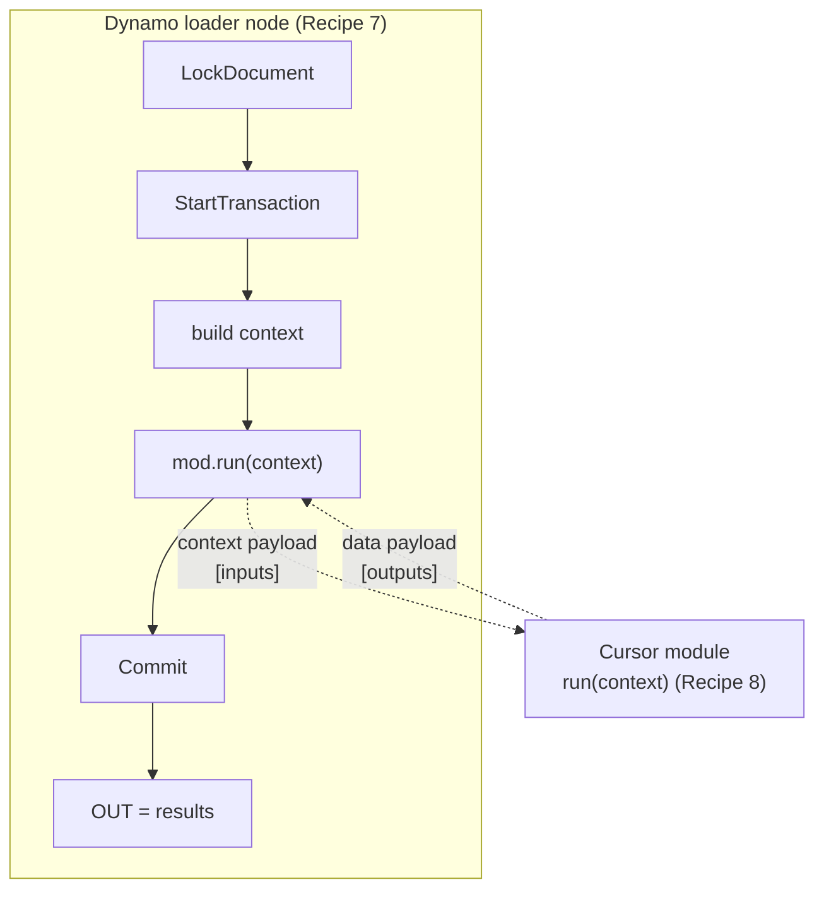
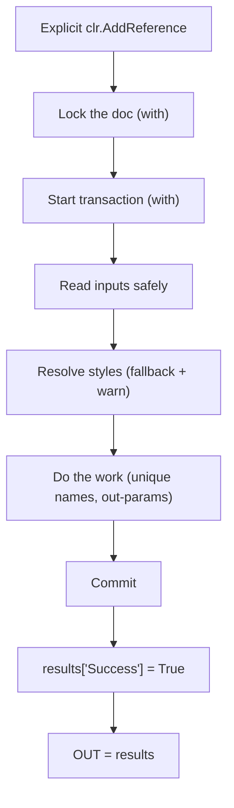

# Reusable Patterns Cookbook

!!! abstract "How to use this page"
    These are **battle-tested, copy-paste building blocks** for Civil 3D
    automation — pulled from real scripts, cleaned up, and stripped of any one
    project's specifics. Grab what you need. Each recipe says *when* to use it and
    *what to watch for*. This is the page you'll open most often.

---

## The `results` schema (read this once)

Every automation returns **one structured dict** — your single source of truth,
inspected in a Watch node. The house schema:

```python
results = {
    "Success":  False,      # set True only after work commits cleanly
    "Warnings": [],         # non-fatal issues (fell back to a default, minor skip)
    "Errors":   [],         # fatal/caught exceptions (str form)
    "Skipped":  [],         # per-item skips in a batch loop (name + reason)
    "Data":     None,       # the actual payload (counts, ids, lists, nested dict)
}
```

| Key | When to write it | Who reads it |
|---|---|---|
| `Success` | `True` after a clean commit; `False` on any caught exception | The caller / Player, to know if it worked |
| `Warnings` | Recoverable: style fell back, optional input missing | Engineer, to fix data later |
| `Errors` | A caught exception (with `Traceback` alongside while developing) | You, to debug |
| `Skipped` | One item in a batch couldn't be processed, run continued | Engineer, to fix that item |
| `Data` | The result itself — counts, created ids, lists | Downstream nodes |

!!! success "One dict, always the same shape"
    Because every script returns this shape, a Watch node (or a downstream node, or
    Dynamo Player) always knows where to look. The rest of this page assumes it.

The subsequent chapters use `Warnings`/`Skipped` freely; treat them as living inside
this schema.

---

## Recipe 1 — The lock → transaction skeleton (start here every time)

**Use when:** *always.* This is the outer shell of essentially every Civil 3D
automation that changes the drawing. Prefer the **`with` (context-manager) form** —
it disposes the lock and the transaction automatically, even on error, and rolls back
any un-committed transaction for you.

```python
import clr, traceback

clr.AddReference("AcMgd")
clr.AddReference("AcCoreMgd")
clr.AddReference("AcDbMgd")
clr.AddReference("AecBaseMgd")           # Autodesk.Aec base (property data, etc.)
clr.AddReference("AecPropDataMgd")
clr.AddReference("AeccDbMgd")            # Civil 3D database objects

from Autodesk.AutoCAD.ApplicationServices.Core import Application
from Autodesk.AutoCAD.DatabaseServices import OpenMode
from Autodesk.Civil.ApplicationServices import CivilApplication

# active document context
doc    = Application.DocumentManager.MdiActiveDocument
db     = doc.Database
ed     = doc.Editor
civdoc = CivilApplication.ActiveDocument

results = {"Success": False, "Warnings": [], "Errors": [], "Skipped": [], "Data": None}
RAISE_ON_ERROR = False        # True while developing → Dynamo fails loudly

try:
    with doc.LockDocument():                                  # 🔒 auto-released
        with db.TransactionManager.StartTransaction() as tr:  # 🧹 auto-disposed
            # ---- all your reading / creating / editing goes here ----
            # obj = tr.GetObject(some_id, OpenMode.ForRead)
            tr.Commit()                                        # 🖊️ keep changes
    results["Success"] = True
except Exception as ex:
    results["Errors"].append(str(ex))
    results["Traceback"] = traceback.format_exc()
    if RAISE_ON_ERROR:
        raise

OUT = results
```

!!! success "Why the `with` form beats manual try/finally"
    Both the document lock and the transaction are disposables. `with` guarantees
    `Dispose()` runs on exit — including on exception — so you can never leak a lock or
    a dangling transaction. If an exception escapes before `tr.Commit()`, the
    transaction is **rolled back** automatically. Less code, fewer ways to get it wrong.
    ([Autodesk — Lock/Unlock a Document (.NET)](https://help.autodesk.com/view/OARX/2025/ENU/?guid=GUID-D4E7A9B2-lock),
    [Autodesk — Commit and Rollback Changes (.NET)](https://help.autodesk.com/view/OARX/2025/ENU/?guid=GUID-commit-rollback))

!!! danger "Three non-negotiables"
    - **`Commit()` only after successful work.** No commit → changes roll back.
    - **Explicit `clr.AddReference(...)`** for every assembly you use — don't rely on
      Dynamo having loaded it.
    - **Never** `with adoc.Database as db:` for the *active* document. Use
      `doc.Database` directly; the active DB is not yours to dispose.

!!! tip "`RAISE_ON_ERROR`: dev vs production"
    - **Developing:** `RAISE_ON_ERROR = True` → the node turns red and shows the
      traceback immediately.
    - **Production / Player:** `RAISE_ON_ERROR = False` → the graph completes and the
      failure is reported *in* `results["Errors"]`/`["Traceback"]`, so an end user gets
      a readable result instead of a crash.

---

## Recipe 2 — Safe Dynamo input readers (never trust a wire)

**Use when:** reading anything from `IN[...]`. Wires may be empty, disconnected,
or the wrong type. These helpers give you a clean value or a sensible default.

```python
def _opt_str(source, i, default=""):
    try:
        if len(source) > i and source[i] is not None:
            s = str(source[i]).strip()
            return s if s else default
    except Exception: pass
    return default

def _opt_int(source, i, default):
    try:
        if len(source) > i and source[i] is not None:
            return int(source[i])
    except Exception: pass
    return default

def _opt_float(source, i, default):
    try:
        if len(source) > i and source[i] is not None:
            return float(source[i])
    except Exception: pass
    return default
```

!!! note "Pass the input list in — don't reach for a global"
    These take the input list as `source` (e.g. `_opt_str(IN, 0, "")`). In the modular
    pattern (Recipe 8) the inputs arrive as `context["IN"]`, so passing them explicitly
    keeps the helpers reusable in both the node and the module.

!!! tip "Normalise list inputs too"
    A wire that should be a list might arrive as a single string. Coerce it:
    ```python
    def normalize_name_list(x):
        if x is None: return []
        if isinstance(x, str): x = [x]
        seen, out = set(), []
        for item in x:
            if item is None: continue
            s = str(item).strip()
            if s and s.lower() not in seen:
                seen.add(s.lower()); out.append(s)
        return out
    ```

---

## Recipe 3 — Resolve a style by name, fall back gracefully

**Use when:** you need a style ObjectId and want the script to *keep going* (with
a warning) if the named style is missing, instead of crashing.

```python
def get_style_id_or_first(style_coll, desired_name, warnings, kind):
    try:
        ids = list(style_coll.ToObjectIds())
    except Exception:
        ids = []
    if not ids:
        raise Exception(f"No {kind} in drawing. Import styles from the template.")
    if desired_name:
        try:
            if style_coll.Contains(desired_name):
                return style_coll.get_Item(desired_name), desired_name
        except Exception: pass
        warnings.append(f'{kind} "{desired_name}" not found; using first available.')
    return ids[0], "<FirstAvailable>"
```

!!! warning "Styles come from the template, not your code"
    Empty collection → drawing-setup problem → **raise**. Missing name only →
    **degrade + warn**. Know the difference.

---

## Recipe 4 — Read a point off any object, robustly

**Use when:** different object types hide their location under different property
names (`Position`, `Location`, `InsertionPoint`, `Point`).

```python
def try_get_point3d(obj):
    for attr in ("Position", "Location", "InsertionPoint", "Point"):
        if hasattr(obj, attr):
            try:
                pt = getattr(obj, attr)
                if hasattr(pt, "X") and hasattr(pt, "Y") and hasattr(pt, "Z"):
                    return pt
            except Exception: pass
    return None
```

---

## Recipe 5 — Call a method with `out` parameters (CPython 3)

**Use when:** a Civil 3D method's C# signature has `out double ...`
(e.g. `StationOffset`, `PointLocation`). Under **pythonnet / CPython 3** there is
no `clr.Reference`; pass dummy `0.0` doubles for each `out` slot — their type
drives overload resolution — and unpack the return tuple.

```python
def station_offset(aln, x, y):
    st = 0.0
    off = 0.0
    _, st, off = aln.StationOffset(x, y, st, off)
    return st, off

def point_location(aln, st, off=0.0):
    x = 0.0
    y = 0.0
    _, x, y = aln.PointLocation(st, off, x, y)
    return x, y
```

!!! danger "The silent-failure trap"
    Call `StationOffset(x, y)` with no out doubles and you get **no value and no
    error** — pythonnet picks the wrong overload. If a Civil 3D call "returns
    nothing," check for `out` params first.

---

## Recipe 6 — Generate a unique name (avoid duplicate-name crashes)

**Use when:** creating alignments / profile views / etc. Civil 3D throws on
duplicate names.

```python
def build_unique_name(existing_set, base):
    if base not in existing_set:
        existing_set.add(base); return base
    i = 1
    while f"{base} {i}" in existing_set:
        i += 1
    existing_set.add(f"{base} {i}")
    return f"{base} {i}"
```

!!! tip "Belt and braces"
    Also wrap the `Create(...)` call in a retry loop that catches the "duplicate"
    exception and tries the next suffix — some names you can't predict.

---

## Recipe 7 — The Dynamo loader node (for modular development in Cursor)

**Use when:** your logic lives in a `.py` module edited in Cursor and you want the
Dynamo node to load, reload, and run it. **The node owns** lock, transaction, commit,
error-handling, and reload; **the module owns only logic** (Recipe 8).

```python
import sys, clr, importlib, traceback

clr.AddReference("AcMgd"); clr.AddReference("AcCoreMgd"); clr.AddReference("AcDbMgd")
clr.AddReference("AecBaseMgd"); clr.AddReference("AecPropDataMgd"); clr.AddReference("AeccDbMgd")

from Autodesk.AutoCAD.ApplicationServices.Core import Application
from Autodesk.Civil.ApplicationServices import CivilApplication

# --- repo path (edit to your clone) ---
REPO = r"C:\dev\civil3d-automations"
if REPO not in sys.path:
    sys.path.insert(0, REPO)

# --- force-reload the WHOLE package so nested helper edits are picked up ---
def unload_package(package_name):
    for name in list(sys.modules.keys()):
        if name == package_name or name.startswith(package_name + "."):
            del sys.modules[name]

# --- active document context ---
doc    = Application.DocumentManager.MdiActiveDocument
db     = doc.Database
ed     = doc.Editor
civdoc = CivilApplication.ActiveDocument

results = {"Success": False, "Warnings": [], "Errors": [], "Skipped": [], "Data": None}
RAISE_ON_ERROR = False

try:
    importlib.invalidate_caches()
    unload_package("automations")                                  # drop cached modules
    mod = importlib.import_module("automations.profile_view_generator")

    with doc.LockDocument():
        with db.TransactionManager.StartTransaction() as tr:
            context = {"doc": doc, "db": db, "ed": ed,
                       "civdoc": civdoc, "tr": tr, "IN": IN}
            results["Data"] = mod.run(context)                     # module does the work
            tr.Commit()

    results["Success"] = True
    results["ModuleFile"] = getattr(mod, "__file__", None)         # confirms which file ran
except Exception as ex:
    results["Errors"].append(str(ex))
    results["Traceback"] = traceback.format_exc()
    if RAISE_ON_ERROR:
        raise

OUT = results
```

!!! danger "`unload_package` — not `importlib.reload` — for multi-module code"
    `importlib.reload(mod)` reloads **only that one module**. If
    `profile_view_generator` imports helper modules and you edit a *helper*, `reload`
    won't pick up the change — you'd run stale code. `unload_package("automations")`
    deletes **every** cached module under the package, so the next `import_module`
    re-reads them all from disk. For any package with more than one file, use this.

!!! tip "`ModuleFile` is a debugging gift"
    `results["ModuleFile"]` echoes the actual path Dynamo loaded. When "my edit isn't
    taking effect," check this first — it catches wrong-`REPO`-path and
    stale-clone mistakes instantly.

!!! warning "Ship builds need a stable path or inlined code"
    The `REPO` path must exist on the **end user's** machine for Dynamo Player. For
    release, put the package on a shared network path everyone can read, or inline the
    logic into the node. Develop with the loader; ship with a stable path.

---

## Recipe 8 — The Cursor module (logic only, receives `context`)

**Use when:** writing the actual automation that Recipe 7 loads. The module is handed
the **already-open transaction** and document context — it does **not** open its own
lock/transaction/commit. It just does work and returns a `Data` payload.

```python
# Uncomment the imports you need

# from Autodesk.AutoCAD.ApplicationServices.Core import Application
# from Autodesk.Civil.ApplicationServices import CivilApplication
# from Autodesk.AutoCAD.DatabaseServices import (
#     OpenMode, ObjectId, Polyline, SymbolUtilityServices, LayerTable, LayerTableRecord)
# from Autodesk.AutoCAD.Geometry import Point2d, Point3d
# from Autodesk.Civil.DatabaseServices import Alignment, PolylineOptions
# from Autodesk.AutoCAD.Colors import Color

# --- imports ----------------------------------------------------------------
import traceback

# --- force-reload the WHOLE package so nested helper edits are picked up ------
# import sys
# from pathlib import Path
# sys.path.append(str(Path(__file__).resolve().parent))

# def unload_package(package_name):
#     for name in list(sys.modules.keys()):
#         if name == package_name or name.startswith(package_name + "."):
#             del sys.modules[name]
# unload_package("_helpers")
# from _helpers import _opt_str, _opt_int, _opt_float, normalize_name_list, _ensure_layer, cleanup, get_style_id_or_first, station_offset, point_location, endpoint_on_alignment

# --- end imports ------------------------------------------------------------

def run(context):
    """Receives an already-open transaction + doc context. Returns the Data payload.
    Does NOT lock, start a transaction, or commit — the node owns that."""
    doc    = context["doc"]
    db     = context["db"]
    ed     = context["ed"]
    civdoc = context["civdoc"]
    tr     = context["tr"]        # <-- already open; just use it
    IN     = context["IN"]

    data = {"Warnings": [], "Skipped": [], "Items": []}

    try:
        # ---------------------------------------------------------------
        # Your logic here, using tr.GetObject(...), etc.
        # ---------------------------------------------------------------

    except Exception as e:
        data["Warnings"].append(str(e))
        data["Warnings"].append(traceback.format_exc())

    return data                    # becomes results["Data"] in the node
```



!!! success "Clean separation of concerns"
    | Owned by the **node** (Recipe 7) | Owned by the **module** (Recipe 8) |
    |---|---|
    | `clr.AddReference`, doc context | Domain imports it needs |
    | Lock, transaction, `Commit` | Reading/creating/editing objects |
    | Error handling, `RAISE_ON_ERROR` | Appending to `Warnings`/`Skipped` |
    | Reload (`unload_package`) | Returning the `Data` payload |
    | `OUT = results` | — |

    The module never touches locks or commits, so it's simpler, testable, and can't
    leak a transaction. Swap in a different module by changing one line in the node.

!!! note "Two idioms, one project"
    - **Small one-off script?** Recipe 1 (self-contained `with` skeleton) is enough.
    - **Reusable automation library?** Recipes 7 + 8 (node loader + logic module).

    The [exercises](dev-env/exercises.md) start self-contained and switch to the
    context model at the capstone.

---

## The mental checklist



!!! success "If you internalise one page, make it this one"
    Eight recipes cover almost every Civil 3D automation: **`with`-form
    lock/transaction, safe inputs, style fallback, robust points, out-parameters,
    unique names, the loader node, and the logic module.** Everything else is domain
    logic on top.
