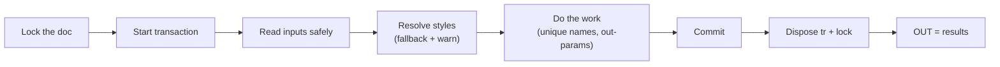

# Reusable Patterns Cookbook

!!! abstract "How to use this page"
    These are **battle-tested, copy-paste building blocks** for Civil 3D
    automation — pulled from real scripts, cleaned up, and stripped of any one
    project's specifics. Grab what you need. Each recipe says *when* to use it and
    *what to watch for*. This is the page you'll open most often.

---

## Recipe 1 — The lock → transaction skeleton (start here every time)

**Use when:** *always.* This is the outer shell of essentially every Civil 3D
automation that changes the drawing.

```python
from Autodesk.AutoCAD.ApplicationServices.Core import Application
from Autodesk.Civil.ApplicationServices import CivilApplication

doc    = Application.DocumentManager.MdiActiveDocument
db     = doc.Database
civdoc = CivilApplication.ActiveDocument

results = {"Warnings": []}

doc_lock = doc.LockDocument()               # 🔒 do-not-disturb sign
try:
    tr = db.TransactionManager.StartTransaction()
    try:
        # ---- all your reading/creating/editing goes here ----
        tr.Commit()                          # 🖊️ make it permanent
    finally:
        tr.Dispose()                         # 🧹 rolls back if not committed
finally:
    doc_lock.Dispose()                       # 🔓 always release the lock

OUT = results
```

!!! danger "Two non-negotiables"
    - **Always `Commit()`** on success — an un-committed transaction discards your
      work and can crash AutoCAD.
    - **Always `Dispose()` in `finally`** — both the transaction and the lock, even
      if something throws.
    ([Autodesk .NET forum: transaction best practices](https://forums.autodesk.com/t5/net-forum/transaction-best-practices/td-p/12537017))

---

## Recipe 2 — Safe Dynamo input readers (never trust a wire)

**Use when:** reading anything from `IN[...]`. Wires may be empty, disconnected,
or the wrong type. These helpers give you a clean value or a sensible default.

```python
def _opt_str(i, default=""):
    try:
        if len(IN) > i and IN[i] is not None:
            s = str(IN[i]).strip()
            return s if s else default
    except: pass
    return default

def _opt_int(i, default):
    try:
        if len(IN) > i and IN[i] is not None:
            return int(IN[i])
    except: pass
    return default

def _opt_float(i, default):
    try:
        if len(IN) > i and IN[i] is not None:
            return float(IN[i])
    except: pass
    return default
```

!!! tip "Normalise list inputs too"
    A wire that should be a list might arrive as a single string. Coerce it:
    ```python
    def normalize_name_list(x):
        if x is None: return []
        if isinstance(x, str): x = [x]
        seen, out = set(), []
        for item in x:
            if item is None: continue
            s = str(item).strip()
            if s and s.lower() not in seen:
                seen.add(s.lower()); out.append(s)
        return out
    ```

---

## Recipe 3 — Resolve a style by name, fall back gracefully

**Use when:** you need a style ObjectId and want the script to *keep going* (with
a warning) if the named style is missing, instead of crashing.

```python
def get_style_id_or_first(style_coll, desired_name, warnings, kind):
    try:
        ids = list(style_coll.ToObjectIds())
    except:
        ids = []
    if not ids:
        raise Exception(f"No {kind} in drawing. Import styles from the template.")
    if desired_name:
        try:
            if style_coll.Contains(desired_name):
                return style_coll.get_Item(desired_name), desired_name
        except: pass
        warnings.append(f'{kind} "{desired_name}" not found; using first available.')
    return ids[0], "<FirstAvailable>"
```

!!! warning "Styles come from the template, not your code"
    If the collection is *empty*, that's a drawing-setup problem — fail loudly.
    If only the *name* is missing, degrade gracefully. Know the difference.

---

## Recipe 4 — Read a point off any object, robustly

**Use when:** different object types hide their location under different property
names (`Position`, `Location`, `InsertionPoint`, `Point`).

```python
def try_get_point3d(obj):
    for attr in ("Position", "Location", "InsertionPoint", "Point"):
        if hasattr(obj, attr):
            try:
                pt = getattr(obj, attr)
                if hasattr(pt, "X") and hasattr(pt, "Y") and hasattr(pt, "Z"):
                    return pt
            except: pass
    return None
```

---

## Recipe 5 — Call a method with `out` parameters (`clr.Reference`)

**Use when:** a Civil 3D method's C# signature has `out double ...`
(e.g. `StationOffset`, `PointLocation`). Python needs by-reference boxes.

```python
import clr, System

def station_offset(aln, x, y):
    st  = clr.Reference[System.Double](0.0)
    off = clr.Reference[System.Double](0.0)
    aln.StationOffset(x, y, st, off)          # fills the boxes
    return float(st.Value), float(off.Value)
```

!!! danger "The silent-failure trap"
    Call these methods without `clr.Reference` boxes and you get **no value and no
    error**. If a Civil 3D call "returns nothing," check for `out` params first.

---

## Recipe 6 — Generate a unique name (avoid duplicate-name crashes)

**Use when:** creating alignments / profile views / etc. Civil 3D throws on
duplicate names.

```python
def build_unique_name(existing_set, base):
    if base not in existing_set:
        existing_set.add(base); return base
    i = 1
    while f"{base} {i}" in existing_set:
        i += 1
    existing_set.add(f"{base} {i}")
    return f"{base} {i}"
```

!!! tip "Belt and braces"
    For API calls that *only* fail at creation time (you can't perfectly predict
    existing names), also wrap the `Create(...)` call in a retry loop that catches
    the "duplicate" exception and tries the next suffix.

---

## The mental checklist



!!! success "If you internalise one page, make it this one"
    Six recipes cover the skeleton of most Civil 3D automation: **lock/transaction,
    safe inputs, style fallback, robust points, out-parameters, unique names.**
    Everything else is domain logic on top.
