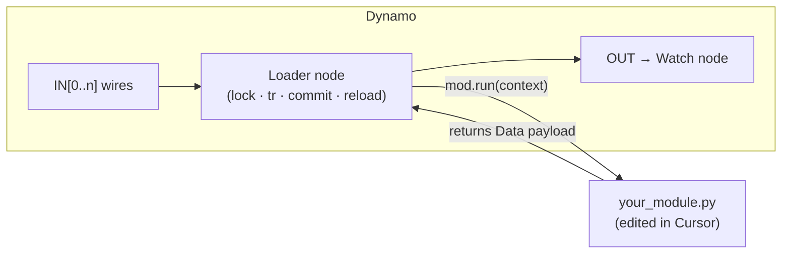
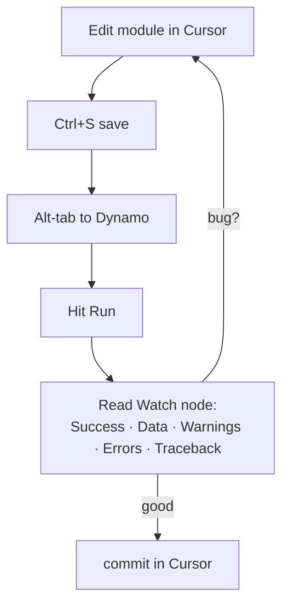
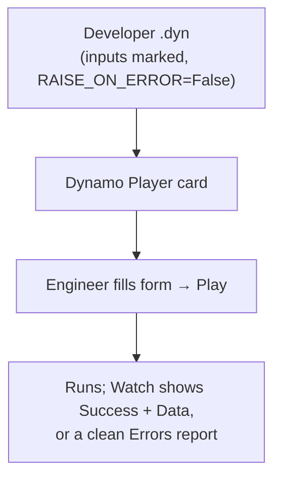

# Dynamo Node Workflow (Import, Reload Loop, Player)

!!! abstract "Goal of this page"
    Wire your Cursor-edited `.py` module into Dynamo, establish a tight
    **edit → reload → run** loop so you never copy-paste code, and package the result
    for **Dynamo Player** so end users can run it with no Dynamo knowledge.

    🔀 = a spot where behaviour differs on non-2025 Civil 3D / Dynamo.

---

## The key idea: the node *loads* your module, it doesn't *contain* it

The naïve workflow is to paste code into a Python node's editor. Don't — you'd be
copy-pasting on every change and losing Git history. Instead the **node is a thin
loader** that owns lock/transaction/commit/error-handling/reload, and calls
`run(context)` in your **module**, which owns only the logic. Your logic lives in the
repo; the node is a launcher.



!!! note "This replaces the old 'thin loader + importlib.reload' shown in earlier drafts"
    We now (a) reload the **whole package** with `unload_package` (not just one
    module), (b) use the **`with`** context-manager form for lock + transaction, and
    (c) pass a **`context` dict** into the module so it receives the already-open
    transaction. See [Cookbook recipes 7 & 8](../cookbook.md#recipe-7--the-dynamo-loader-node-for-modular-development-in-cursor).

---

## Step 1 — Structure your repo as a package

Give your automations a package folder with an `__init__.py` so they import cleanly:

```text
civil3d-automations/
├─ automations/
│  ├─ __init__.py                 # can be empty
│  ├─ profile_view_generator.py   # def run(context): ...
│  └─ _helpers.py                 # shared helpers
├─ .cursorrules
├─ ruff.toml
└─ typings/                       # API stubs for autocomplete
```

Each automation exposes a `run(context)` that takes the context dict and returns a
`Data` payload — **no** lock, transaction, or commit inside the module:

```python
# automations/profile_view_generator.py
from Autodesk.AutoCAD.DatabaseServices import OpenMode
from Autodesk.Civil.DatabaseServices import Alignment

def run(context):
    doc, db, civdoc = context["doc"], context["db"], context["civdoc"]
    tr, IN          = context["tr"], context["IN"]        # tr already open
    data = {"Warnings": [], "Skipped": [], "Items": []}
    # ... logic using tr.GetObject(...) ...
    return data
```

!!! tip "Why the module receives `tr` instead of opening its own"
    The node has already opened the transaction. If the module opened another, you'd
    have nested transactions and unclear commit ownership. One transaction, owned by
    the node, committed once — the module just uses it.

---

## Step 2 — The loader node (paste once, rarely change)

Add a **Python Script** node (right-click canvas → "Python Script"), set its engine to
**CPython3** (dropdown at the bottom of the editor). 🔀 On Dynamo 2.x the label may
read `CPython3` or `PythonNet`; the concept is identical. Paste this **once**:

```python
import sys, clr, importlib, traceback

clr.AddReference("AcMgd"); clr.AddReference("AcCoreMgd"); clr.AddReference("AcDbMgd")
clr.AddReference("AecBaseMgd"); clr.AddReference("AecPropDataMgd"); clr.AddReference("AeccDbMgd")

from Autodesk.AutoCAD.ApplicationServices.Core import Application
from Autodesk.Civil.ApplicationServices import CivilApplication

REPO = r"C:\dev\civil3d-automations"           # <-- edit to your clone
if REPO not in sys.path:
    sys.path.insert(0, REPO)

def unload_package(package_name):
    for name in list(sys.modules.keys()):
        if name == package_name or name.startswith(package_name + "."):
            del sys.modules[name]

doc    = Application.DocumentManager.MdiActiveDocument
db     = doc.Database
ed     = doc.Editor
civdoc = CivilApplication.ActiveDocument

results = {"Success": False, "Warnings": [], "Errors": [], "Skipped": [], "Data": None}
RAISE_ON_ERROR = False                         # True while developing

try:
    importlib.invalidate_caches()
    unload_package("automations")              # force fresh read of ALL package modules
    mod = importlib.import_module("automations.profile_view_generator")

    with doc.LockDocument():
        with db.TransactionManager.StartTransaction() as tr:
            context = {"doc": doc, "db": db, "ed": ed,
                       "civdoc": civdoc, "tr": tr, "IN": IN}
            results["Data"] = mod.run(context)
            tr.Commit()

    results["Success"] = True
    results["ModuleFile"] = getattr(mod, "__file__", None)
except Exception as ex:
    results["Errors"].append(str(ex))
    results["Traceback"] = traceback.format_exc()
    if RAISE_ON_ERROR:
        raise

OUT = results
```

Wire inputs into `IN[0]`, `IN[1]`, …; attach a **Watch** node to the output.

!!! danger "`unload_package` vs `importlib.reload` — this matters"
    `importlib.reload(mod)` reloads **only that one module**. Edit a *helper* module it
    imports and `reload` runs stale code — a maddening "my fix didn't work" bug.
    `unload_package("automations")` deletes **every** cached module under the package,
    so the next `import_module` re-reads them all. Always use `unload_package` for
    multi-file packages.

!!! danger "Never `with adoc.Database as db:` for the active document"
    Use `doc.Database` directly. The active database is owned by Civil 3D — disposing
    it via a `with` is wrong. Only the **lock** and the **transaction** are yours to
    manage with `with`.

---

## Step 3 — The development loop



1. Edit the module in Cursor, **save**.
2. In Dynamo, **Run**. The node calls `unload_package` then re-imports, so your edits
   (including in helper modules) take effect.
3. Inspect the **Watch node** — `Success`, `Data`, `Warnings`, `Skipped`, and (if it
   failed) `Errors` + `Traceback`.
4. Fix in Cursor, repeat. Commit when green.

!!! tip "Turn on loud failures while developing"
    Set `RAISE_ON_ERROR = True` during development: the node turns red and surfaces the
    traceback immediately instead of tucking it into `results`. Flip it back to
    `False` before shipping (see Step 5).

!!! tip "Set Dynamo to Manual run while developing"
    `Dynamo → Run mode → Manual` stops the graph re-running on every tiny change and
    lets you control exactly when your reloaded code executes.

---

## Step 4 — Reading errors effectively

When a run fails, errors surface in several places — check in this order:

| Where | Shows |
|---|---|
| `results["Success"]` in the Watch node | `False` = something was caught |
| `results["Errors"]` + `["Traceback"]` | The exception message + full traceback |
| `results["Skipped"]` | Which batch items were skipped, and why |
| `results["ModuleFile"]` | Which `.py` actually loaded (catches path mistakes) |
| The **node** (yellow/red) | Only when `RAISE_ON_ERROR = True` |
| **Dynamo → View → Show Console** 🔀 | `print()` output and lower-level errors |

!!! success "Your `results` dict is your debugger"
    With the standard schema, the Watch node tells you *whether* it worked
    (`Success`), *what* failed (`Errors`/`Traceback`), *which item* failed (`Skipped`),
    and *which file* ran (`ModuleFile`) — far more useful than a bare red node.

---

## Step 5 — Package for Dynamo Player (end-user delivery)

Dynamo Player runs your graph from a simple form. To make a graph Player-friendly:

1. **Mark inputs/outputs.** On each input node, right-click → **Is Input**; on the
   Watch/output node → **Is Output**.
2. **Give inputs clear names** ("Pipe Network Name", "IC Prefix") — they become the
   Player form fields.
3. **Provide sensible defaults** so the form runs out of the box.
4. **Set `RAISE_ON_ERROR = False`** so a failure returns a readable `results` instead
   of crashing the run for the engineer.
5. **Resolve the module path for the user's machine** — see the warning below.
6. Open **Civil 3D → Manage → Dynamo Player**, point it at the folder; the graph
   appears as a runnable card.



!!! warning "The `REPO` path must exist on the end user's machine"
    The loader imports from `REPO`. For distribution, either (a) put the `automations`
    package on a **shared network path** every user can read (set `REPO` to it), or
    (b) **inline** the final logic into the node for a locked release build. Develop
    with the loader; ship with a stable path or inlined code.

!!! tip "Two build modes, one repo"
    - **Dev build:** loader node + `unload_package` + local `REPO` + `RAISE_ON_ERROR=True`.
    - **Release build:** shared/inlined code + `RAISE_ON_ERROR=False`.
    Keep both; switch at release time.

---

## Workflow verification checklist

- [ ] Python node engine set to **CPython3**.
- [ ] `automations/` is a package (`__init__.py` present); `REPO` on `sys.path`.
- [ ] Node uses the `with` lock + `with` transaction form and calls `mod.run(context)`.
- [ ] Editing a **helper** module and running reflects the change (proves
      `unload_package`, not just `reload`).
- [ ] Watch node shows the full schema: `Success`, `Data`, `Warnings`, `Skipped`,
      and `Errors`/`Traceback` on failure.
- [ ] `RAISE_ON_ERROR = True` during development; `False` for Player/release.
- [ ] Inputs marked **Is Input**, output marked **Is Output**; graph appears in Player.
- [ ] `results["ModuleFile"]` points at the file you expect.

Next: [Exercises](exercises.md) — ten progressive tasks that exercise every core
skill: read, write, update, delete, resolve styles, out-params, geometry, bug-fixing,
and a full batch loop.