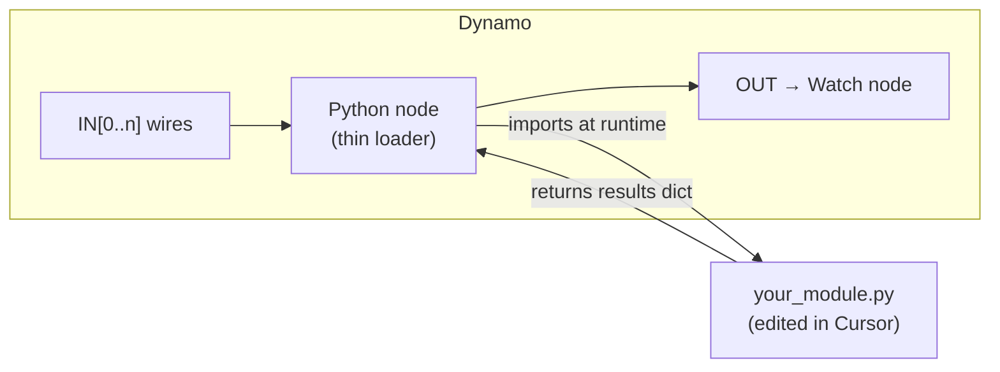
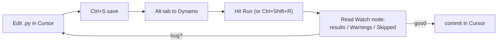
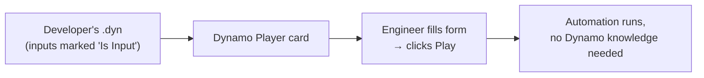

# Dynamo Node Workflow (Import, Reload Loop, Player)

!!! abstract "Goal of this page"
    Wire your Cursor-edited `.py` file into Dynamo as a node, establish a tight
    **edit → reload → run** loop so you never copy-paste code, and package the result
    for **Dynamo Player** so end users can run it with no Dynamo knowledge.

    🔀 = a spot where behaviour differs on non-2025 Civil 3D / Dynamo.

---

## The key idea: the node *imports* your file, it doesn't *contain* it

The naïve workflow is to paste code into a Python node's editor. Don't — you'd be
copy-pasting on every change and losing Git history. Instead, the node body is a
**thin loader** that imports your real `.py` module from disk and calls it. Your
logic lives in the repo; the node is just a launcher.



---

## Step 1 — Structure your `.py` as an importable module

Put your logic in a function that takes the inputs and returns `results`, and guard
the "run" part so importing it doesn't execute anything:

```python
# file: automations/profile_view_generator.py
def run(IN):
    """All logic here. Returns the results dict."""
    results = {"Warnings": [], "Skipped": []}
    # ... lock → transaction → work → commit ...
    return results

# no top-level side effects — importing this file does nothing on its own
```

!!! tip "Pass `IN` in, return `results` out"
    Keep the module free of Dynamo globals (`IN`, `OUT`, `DataEnteringNode`). Take
    inputs as a parameter and *return* the result. This makes the module testable
    outside Civil 3D later, and keeps the node loader trivial.

---

## Step 2 — The thin loader node (paste this once, rarely change it)

In Dynamo: add a **Python Script** node (right-click canvas → search "Python
Script"). Set its engine to **CPython3** (dropdown at the bottom of the node editor).
🔀 On Dynamo 2.x the dropdown label may read `CPython3` or `PythonNet`; the concept
is identical.

Paste this loader **once**. It reloads your module every run, so your Cursor edits
take effect without re-pasting:

```python
import sys, importlib

# 1. put your repo on the path (edit to your clone location)
REPO = r"C:\dev\civil3d-automations"
if REPO not in sys.path:
    sys.path.append(REPO)

# 2. import and FORCE-RELOAD the module so file edits are picked up every run
import automations.profile_view_generator as mod
importlib.reload(mod)                 # <-- the magic that avoids copy-paste

# 3. hand Dynamo's inputs to your function, return its result
OUT = mod.run(IN)
```

Wire your inputs into `IN[0]`, `IN[1]`, … and attach a **Watch** node to the output.

!!! danger "Without `importlib.reload`, Dynamo caches the first import"
    Python caches imported modules for the life of the Dynamo session. Edit your
    `.py`, hit Run, and *nothing changes* — you're running the cached version.
    `importlib.reload(mod)` forces a fresh read from disk every run. This one line is
    the heart of the whole loop.

🔀 **Deeply nested edits:** `importlib.reload` reloads *one* module. If you edit a
helper module that `profile_view_generator` imports, reload it too, or restart the
Dynamo session. For a single-file automation this isn't an issue.

---

## Step 3 — The development loop



1. Edit in Cursor, **save**.
2. In Dynamo, **Run**. The loader reloads your file.
3. Inspect the **Watch node** — your `results` dict, `Warnings`, `Skipped`.
4. Fix in Cursor, repeat. Commit when green.

!!! tip "Set Dynamo to Manual run while developing"
    `Dynamo → Run mode → Manual` stops the graph re-running on every tiny change and
    lets you control exactly when your reloaded code executes. Switch to Automatic
    only when the graph is stable.

---

## Step 4 — Reading errors effectively

When a run fails, errors surface in three places — check them in this order:

| Where | Shows | 
|---|---|
| The **node** (turns yellow/red) | The Python traceback — hover or expand |
| The **Watch node** | Your `results["Warnings"]` and `["Skipped"]` |
| **Dynamo → View → Show Console** 🔀 | `print()` output and lower-level errors |

!!! success "Your `results` dict is your debugger"
    Because every helper appends to `Warnings`/`Skipped` (per the
    [gotchas](../gotchas.md) rules), the Watch node tells you *which item* and *which
    step* failed — far more useful than a bare traceback. Lean on it.

---

## Step 5 — Package for Dynamo Player (end-user delivery)

Dynamo Player lets non-developers run your graph from a simple form. To make a graph
Player-friendly:

1. **Mark inputs/outputs.** On each input node (sliders, string nodes, file
   pickers), right-click → **Is Input**. On the Watch/output node → **Is Output**.
2. **Give inputs clear names.** Rename nodes to what the user should type
   ("Pipe Network Name", "IC Prefix"). These labels become the Player form fields.
3. **Provide sensible defaults** so the form runs out-of-the-box.
4. **Save the `.dyn`** into your team's Player folder.
5. Open **Civil 3D → Manage → Dynamo Player**, point it at the folder, and the graph
   appears as a runnable card with your named inputs.



!!! warning "Player runs the graph, which reloads your .py — so paths must be valid on the user's machine"
    The loader's `REPO = r"C:\dev\..."` path must exist on the **end user's** machine
    too, or the import fails. For Player distribution, either (a) put the `.py` on a
    shared network path all users can read, or (b) inline the final code into the node
    for release builds. Develop with the reload loader; ship with a stable path or
    inlined code.

!!! tip "Two build modes"
    - **Dev build:** thin loader + `importlib.reload` + repo path (fast iteration).
    - **Release build:** code pasted into the node, or a locked shared path (no
      moving parts on the user's machine). Keep both; switch at release time.

---

## Workflow verification checklist

- [ ] Python node engine set to **CPython3**.
- [ ] Loader node imports your module and calls `importlib.reload`.
- [ ] Editing the `.py` and hitting Run reflects changes (test: add a warning string,
      see it in Watch).
- [ ] Watch node shows the full `results` dict.
- [ ] Inputs marked **Is Input**, output marked **Is Output**; graph appears in Player.

Next: [Exercises](exercises.md) — ten progressive tasks that exercise every core
skill: read, write, update, resolve styles, out-params, geometry, bug-fixing, and a
full batch loop.
