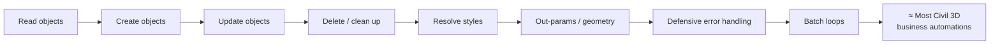

# Exercises

!!! abstract "How these work"
    Ten progressive exercises that build every core Civil 3D automation skill —
    **read, write, update, delete, resolve styles, out-parameters, geometry,
    error-handling, bug-fixing, and a full batch loop.** Do them **in order**; each
    reuses skills from the last. Business logic is deliberately trivial — the point is
    to master the *mechanics*.

    Every exercise: **Goal → What you'll practise → Steps → Acceptance test → Stretch.**
    Reference solutions are in [Exercise Solutions](exercise-solutions.md) — try first,
    peek only when stuck.

!!! warning "Scratch drawing only"
    Exercises 3+ write to the drawing. Use a throwaway DWG with a small pipe network,
    an alignment, and a surface. Keep a clean baseline you can revert to.

!!! tip "Use the loader from the workflow page"
    Write each exercise as `run(IN)` in its own `.py` (`exercises/ex01_read.py`, …)
    and point the [thin loader node](dynamo-node-workflow.md#step-2--the-thin-loader-node-paste-this-once-rarely-change-it)
    at it. Inspect every result in a Watch node.

---

## Exercise 0 — Prove the loop works (the "hello world")

**Goal:** confirm your Cursor → Dynamo reload loop is live before doing anything real.

**Practise:** the edit → save → reload → run cycle; reading `OUT` in a Watch node.

**Steps**

1. Create `exercises/ex00_hello.py`:
   ```python
   def run(IN):
       return {"message": "hello from Cursor", "inputs_seen": len(IN)}
   ```
2. Point the loader node at it, wire any two inputs, Run.
3. Edit the message string in Cursor, save, Run again.

**Acceptance test:** the Watch node shows your **new** message on the second run
(proves `importlib.reload` works).

**Stretch:** deliberately introduce a bare `except:` in the file — confirm Cursor +
Ruff flag it.

---

## Exercise 1 — Read one object (query the active document)

**Goal:** open the doc/db/civdoc and report basic facts — no writing.

**Practise:** the objects from the [primer](../getting-started/civil3d-api-primer.md);
read-only access; returning a `results` dict.

**Steps**

1. Inside `run(IN)`, get `doc`, `db`, `civdoc`.
2. Open a read transaction (lock optional for pure reads, but include it for habit).
3. Return: the drawing name, the count of pipe networks
   (`civdoc.GetPipeNetworkIds()`), and the count of alignments
   (`civdoc.GetAlignmentIds()`).

**Acceptance test:** Watch shows correct counts matching what you see in Civil 3D's
Prospector.

**Stretch:** also return a **list of every pipe network name** (open each id
`ForRead`, read `.Name`). This is the "echo available names" habit from
[Chunk G](../walkthrough/g-main-loop.md#step-1b--list-every-network-a-diagnostic-gift).

---

## Exercise 2 — Safe inputs (never trust a wire)

**Goal:** read a network name, an IC prefix, and a numeric tolerance from `IN[]`
without ever crashing on missing/empty/wrong-type wires.

**Practise:** `_opt_str/_opt_int/_opt_float` ([Cookbook recipe 2](../cookbook.md#recipe-2--safe-dynamo-input-readers-never-trust-a-wire)).

**Steps**

1. Implement the three safe readers.
2. Read `IN[0]` → network name (default `""`), `IN[1]` → IC prefix (default `"IC-"`),
   `IN[2]` → tolerance (default `0.15`).
3. Return the resolved values **and** a `Warnings` list noting any that fell back to
   default.

**Acceptance test:** disconnect a wire, or feed a string into the numeric port — the
node still runs and reports the default in `Warnings`.

**Stretch:** add `normalize_name_list` and accept `IN[3]` as either a single string
or a list of crossing-network names; return the de-duplicated list.

---

## Exercise 3 — Write: create a simple object

**Goal:** create a **layer** and a short **polyline** between two points, inside a
proper lock → transaction → commit.

**Practise:** the [skeleton](../cookbook.md#recipe-1--the-lock--transaction-skeleton-start-here-every-time);
`AppendEntity`; `AddNewlyCreatedDBObject`; `Commit`.

**Steps**

1. Lock the doc, start a transaction.
2. Ensure a layer `"DEV-SCRATCH"` exists (create it if not).
3. Create a `Polyline` with two vertices (hard-code coordinates), put it on that
   layer, `AppendEntity` to model space, and **register it** with
   `AddNewlyCreatedDBObject`.
4. Commit. Return the new polyline's `ObjectId` as a string.

**Acceptance test:** the polyline appears in the drawing on layer `DEV-SCRATCH` after
running.

!!! danger "Deliberate failure to learn from"
    First, **omit** `AddNewlyCreatedDBObject` and run — observe the error/corruption.
    Then add it back. Feel *why* the rule exists.

**Stretch:** wrap the whole thing so that if any step throws, the transaction is
disposed (rolled back) in `finally` and the lock always released.

---

## Exercise 4 — Read then Update (get → modify → set)

**Goal:** find your `DEV-SCRATCH` polyline from Exercise 3 and **change** it — move a
vertex and change its layer.

**Practise:** `OpenMode.ForWrite` / `UpgradeOpen()`; modifying an existing DB object;
the get-modify-set discipline.

**Steps**

1. Locate the polyline (by iterating model space, or reuse the ObjectId).
2. Open it `ForWrite` (or `ForRead` then `UpgradeOpen()`).
3. Move one vertex (`SetPointAt`) and set `.Layer` to a new value.
4. Commit; return old vs new coordinates.

**Acceptance test:** the polyline visibly moves; Watch shows the before/after points.

**Stretch:** find a **profile view's band items**, flip one band's `ShowLabels`, and
push it back with `SetBottomBandItems(...)` — the
[band idiom](../gotchas.md#band-set). Observe that forgetting the `Set...` call
silently does nothing.

---

## Exercise 5 — Delete / clean up

**Goal:** erase everything your exercises created on `DEV-SCRATCH`, leaving the
drawing clean.

**Practise:** `Erase()`; iterating a collection safely while deleting; idempotent
cleanup.

**Steps**

1. Lock + transaction.
2. Iterate model space; for every entity on layer `DEV-SCRATCH`, open `ForWrite` and
   `Erase()`.
3. Commit; return a count of erased objects.

**Acceptance test:** running twice — second run reports `0 erased` (idempotent, no
crash on an already-clean drawing).

!!! tip "Collect ids first, then erase"
    Don't erase while iterating the live collection. Gather ObjectIds into a list in
    one pass, then erase them in a second pass — avoids "collection modified" issues.

**Stretch:** make it a reusable `cleanup(layer_name)` helper you can call at the start
of later exercises to reset state.

---

## Exercise 6 — Resolve a style by name (with fallback)

**Goal:** resolve an **Alignment Style** and a **Profile View Style** by name,
falling back to the first available with a warning.

**Practise:** [`get_style_id_or_first`](../cookbook.md#recipe-3--resolve-a-style-by-name-fall-back-gracefully);
the "empty collection → raise, missing name → warn" distinction.

**Steps**

1. Implement `get_style_id_or_first`.
2. Resolve a style using a **real** name from your template → confirm exact match.
3. Resolve using a **bogus** name → confirm fallback + warning.
4. Return both resolved names and the `Warnings`.

**Acceptance test:** real name → `<that name>`; bogus name → `<FirstAvailable>` plus a
warning string.

**Stretch:** implement the **path-list resolution**
([Chunk D](../walkthrough/d-styles.md#the-improved-pattern-path-list-resolution)) for a
label-style collection, trying at least two candidate paths and reporting which one
matched.

---

## Exercise 7 — Out-parameters (`clr.Reference`)

**Goal:** for a given world point, get its **station and offset** on an alignment.

**Practise:** [`clr.Reference[System.Double]`](../cookbook.md#recipe-5--call-a-method-with-out-parameters-clrreference);
recognising the silent-failure trap.

**Steps**

1. Pick any alignment in the scratch drawing.
2. Implement `station_offset(aln, x, y)` using two `clr.Reference` boxes.
3. Feed it a point you know lies on/near the alignment; return `(station, offset)`.

**Acceptance test:** offset ≈ 0 for a point on the centreline; a sensible station
value matching Civil 3D's own readout.

!!! danger "Feel the trap first"
    Call `StationOffset` *without* the reference boxes and observe you get **nothing
    and no error**. Then do it correctly. This memory will save you hours later.

**Stretch:** write `endpoint_on_alignment(aln, pt, tol)` returning `abs(offset) <=
tol`, and test it against a point you know is off to the side.

---

## Exercise 8 — Geometry: is it a crossing? (and fix the bug)

**Goal:** given the alignment segment and a candidate pipe segment, decide if it's a
**true crossing** — not a parallel run.

**Practise:** pure-Python segment intersection; the **three-question test**; turning a
buggy one-condition test into a correct one ([Chunk E](../walkthrough/e-crossing-detection.md)).

**Steps**

1. Implement `_segment_cross_params` (returns `t, u, ix, iy` or `None`).
2. Start with the **buggy** single-condition `is_pipe_crossing` (intersection only).
   Feed it a hand-crafted **parallel** pipe that clips the alignment near one end →
   watch it wrongly return `True`.
3. Fix it: add the **angle check** and the **endpoint (`u`) guard**. Re-test → now
   `False` for parallel, `True` for a genuine crossing.

**Acceptance test:** four hand-made cases classify correctly:
crossing at 90° ✅, crossing at 30° ✅, parallel/alongside ❌, touch-at-endpoint ❌.

**Stretch:** emit a **diagnostics list** (`u`, `angle_deg`, `kept`) per candidate so
you could tune thresholds from data
([Chunk E, step 5](../walkthrough/e-crossing-detection.md#step-5--tune-with-data-not-vibes-the-diagnostics-habit)).

---

## Exercise 9 — Error handling & defensive structure

**Goal:** harden a script that processes a list so **one bad item never aborts the
run**, and every failure is reported with its item and step.

**Practise:** narrow try/except; skip-and-record; fail-loud-only-when-fatal
([gotchas](../gotchas.md)).

**Steps**

1. Take a list of structure ObjectIds (e.g. all ICs in the network).
2. Loop over them. Inside the loop, wrap **each fallible call** in its own narrow
   `try/except Exception as e`, appending a specific message like
   `f"{name}: read position failed: {e}"` to `results["Warnings"]` and `continue`.
3. Deliberately include a structure with missing/odd data (or fake one) so at least
   one item fails.
4. Return counts: `Processed`, `Skipped`, and the full `Warnings`/`Skipped` lists.

**Acceptance test:** the run completes even though one item failed; `Skipped` names the
bad item and *why*; `Processed + Skipped == total`.

!!! bug "Anti-pattern to experience, then remove"
    First wrap the **entire** loop body in one broad `try/except` and make an item
    fail — notice the message can't tell you *which* item or *which* step broke. Then
    refactor to narrow try/excepts and feel the difference in debuggability
    ([gotchas](../gotchas.md#broad-try-except)).

**Stretch:** raise (don't skip) for a genuinely **fatal** condition — e.g. the target
network is missing entirely — and confirm that fatal errors stop the run while
per-item errors don't. This is the graceful-degradation philosophy from
[Chunk G](../walkthrough/g-main-loop.md#the-graceful-degradation-philosophy-the-whole-point).

---

## Exercise 10 — Capstone: a mini batch automation

**Goal:** combine everything into one script that, for each IC in a network, creates a
short **alignment** from a connected pipe and reports what it did — a stripped-down
cousin of the full Profile View Generator.

**Practise:** setup-once-then-loop; connectivity map; unique names; the full
lock/transaction/commit; graceful degradation; a rich `results` dict.

**Steps**

1. **Setup (once):** lock + transaction; find the target network by name (raise if
   missing); resolve an alignment style with fallback; build a
   [connectivity map](../walkthrough/c-helpers.md#the-connectivity-map--a-pattern-worth-knowing)
   (structure → connected pipes).
2. **Loop:** for each IC (respect a `TEST_LIMIT` input), take one connected pipe, read
   its endpoints (with fallbacks), create a **seed polyline**, and create an
   **alignment** with a [unique name](../cookbook.md#recipe-6--generate-a-unique-name-avoid-duplicate-name-crashes)
   (`SITE_ID = ObjectId.Null`). Register the seed polyline; let Civil 3D erase it.
3. Skip-and-record any IC with no connected pipe or no coordinates.
4. Commit. Return: `Created` count, `Skipped` list, `Warnings`, and the resolved
   style name.

**Acceptance test:** new alignments appear (one per processed IC); re-running produces
` (1)`, ` (2)` suffixes rather than crashing; `TEST_LIMIT = 3` processes exactly three.

**Stretch A:** extend it to also create a **profile view** per alignment
([Chunk F](../walkthrough/f-profile-views.md)) with duplicate-name retry.

**Stretch B:** add the **crossing detection** from Exercise 8 so each view only lists
genuine crossings — at which point you've rebuilt the core of the real tool from first
principles.

---

## What you can build after these



!!! success "Coverage check"
    These ten exercises exercise every mechanic behind the full example script:
    **querying, creating, modifying, deleting, style resolution, out-parameters,
    plan-view geometry, defensive structure, and batch orchestration.** Master them and
    the business logic of most Civil 3D automations becomes "just" wiring these
    patterns together.

---

## Suggested pace

| Session | Exercises | Focus |
|---|---|---|
| Day 1 | 0–2 | Loop works; read; safe inputs |
| Day 2 | 3–5 | Write, update, delete (CRUD) |
| Day 3 | 6–7 | Styles + out-parameters |
| Day 4 | 8–9 | Geometry + bug-fixing + error handling |
| Day 5 | 10 | Capstone (+ stretches) |

Next: [Exercise Solutions](exercise-solutions.md) — reference implementations for all
ten, in collapsible boxes so they don't spoil your first attempt.

