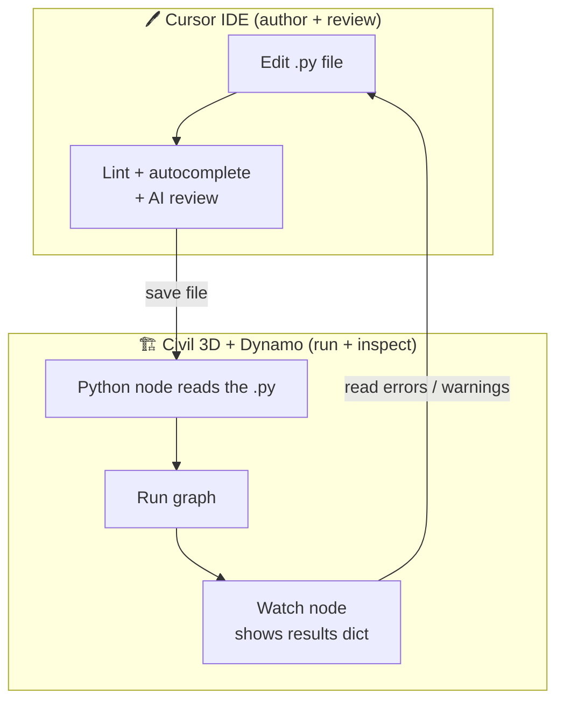
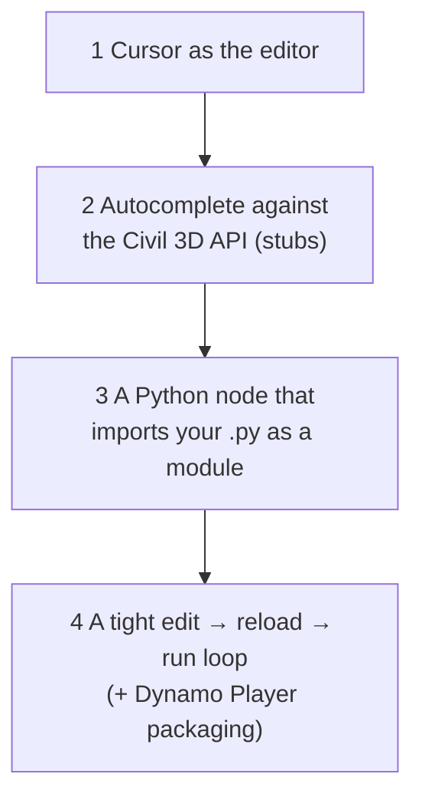

# Development Environment — Overview

!!! abstract "What this section is"
    A complete, step-by-step guide to setting up an **integrated Cursor + Civil 3D
    Dynamo** development workflow, followed by a set of **progressive exercises** that
    take you from "read one object" to "write a full batch automation." Work through
    it in order the first time; return to individual pages as reference later.

    Assumes: **Civil 3D 2025**, **Dynamo CPython 3 engine**, a developer comfortable
    with Python/OOP but new to the Civil 3D .NET API. Version differences are flagged
    with a 🔀 marker.

---

## The core problem this solves

Dynamo's built-in Python editor is a plain text box: no autocomplete, no linting, no
Git, no refactoring. Real automation development needs a real IDE. **Cursor** gives
you all of that — but Cursor doesn't *run* the code; Civil 3D does. So the workflow
is a loop between two tools:

You **write and review** in Cursor, then **run and inspect** in Dynamo. The trick is
wiring them so that (a) Cursor knows the Civil 3D API for autocomplete, and (b)
Dynamo re-reads your file without copy-paste.

---

## The four things we'll set up

1. **Cursor as the editor** — install, point it at the right Python, load the
   `.cursorrules` from the [prompt pack](../_cursor-prompts.md).
2. **Autocomplete against the Civil 3D API** — install type stubs and configure the
   language server so `alignment.` offers `StationOffset(...)`, etc.
3. **Import a `.py` as a Dynamo node** — so your external file *is* the node body,
   editable in Cursor.
4. **The dev loop + Dynamo Player** — reload-on-run, and packaging for end users.

Pages [Cursor setup](cursor-setup.md) and [Dynamo node workflow](dynamo-node-workflow.md)
cover 1–4. Then the [exercises](exercises.md) put it to work.

---

## Prerequisites checklist

Before starting, confirm you have:

- [ ] **Civil 3D 2025** installed and licensed, opening successfully.
- [ ] **Dynamo for Civil 3D** available (Manage ribbon → Visual Programming →
      Dynamo). It ships with Civil 3D.
- [ ] **Cursor** installable (admin rights or a user-scope install).
- [ ] **Git** installed, and access to your team's automation repo.
- [ ] A **scratch drawing** with a small pipe network + a surface, for testing. Never
      develop against a live production drawing.

!!! warning "Use a scratch DWG, always"
    Every exercise here *writes* to the drawing. Develop on a throwaway copy so a bug
    can't damage real project data. Keep a clean baseline DWG you can revert to.

---

## Mental model: where does your code actually live?

This trips up newcomers, so fix it early:

| Thing | Lives where | Edited in |
|---|---|---|
| Your logic (`.py` file) | On disk, in your Git repo | **Cursor** |
| The Dynamo **node** | Inside the `.dyn` graph | Dynamo (points at the `.py`) |
| The **runtime** (CPython 3 + .NET) | Inside Civil 3D's process | — (Civil 3D owns it) |
| The **API stubs** (for autocomplete only) | A folder Cursor reads | Cursor (never runs them) |

!!! note "Stubs are for autocomplete, not execution"
    The type stubs you install for Cursor are *empty shells* describing the API's
    shape. They make autocomplete work. They are **never** the code that runs — the
    real DLLs inside Civil 3D are. Don't confuse "Cursor shows no error" with "it runs."

---

## The golden rule of this workflow

!!! success "Author in Cursor, truth is in Dynamo"
    Cursor's autocomplete and linter are *guides*, not *ground truth*. The Civil 3D
    API has version quirks that no stub captures perfectly. **Always confirm behaviour
    by running in Dynamo and reading the `results` dict in a Watch node.** The
    [exercises](exercises.md) build this habit deliberately.

Next: [Cursor setup](cursor-setup.md).
