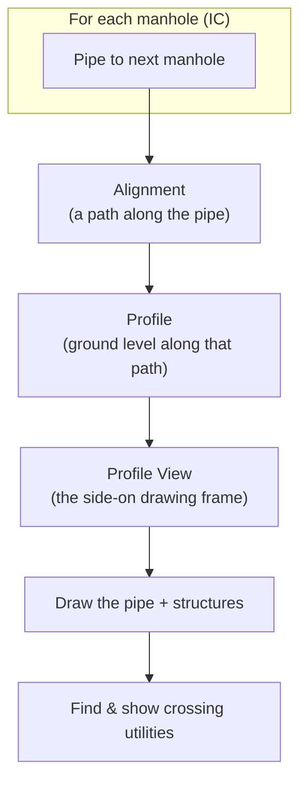
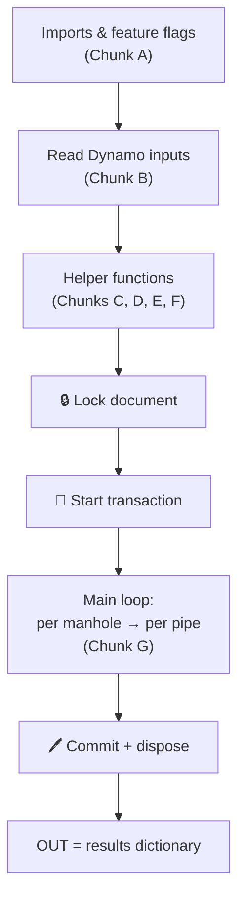

# The Big Picture — what this workflow actually does

!!! abstract "One sentence"
    For every inspection chamber (manhole) in a sewer network, automatically build
    the **long-section drawing** — an alignment along each pipe, a ground profile,
    a profile view on a grid, and the **crossing utilities** shown on it.

If you've never drawn a pipe long-section by hand in Civil 3D, that sentence is
noise. So let's build the picture from the ground up.

---

## The real-world job we're automating

A drainage engineer needs, for each pipe run between two manholes, a **profile
view** (a side-on drawing) that shows:

1. the **pipe** going downhill from one manhole to the next,
2. the **existing ground** line above it,
3. a **data band** underneath listing invert levels, sizes, chainages, and
4. little markers wherever **other utilities cross over or under** this pipe
   (water, gas, electric ducts…).

Doing this by hand for hundreds of pipes is soul-destroying. So we automate it.



---

## The five tasks, in human terms

| # | Task | Plain-language goal | Chapter that covers the tricky bits |
|---|---|---|---|
| 1 | **Alignment** | Draw an invisible path following each pipe | [F](../walkthrough/f-profile-views.md) |
| 2 | **Profile** | Drape the ground surface over that path | [F](../walkthrough/f-profile-views.md) |
| 3 | **Profile View** | Create the drawing frame and place it on a tidy grid | [F](../walkthrough/f-profile-views.md) |
| 4 | **Draw parts** | Turn "Draw = Yes" for the pipe + its manholes | [F](../walkthrough/f-profile-views.md) |
| 5 | **Crossings** | Detect other pipes that cross, and mark them | [E](../walkthrough/e-crossing-detection.md) |

!!! note "Why an *alignment* for a pipe?"
    A profile view in Civil 3D can only be built **along an alignment**. So even
    though we just want "the pipe's long-section," we must first create an alignment
    that follows the pipe. The alignment is the *ruler*; the profile view hangs off
    it.

---

## The shape of the code

Every serious Civil 3D script has the same overall shape. Ours is no exception:



- **Top half = definitions.** Imports, then dozens of small helper functions. None
  of it *does* anything yet — it's all setup.
- **Bottom half = one big transaction.** The lock/transaction skeleton from the
  [Cookbook](../cookbook.md), inside which the main loop runs.
- **The output** is a single Python **dictionary** (`results`) with counts,
  diagnostics, and warnings — perfect for inspecting in a Dynamo Watch node.

!!! tip "This is a universal template"
    *Definitions on top, one locked transaction on the bottom, a results dict as
    output.* Once you recognise this shape, every Civil 3D script becomes readable —
    you just ask "which helper does what, and what does the loop do per item?"

---

## Inputs and outputs at a glance

**Inputs** arrive through Dynamo wires (`IN[0]`, `IN[1]`, …): the network name, the
manhole prefix, style names, the surface name, the list of networks to check for
crossings, and a few tolerances. Chapter B shows how to read them without crashing.

**Output** is the `results` dictionary — for example:

```python
{
  "Network": "SEWER_MAIN",
  "IC_Count": 42,
  "AlignmentsCreated": [ ... ],
  "ProfileViewsCreated": [ ... ],
  "Crossings": { "Found": [ ... ], "LabelsCreated": [ ... ] },
  "Warnings": [ ... ]
}
```

!!! success "Design principle: never crash, always report"
    A good automation script **degrades gracefully**. Missing a style? Warn and use
    a default. A pipe has no coordinates? Skip it and record it in `Skipped`. The
    engineer reads the `results` dict, sees exactly what happened, and fixes their
    data — instead of staring at a red node with no explanation.

---

## Where to go next

You now know the *what* and the *shape*. Time for the *how* — start the code tour:

[:octicons-arrow-right-24: Chunk A — Imports & feature flags](../walkthrough/a-imports.md)
