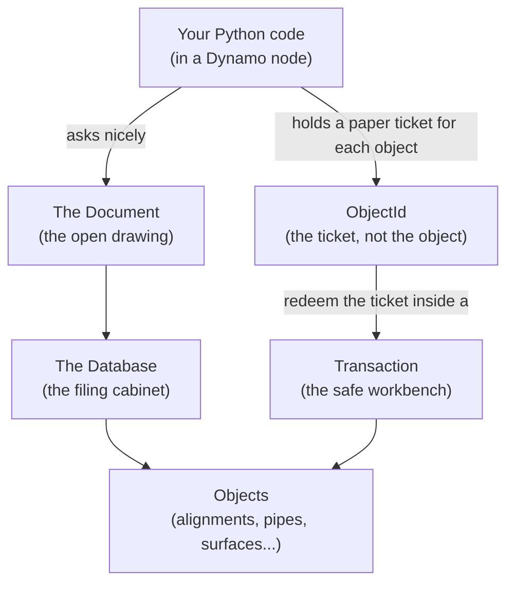
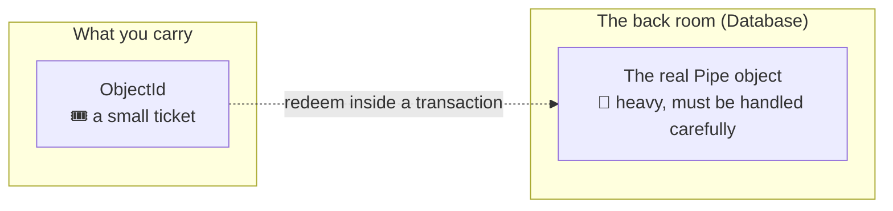
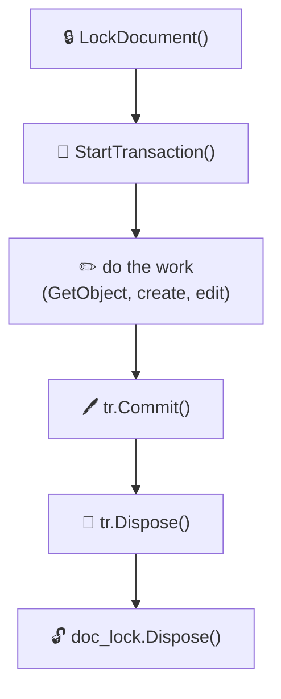

# Civil 3D API Primer — the words before the code

!!! info "Who this page is for"
    You know a little Python. You have **never** touched the Civil 3D .NET API.
    This page explains the *ideas* you must hold in your head **before** you read
    any automation script. Read it once, slowly. Every later chapter assumes you
    understand these five words: **Document, Database, ObjectId, Transaction, Style.**

---

## The big picture (in one drawing)

When you automate Civil 3D, you are not "editing a file" the way you edit a Word
document. You are talking to a **live program** that is holding a giant filing
cabinet in memory. Your job is to open the right drawer, take out the right
folder, change something, and put it back **safely** so nobody else gets confused.



Hold that picture. Now the five words.

---

## 1. The Document — the open drawing

The **Document** is simply *the drawing that is open on screen*. In code we grab
the currently-active one:

```python
from Autodesk.AutoCAD.ApplicationServices.Core import Application
doc = Application.DocumentManager.MdiActiveDocument   # the drawing on screen
```

!!! note "Two documents, one drawing"
    Civil 3D actually gives you **two** handles to the same drawing:

    - the **AutoCAD** document (`doc`) — knows about lines, layers, blocks.
    - the **Civil** document (`civdoc`) — knows about alignments, surfaces, pipe networks.

    ```python
    from Autodesk.Civil.ApplicationServices import CivilApplication
    civdoc = CivilApplication.ActiveDocument   # the "Civil 3D brain" of the same drawing
    ```

    Rule of thumb: **civil things → `civdoc`**, **plain CAD things → `doc`/`db`**.

---

## 2. The Database — the filing cabinet

Inside the document is the **Database** (`db = doc.Database`). This is the actual
filing cabinet where **every** object lives: every line, every pipe, every layer.
You almost never touch objects directly through the cabinet — you go through a
*ticket* and a *workbench* (next two sections).

```python
db = doc.Database
```

---

## 3. The ObjectId — the ticket, not the object

This is the single most important idea, and the one that confuses everyone at
first.

> When Civil 3D hands you an object, it does **not** hand you the object.
> It hands you a **ticket** called an **`ObjectId`**.

Think of a coat check at a restaurant. You give them your coat; they give you a
little numbered ticket. The ticket is tiny, safe to carry around, and **cheap**.
The coat stays in the back room. When you want the coat, you show the ticket at
the counter and they fetch it.



Why does Civil 3D do this?

- **Tickets are cheap.** You can put thousands of `ObjectId`s in a list without
  loading thousands of heavy objects into memory.
- **Tickets are safe.** An object can only be *opened* (fetched) at the counter
  (a transaction), where the program can make sure two people aren't scribbling
  on the same coat at once.

!!! tip "Special ticket: `ObjectId.Null`"
    `ObjectId.Null` is the "empty ticket" — it means *"no object"*. Scripts use it
    as a polite way to say "nothing here" instead of crashing. You will see checks
    like `if surface_id != ObjectId.Null:` — that reads as *"if we actually found a
    surface..."*

---

## 4. The Transaction — the safe workbench

You may only **open** a ticket (turn an `ObjectId` into a real object) inside a
**Transaction**. A transaction is a safe workbench with two magic rules:

1. **All-or-nothing.** Everything you do on the workbench is pencilled in. At the
   end you either **`Commit()`** (ink it — make it permanent) or you walk away and
   it's all erased. There is no "half-done" mess.
2. **One counter clerk.** The transaction is where the program checks out objects
   for you and hands them back, making sure the cabinet stays consistent.

```python
tr = db.TransactionManager.StartTransaction()
try:
    pipe = tr.GetObject(pipe_id, OpenMode.ForRead)    # redeem the ticket
    # ... read / change things ...
    tr.Commit()                                       # ink it — make it real
finally:
    tr.Dispose()                                      # always clean up the workbench
```

- `tr.GetObject(id, OpenMode.ForRead)` = *"fetch this coat, I only want to look."*
- `tr.GetObject(id, OpenMode.ForWrite)` = *"fetch this coat, I'm going to change it."*

!!! danger "If you forget to Commit"
    Forgetting `tr.Commit()` means every change is thrown away — and with some
    AutoCAD objects, leaving a transaction dangling can even **crash** the program.
    The community rule is blunt and correct: *"just commit the thing."*
    ([Dynamo & Civil 3D's API, session notes](https://www.youtube.com/watch?v=6NUu4sRMkTU))

---

## 5. The Document Lock — the "do not disturb" sign

When your code runs from **Dynamo**, it runs on a different thread than the one
AutoCAD normally uses. Before you're allowed to change the database, you must hang
a **"do not disturb" sign** on the door — a **Document Lock** — so the user and
Civil 3D don't edit the same thing at the same moment.

```python
doc_lock = doc.LockDocument()          # hang the "do not disturb" sign
try:
    tr = db.TransactionManager.StartTransaction()
    try:
        # ... all your work ...
        tr.Commit()
    finally:
        tr.Dispose()
finally:
    doc_lock.Dispose()                 # take the sign down when you leave
```

This **lock → transaction → work → commit → dispose** sandwich is *the* skeleton
of almost every Civil 3D automation script. You will see it in the
[Reusable Patterns Cookbook](../cookbook.md) and use it forever.



---

## 6. Styles — the "how it looks" recipes

Civil 3D separates **what a thing is** (a pipe at these coordinates) from **how it
looks** (line weight, color, labels). The "how it looks" recipes are called
**Styles**, and they live in named **collections** on `civdoc.Styles`.

Think of styles as **outfits in a wardrobe**. The pipe is the person; the style is
the outfit you pick for them. You look up an outfit **by name**:

```python
civdoc.Styles.AlignmentStyles          # wardrobe of alignment outfits
civdoc.Styles.ProfileViewStyles        # wardrobe of profile-view outfits
```

!!! warning "Styles must already exist in the drawing"
    Your code does **not** create outfits — it picks from what the **drawing
    template** already contains. If the style name isn't there, a good script
    *falls back to the first available one* and warns, rather than crashing. We
    cover that exact pattern in
    [Resolving Styles](../walkthrough/d-styles.md).

---

## The vocabulary, in one table

| Word | 5-year-old version | Code you'll see |
|---|---|---|
| **Document** | The drawing open on screen | `doc`, `civdoc` |
| **Database** | The filing cabinet inside the drawing | `db = doc.Database` |
| **ObjectId** | A coat-check ticket for one object | `pipe_id`, `ObjectId.Null` |
| **Transaction** | The safe workbench where tickets are redeemed | `tr.GetObject(...)`, `tr.Commit()` |
| **Document Lock** | A "do not disturb" sign on the drawing | `doc.LockDocument()` |
| **Style** | An outfit recipe for how a thing looks | `civdoc.Styles.AlignmentStyles` |

---

## One more mental model: Dynamo `IN` / `OUT`

Because our scripts run inside a **Dynamo Python node**, two special variables
appear from nowhere:

- **`IN`** is a list holding whatever is wired into the node's input ports.
  `IN[0]` is the first wire, `IN[1]` the second, and so on.
- **`OUT`** is whatever you want to send back out of the node. The **last line**
  of almost every script is `OUT = something`.

```python
network_name = IN[0]        # first wire
prefix       = IN[1]        # second wire
# ... work ...
OUT = results               # hand the answer back to Dynamo
```

!!! tip "Never trust a wire"
    Wires can be empty, disconnected, or the wrong type. Chapter B
    ([Reading Dynamo inputs safely](../walkthrough/b-inputs.md)) shows the tiny
    helper functions that turn "whatever the user wired" into "a clean value or a
    sensible default." Copy those helpers into every project.

---

## You are ready

If you can explain **ticket → workbench → do-not-disturb sign** to a colleague,
you understand 80% of what makes Civil 3D automation feel weird at first. The rest
is just learning which drawer holds which object. On to the
[walkthrough](../walkthrough/a-imports.md).
