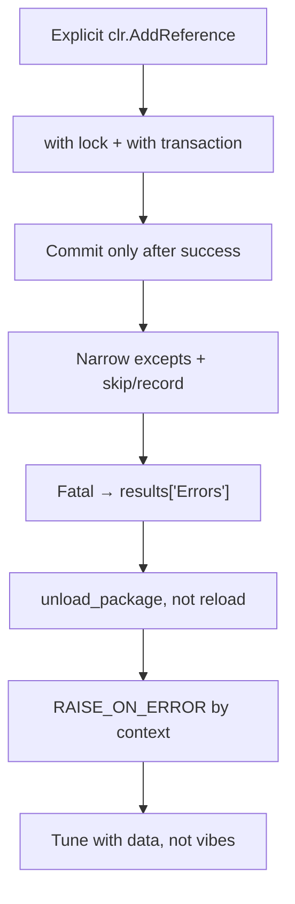

# Gotchas & Anti-patterns

!!! abstract "How to use this page"
    A field guide to the mistakes that bite Civil 3D automation developers — several
    found in our own example script. Each entry: **what it looks like**, **why it
    hurts**, and **what to do instead.** When you hit a baffling bug, scan this page
    first.

---

## Bare `except:` { #bare-except }

!!! bug "The single biggest time-sink in Civil 3D scripting"
    ```python
    try:
        do_something()
    except:              # ❌ catches EVERYTHING, including your own typos
        pass
    ```
    A bare `except:` swallows `KeyboardInterrupt`, `SystemExit`, and — worst of all —
    `NameError`/`AttributeError` from **your own bugs**. Classic symptom: *"nothing
    happens and there's no error."*

**Do instead:** catch `Exception` (or narrower), and record it.

```python
try:
    do_something()
except Exception as e:                       # ✅ narrow; lets fatal signals through
    warnings.append(f"do_something failed: {e.__class__.__name__}: {e}")
```

---

## Unreachable code after `return` { #unreachable-code }

!!! bug "Dead code left over from refactors"
    Our example script has an entire block **after** a `return` in
    `get_pressure_crossing_label_style_id` — Python never runs it.

**Do instead:** run a linter. `ruff` catches this instantly:

```bash
pip install ruff
ruff check your_script.py         # flags unreachable code, bare except, unused vars
```

---

## Broad `try/except` around a whole loop body { #broad-try-except }

!!! warning "You lose the 'which item failed?' information"
    ```python
    for item in items:
        try:
            step_a(item); step_b(item); step_c(item)   # ❌ which one broke?
        except Exception:
            warnings.append("something failed")         # useless message
    ```

**Do instead:** narrow the `try` to each fallible call, with a specific message that
includes the item's identity.

```python
for item in items:
    try:
        step_a(item)
    except Exception as e:
        skipped.append(f"{item.Name}: step_a failed: {e}")
        continue
```

!!! note "One outer try is still correct at the *top* level"
    The **node/module top-level** does wrap everything in a single try to populate
    `results["Errors"]`/`["Traceback"]`. That's the *fatal* boundary. Inside a batch
    loop, keep try/except **narrow and per-item**. Two different jobs.

---

## Not using the `with` form for lock + transaction { #with-form }

!!! bug "Manual try/finally + Dispose() is easy to get wrong"
    ```python
    lock = doc.LockDocument()
    tr = db.TransactionManager.StartTransaction()
    # ... work ...
    tr.Commit()
    tr.Dispose(); lock.Dispose()   # ❌ skipped entirely if an exception is thrown above
    ```
    If anything throws before the `Dispose()` lines, you **leak the lock** (drawing
    stays locked) and **leave a dangling transaction** — which can crash AutoCAD.

**Do instead:** use the **`with` (context-manager) form**. Both the lock and the
transaction are disposables; `with` guarantees `Dispose()` on exit, including on
exception, and rolls back an un-committed transaction automatically.

```python
with doc.LockDocument():                                  # 🔒 auto-released
    with db.TransactionManager.StartTransaction() as tr:  # 🧹 auto-disposed / rolled back
        # ... work ...
        tr.Commit()                                        # 🖊️ keep changes
```
([Autodesk — Lock/Unlock a Document (.NET)](https://help.autodesk.com/view/OARX/2025/ENU/?guid=GUID-D4E7A9B2-lock),
[Autodesk — Commit and Rollback Changes (.NET)](https://help.autodesk.com/view/OARX/2025/ENU/?guid=GUID-commit-rollback))

---

## Forgetting `tr.Commit()` { #forgetting-commit }

!!! danger "Your work vanishes — silently"
    With the `with` form, an un-committed transaction is **rolled back** on exit. That
    protects you from corruption but means: *forget `Commit()` and your changes just
    disappear, with no error.*

**Do instead:** call `tr.Commit()` as the **last** line inside the transaction block,
only after the work succeeded. For read-only scripts a commit is optional but harmless.

---

## Disposing the active document's Database { #with-database }

!!! danger "Never `with adoc.Database as db:` for the active document"
    ```python
    with adoc.Database as db:      # ❌ wrong for the ACTIVE document
        ...
    ```
    The active drawing's `Database` is owned by Civil 3D. Wrapping it in a `with`
    disposes it at block exit — corrupting the live document.

**Do instead:** grab it directly and never dispose it. Only the **lock** and the
**transaction** are yours to manage with `with`.

```python
doc = Application.DocumentManager.MdiActiveDocument
db  = doc.Database             # ✅ use directly; do not dispose
```

---

## Forgetting the document lock (Dynamo) { #forgetting-lock }

!!! danger "eLockViolation from a Dynamo node"
    Dynamo runs on a different thread than AutoCAD's command loop. Writing to the
    database without `doc.LockDocument()` throws `eLockViolation` — or corrupts data.

**Do instead:** wrap everything in `with doc.LockDocument():`. Read-only queries
sometimes work without it, but *"just lock it"* is the safe rule.

---

## Missing `clr.AddReference` (or relying on Dynamo's) { #missing-addreference }

!!! warning "Works today, `ImportError` tomorrow"
    Assuming an assembly is already loaded because it happened to be is fragile —
    another graph, a fresh session, or a different machine breaks the import.

**Do instead:** **explicitly** add every assembly you use, at the top of the node:

```python
clr.AddReference("AcMgd"); clr.AddReference("AcCoreMgd"); clr.AddReference("AcDbMgd")
clr.AddReference("AecBaseMgd"); clr.AddReference("AecPropDataMgd"); clr.AddReference("AeccDbMgd")
```

!!! tip "Prefer explicit imports over wildcards"
    `from Autodesk.Civil.DatabaseServices import Alignment, ProfileView` beats
    `import *` — it's clear what you depend on and it keeps autocomplete accurate.

---

## `importlib.reload` on a multi-file package { #reload-vs-unload }

!!! bug "'My fix didn't take effect' — you ran stale code"
    ```python
    import automations.profile_view_generator as mod
    importlib.reload(mod)          # ❌ reloads ONLY this module
    ```
    `reload` refreshes **one** module. If you edited a **helper** that
    `profile_view_generator` imports, the helper is still the cached old version — you
    run stale code and chase a bug you already fixed.

**Do instead:** drop **every** cached module under the package, then re-import:

```python
def unload_package(package_name):
    for name in list(sys.modules.keys()):
        if name == package_name or name.startswith(package_name + "."):
            del sys.modules[name]

importlib.invalidate_caches()
unload_package("automations")
mod = importlib.import_module("automations.profile_view_generator")
```

!!! tip "Echo the loaded path to confirm"
    Return `results["ModuleFile"] = getattr(mod, "__file__", None)` so the Watch node
    shows *which* file actually ran — catches wrong-`REPO`-path mistakes instantly.

---

## `RAISE_ON_ERROR` set wrong for the context { #raise-on-error }

!!! warning "Silent failures in dev, or scary crashes for end users"
    - `RAISE_ON_ERROR = False` **while developing** hides tracebacks behind a green
      node — you miss real bugs.
    - `RAISE_ON_ERROR = True` **in production/Player** turns a recoverable data issue
      into a red crash for the engineer.

**Do instead:** flip it by context.

```python
RAISE_ON_ERROR = True    # developing → fail loudly, see the traceback immediately
RAISE_ON_ERROR = False   # production / Dynamo Player → report via results["Errors"]
```

---

## Forgetting `AddNewlyCreatedDBObject` { #forgetting-addnewly }

!!! danger "Orphaned objects and commit-time corruption"
    Any object you create in code and add to the database must be **registered with
    the transaction**:

```python
pl_id = ms.AppendEntity(pl)
tr.AddNewlyCreatedDBObject(pl, True)         # ✅ always pair these two lines
```

---

## `out` parameters return nothing in Python { #out-params }

!!! danger "The 'it returned None and no error' trap"
    `Alignment.StationOffset`, `PointLocation`, and similar have `out double`
    parameters. Called the normal Python way they appear to return nothing — the
    answers went into boxes you didn't provide.

**Do instead:** pass dummy `0.0` values for each `out double` slot and unpack the
return tuple — e.g. `_, st, off = aln.StationOffset(x, y, st, off)` (Cookbook
recipe 5). `clr.Reference` is not available under pythonnet / CPython 3.
([Dynamo forum](https://forum.dynamobim.com/t/how-to-use-civil-3d-api-command-alignment-pointlocation-station-offset-easting-northing-with-python/82232))

---

## Get-modify-… forgetting the Set { #band-set }

!!! warning "'My band change didn't stick'"
    `pv.Bands.GetBottomBandItems()` returns a **copy**. Modifying it does nothing
    until you push it back with `SetBottomBandItems(...)`.

```python
items = pv.Bands.GetBottomBandItems()
# ...modify items...
pv.Bands.SetBottomBandItems(items)           # ✅ without this, nothing changes
```

---

## Assuming a single API path for label styles { #label-paths }

!!! warning "Works on your machine, fails on your colleague's"
    Label-style collection paths differ between Civil 3D versions and between
    gravity/pressure. Hard-coding one path is fragile.

**Do instead:** try a **priority-ordered list of candidate paths**
([Chunk D](walkthrough/d-styles.md#the-improved-pattern-path-list-resolution)).

---

## Duplicate-name exceptions { #duplicate-names }

!!! warning "Second run creates ' 1', ' 2' suffixes — or crashes"
    Civil 3D throws on duplicate alignment/view names.

**Do instead:** pre-populate an "existing names" set **and** retry creation on the
duplicate error (Cookbook recipe 6, and
[Chunk F step 3](walkthrough/f-profile-views.md#step-3--the-profile-view-with-duplicate-name-retry)).

---

## 2-D geometry ignoring Z { #2d-only }

!!! warning "Crossings that aren't really there"
    Plan-view intersection tests ignore elevation. A pipe crossing in plan but 3 m
    above the alignment is still flagged.

**Do instead:** if vertical clearance matters, add a Z-band check after the 2-D test
([Chunk E, step 4](walkthrough/e-crossing-detection.md#step-4--two-assumptions-you-must-never-forget)).

---

## One condition where you need three (the crossing bug) { #crossing-bug }

!!! bug "Parallel pipes leaking onto sections"
    Deciding "is this a crossing?" from intersection **alone** misclassifies pipes
    that run alongside the alignment. You need intersection **and** a meaningful
    **angle** **and** an **endpoint guard**.

**Do instead:** the three-question test in
[Chunk E, step 3](walkthrough/e-crossing-detection.md#the-better-approach-). And
**tune thresholds against logged data**, never by guessing.

---

## IronPython 2 vs CPython 3 mismatch { #engine-mismatch }

!!! warning "Copied code fails for no obvious reason"
    Syntax and some marshalling differ between the two engines. Code copied from an
    IronPython node into a CPython node (or vice-versa) can break subtly.

**Do instead:** confirm both nodes use the **same engine** before sharing code, and
standardise on CPython 3 for new work.

---

## The meta-lesson



!!! success "Trustworthy > clever"
    Most of these gotchas share one cure: **make failures visible.** A script that
    tells you exactly what went wrong — `Success`, `Errors`, `Traceback`, `Skipped`,
    `ModuleFile` — on which item, is worth ten clever scripts that fail silently.

See also: the [Cookbook](cookbook.md) for the correct patterns (including the
[`results` schema](cookbook.md#the-results-schema-read-this-once) and the
[loader node](cookbook.md#recipe-7--the-dynamo-loader-node-for-modular-development-in-cursor)),
and the [Glossary](glossary.md) for any unfamiliar term.
