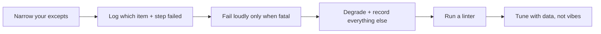

# Gotchas & Anti-patterns

!!! abstract "How to use this page"
    A field guide to the mistakes that bite Civil 3D automation developers — several
    of them found in our own example script. Each entry: **what it looks like**, **why
    it hurts**, and **what to do instead.** When you hit a baffling bug, scan this
    page first.

---

## Bare `except:` { #bare-except }

!!! bug "The single biggest time-sink in Civil 3D scripting"
    ```python
    try:
        do_something()
    except:              # ❌ catches EVERYTHING, including your own typos
        pass
    ```
    A bare `except:` swallows `KeyboardInterrupt`, `SystemExit`, and — worst of all —
    `NameError`/`AttributeError` from **your own bugs**. The classic symptom:
    *"nothing happens and there's no error."*

**Do instead:** catch `Exception` (or narrower), and when debugging, log it.

```python
try:
    do_something()
except Exception as e:                       # ✅ narrow; lets fatal signals through
    warnings.append(f"do_something failed: {e.__class__.__name__}: {e}")
```

---

## Unreachable code after `return` { #unreachable-code }

!!! bug "Dead code left over from refactors"
    Our example script has an entire block **after** a `return` in
    `get_pressure_crossing_label_style_id` — Python never runs it. It looks like a
    working fallback; it does nothing.

**Do instead:** run a linter. `ruff` catches this instantly:

```bash
pip install ruff
ruff check your_script.py         # flags unreachable code, bare except, unused vars
```

---

## Broad `try/except` around a whole loop body { #broad-try-except }

!!! warning "You lose the 'which item failed?' information"
    ```python
    for item in items:
        try:
            step_a(item); step_b(item); step_c(item)   # ❌ which one broke?
        except Exception:
            warnings.append("something failed")         # useless message
    ```

**Do instead:** narrow the `try` to each fallible call, with a specific message that
includes the item's identity.

```python
for item in items:
    try:
        step_a(item)
    except Exception as e:
        warnings.append(f"{item.Name}: step_a failed: {e}")
        continue
```

---

## Forgetting `tr.Commit()` { #forgetting-commit }

!!! danger "Your work vanishes — or AutoCAD crashes"
    An un-committed transaction discards everything, and dangling transactions can
    crash AutoCAD. There is no "partial save."

**Do instead:** commit on success, dispose in `finally`. Never leave a transaction
open across user interaction or another command.
([Autodesk .NET forum](https://forums.autodesk.com/t5/net-forum/transaction-best-practices/td-p/12537017))

---

## Forgetting the document lock (Dynamo) { #forgetting-lock }

!!! danger "eLockViolation from a Dynamo node"
    Dynamo runs on a different thread than AutoCAD's command loop. Writing to the
    database without `doc.LockDocument()` throws `eLockViolation` — or corrupts data.

**Do instead:** wrap everything in the lock (Cookbook recipe 1). Read-only queries
sometimes work without it, but *"just lock it"* is the safe rule.

---

## Forgetting `AddNewlyCreatedDBObject` { #forgetting-addnewly }

!!! danger "Orphaned objects and commit-time corruption"
    ```python
    pl = Polyline()
    ms.AppendEntity(pl)
    # ❌ missing: tr.AddNewlyCreatedDBObject(pl, True)
    ```
    Any object you create in code and add to the database must be **registered with
    the transaction**. Skip it and the object is orphaned.

**Do instead:**

```python
pl_id = ms.AppendEntity(pl)
tr.AddNewlyCreatedDBObject(pl, True)         # ✅ always pair these two lines
```

---

## `out` parameters return nothing in Python { #out-params }

!!! danger "The 'it returned None and no error' trap"
    `Alignment.StationOffset`, `PointLocation`, and similar have `out double`
    parameters. Called the normal Python way, they appear to return nothing — the
    answers went into boxes you didn't provide.

**Do instead:** pass `clr.Reference[System.Double](0.0)` boxes and read `.Value`
back (Cookbook recipe 5).
([Dynamo forum](https://forum.dynamobim.com/t/how-to-use-civil-3d-api-command-alignment-pointlocation-station-offset-easting-northing-with-python/82232))

---

## Get-modify-… forgetting the Set { #band-set }

!!! warning "'My band change didn't stick'"
    `pv.Bands.GetBottomBandItems()` returns a **copy**. Modifying it does nothing
    until you push it back with `SetBottomBandItems(...)`.

**Do instead:** always pair `Get...` with `Set...`.

```python
items = pv.Bands.GetBottomBandItems()
# ...modify items...
pv.Bands.SetBottomBandItems(items)           # ✅ without this, nothing changes
```

---

## Assuming a single API path for label styles { #label-paths }

!!! warning "Works on your machine, fails on your colleague's"
    Label-style collection paths differ between Civil 3D versions and between
    gravity/pressure. Hard-coding one path is fragile.

**Do instead:** try a **priority-ordered list of candidate paths**
([Chunk D](walkthrough/d-styles.md#the-improved-pattern-path-list-resolution)).

---

## Duplicate-name exceptions { #duplicate-names }

!!! warning "Second run creates ' 1', ' 2' suffixes — or crashes"
    Civil 3D throws on duplicate alignment/view names.

**Do instead:** pre-populate an "existing names" set **and** retry creation on the
duplicate error (Cookbook recipe 6, and
[Chunk F step 3](walkthrough/f-profile-views.md#step-3--the-profile-view-with-duplicate-name-retry)).

---

## 2-D geometry ignoring Z { #2d-only }

!!! warning "Crossings that aren't really there"
    Plan-view intersection tests ignore elevation. A pipe crossing in plan but 3 m
    above the alignment is still flagged.

**Do instead:** if vertical clearance matters, add a Z-band check after the 2-D test
([Chunk E, step 4](walkthrough/e-crossing-detection.md#step-4--two-assumptions-you-must-never-forget)).

---

## One condition where you need three (the crossing bug) { #crossing-bug }

!!! bug "Parallel pipes leaking onto sections"
    Deciding "is this a crossing?" from intersection **alone** misclassifies pipes
    that run alongside the alignment. You need intersection **and** a meaningful
    **angle** **and** an **endpoint guard**.

**Do instead:** the three-question test in
[Chunk E, step 3](walkthrough/e-crossing-detection.md#the-better-approach-). And
**tune thresholds against logged data**, never by guessing.

---

## IronPython 2 vs CPython 3 mismatch { #engine-mismatch }

!!! warning "Copied code fails for no obvious reason"
    Syntax and some marshalling differ between the two engines. Code copied from an
    IronPython node into a CPython node (or vice-versa) can break subtly.

**Do instead:** confirm both nodes use the **same engine** before sharing code, and
standardise on CPython 3 for new work.

---

## The meta-lesson



!!! success "Trustworthy > clever"
    Most of these gotchas share one cure: **make failures visible.** A script that
    tells you exactly what went wrong, on which item, is worth ten clever scripts
    that fail silently.

See also: the [Cookbook](cookbook.md) for the correct patterns, and the
[Glossary](glossary.md) for any unfamiliar term.
