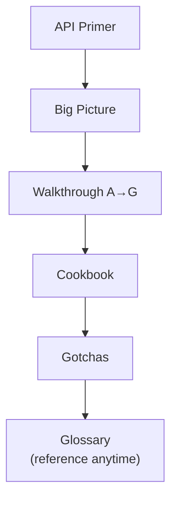

# Civil 3D Automation — Developer Training

!!! abstract "Why this site exists"
    This is the onboarding module for developers writing **Civil 3D automation**
    (Dynamo Python nodes and .NET scripts). It teaches the *nature of the tasks* we
    do — creating alignments, profiles, profile views, detecting utility crossings —
    by walking through a real example script, extracting the **reusable patterns**,
    and flagging the **mistakes to avoid**. You'll leave able to read, write, and
    debug this kind of code with confidence.

-   :material-school:{ .lg .middle } **Start with the concepts**

    ---

    New to the Civil 3D .NET API? Read the primer first — Document, ObjectId,
    Transaction, and friends, explained with everyday analogies.

    [:octicons-arrow-right-24: API Primer](getting-started/civil3d-api-primer.md)

-   :material-map:{ .lg .middle } **Walk the code**

    ---

    A chunk-by-chunk tour of a real Profile View generator, from imports to the
    main transaction loop.

    [:octicons-arrow-right-24: The Walkthrough](walkthrough/a-imports.md)

-   :material-toolbox:{ .lg .middle } **Grab the patterns**

    ---

    Copy-paste building blocks: the lock/transaction skeleton, safe input readers,
    style fallbacks, `out`-parameter calls, and more.

    [:octicons-arrow-right-24: Cookbook](cookbook.md)

---

## How to read these docs

We use coloured **admonition boxes** with a consistent meaning. Learn them once:

!!! note "note — a concept"
    Explains an idea or clarifies how something works.

!!! tip "tip — do this"
    A recommended practice worth adopting.

!!! warning "warning — be careful"
    An assumption or edge case that will surprise you if ignored.

!!! danger "danger — this will bite you"
    A mistake that causes crashes, data loss, or silent wrong answers.

!!! bug "bug — a real mistake we learned from"
    An actual defect in the example code, kept as a teaching moment (not to copy).

!!! success "success — why a fix works"
    Explains the reasoning behind a recommended solution.

---

## A note on the example script

The script we dissect is **illustrative, not gold-standard**. It's a genuine,
working Profile View generator — which makes it perfect for learning — but parts of
it are weak or buggy. Throughout these docs we **keep the good patterns, replace
the weak ones, and add better approaches** where they exist. When you see a
`!!! bug` box, that's us turning a real defect into a lesson.

---

## Suggested reading order

New developers: go top to bottom. Experienced devs: jump straight to the
[Cookbook](cookbook.md) and [Gotchas](gotchas.md).
