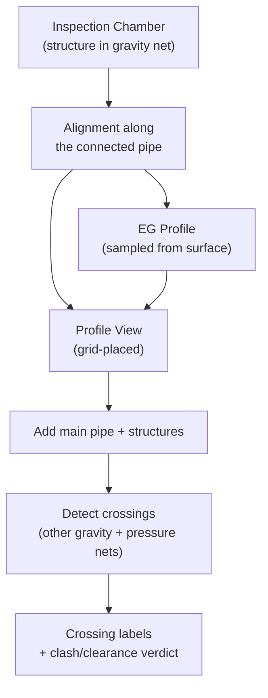
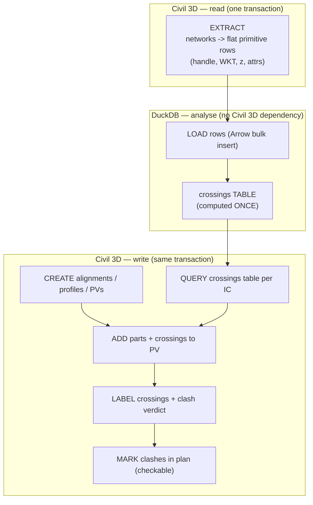

# Major Project — IC → Profile Views with Crossing Detection

!!! abstract "What this section is"
    A complete, production-grade automation built the way the foundation section
    taught: a **loader node + `run(context)` module**, a **category-split helper
    library**, and a **DuckDB analysis core**. We take a real, messy problem —
    generating a Profile View for every Inspection Chamber in a gravity network,
    with all crossing utilities detected and labelled — and build it end to end,
    stage by stage, each stage runnable on its own.

    This is the capstone. It assumes you've internalised the
    [cookbook](../cookbook.md): the `results` schema, the `with`-form
    lock/transaction, the loader/module split, safe input readers, style
    fallback, and the verified out-parameter convention.

---

## The problem, in one paragraph

For every **Inspection Chamber (IC)** in a named gravity pipe network, produce a
**Profile View** that shows the pipe run through that IC, the existing-ground
profile, and **every other utility that crosses it** — gravity *and* pressure —
each annotated with a crossing label. Do it for hundreds of ICs, unattended, and
produce results an engineer can **check**, not just trust.



---

## Why this is a *major* project and not another recipe

Three things make it hard, and each maps to a section stage:

1. **Geometry that must be correct, at scale.** "Which pipes cross this
   alignment?" is a spatial question asked hundreds of times. Get the geometry
   subtly wrong and you get *plausible but false* results — the worst kind,
   because they pass a glance and fail an audit.
2. **A large, uneven API surface.** Alignments, profiles, profile views, band
   sets, profile-view *parts*, and two families of crossing labels — each with
   its own creation sequence, style collection, and overload quirks.
3. **Deliverables an engineer can verify.** A profile view full of labels is
   only useful if you can trust it. We add a **clash/clearance verdict** and a
   **plan-view marker** so results are checkable in two independent views.

---

## We stand on a working reference — and improve it deliberately

This project is *motivated by* three working Dynamo scripts (`ic_to_mh_profile`,
`ic_to_mh_profile_with_crossings`, and a crossing-labels script). They run. They
also — by the author's own account and ours — **produce inconsistent, inaccurate
crossing results**. That is not a tuning problem; it is an architectural one, and
naming it precisely is the whole point of this section.

!!! danger "The reference's core flaw: iterating over the whole crossing network per IC"
    The reference iterates over the whole crossing network per IC. This is inefficient and prone to errors.
    It also does not handle the case where the same alignment is used for multiple IC's. 
    This is a major flaw and it is the root cause of the "inconsistent results" problem.
    The angle of intersection is not considered, so glancing/near-parallel "crossings" are not detected.
    The z at the crossing is not resolved, so clash vs. clearance is not classified.
    This is a major flaw and it is the root cause of the "inconsistent results" problem.

!!! success "Our fix, previewed"
    We test each pipe against **every segment of the alignment's real polyline**,
    add an **angle guard** (reject glancing/near-parallel "crossings"), **exclude
    pipes that merely share a structure**, and resolve a **z at the crossing** to
    classify clash vs. clearance. We compute this **once** into a DuckDB table and
    **query** it per-IC — instead of re-scanning every network inside every IC
    loop. Correct geometry, set-based scale, checkable output.

We keep what the reference got *right* — the creation sequences
(`PolylineOptions → Alignment.Create → Profile.CreateFromSurface →
ProfileView.Create`), the grid layout, the station→ratio math for pressure
labels — and cite it where we reuse it. We replace what it got *wrong*, and we
say why.

!!! note "A word on the reference's 2000-line label file"
    The crossing-label reference is ~2,000 lines and ~56 functions, many of them
    enumerating **every** style collection and trying **every** `Create` overload
    until one works. That is *working by exhaustion* — the mark of fighting an API
    you haven't pinned down. A recurring goal of this section is to replace that
    guesswork with **verified, documented** style paths and overloads, so the
    equivalent logic is a few hundred lines you can actually reason about.

---

## The architecture: three phases, one DuckDB spine



!!! success "The one idea that makes it scale *and* be correct"
    **Compute crossings once, store them as a DuckDB table, then query.** The
    reference recomputes crossings inside every IC loop — `O(ICs × networks ×
    pipes)`. We extract all geometry once, run one spatial pass, and each IC just
    runs a `SELECT ... WHERE alignment = ?`. Correct geometry lives in *one* place,
    and adding a new check (slope, cover, clearance) is one more SQL query, not
    another nested loop.

The boundary contract is the same one from the DuckDB cookbook recipe: **only
primitives cross the Civil 3D ↔ DuckDB boundary** — handles (hex strings),
2D WKT geometry, and z as attribute columns. Live Civil 3D objects never leave
the extract step; the analysis hands back **handles + a verdict**, which the
write phase re-resolves.

---

## Module layout (category-split, public helpers)

The foundation used one `_helpers`. At this scale that becomes a junk drawer, so
we split by concern. Helper functions are **public** (no leading underscore) —
they're a real library other automations import.

```text
automations/
├─ helpers_core.py         # input readers, name normalise, unique names, layers, styles
├─ helpers_geometry.py     # points, out-params (station_offset, point_location), WKT, per-segment tests
├─ helpers_network.py      # pipe/structure extraction -> flat rows
├─ helpers_alignment.py    # alignment + surface profile creation
├─ helpers_profileview.py  # profile view creation, grid layout, add parts
├─ helpers_labels.py       # crossing label creation (verified overloads + station->ratio)
├─ duckdb_engine.py        # load, crossings table, per-alignment queries
└─ project_ic_profiles.py  # run(context) orchestrator — the node loads THIS
```

!!! tip "Why split now and not earlier"
    A single helper file is fine for exercises. For a project with alignment,
    profile-view, and label concerns each carrying their own API baggage, one file
    would be 1,500 lines and every reload would re-import all of it. Splitting by
    concern keeps each file readable, lets a change to labels not touch geometry,
    and makes the dependency of each stage explicit.

---

## What each stage delivers

| Stage | Page | You end with |
|---|---|---|
| 0 · Overview | *this page* | The architecture and the reference contrast |
| 1 · Domain primer | 01 | A mental model of ICs, networks, profiles, crossings |
| 2 · Extraction | 02 | `helpers_network` + rows loaded into DuckDB |
| 3 · Crossing detection | 03 | The verified crossings **table** + clash verdict |
| 4 · Alignment + profile | 04 | `helpers_alignment`, one alignment + EG profile |
| 5 · Profile view + grid | 05 | `helpers_profileview`, a placed, banded PV |
| 6 · Add parts & crossings | 06 | Main pipe + crossing utilities drawn in the PV |
| 7 · Crossing labels | 07 | Verified label creation, guesswork removed |
| 8 · Orchestrator | 08 | `project_ic_profiles.run(context)` — the whole thing |
| 9 · Limits & verification | 09 | Known caveats, first-run probe, how to check results |

!!! note "Each stage is runnable"
    Like the foundation exercises, you can stop after any stage and run what you
    have through the loader node. Stage 3 alone is a useful crossing-audit tool;
    stage 5 alone generates empty profile views. You don't have to reach stage 8
    to get value.

---

## Before you start

- [ ] Foundation section complete — you're comfortable with the loader/module split.
- [ ] A **scratch DWG** with: a named gravity network with several ICs, at least
      one *other* gravity network and one *pressure* network that cross it, and a
      surface for the EG profile.
- [ ] Alignment, profile, profile-view, band-set, and crossing-label **styles**
      present in the drawing (they come from the template, not your code).
- [ ] `pyarrow` available in the Dynamo CPython3 environment (for fast DuckDB load).

!!! warning "Scratch DWG, always"
    This project *writes* extensively — new alignments, profiles, profile views,
    and labels. Develop on a throwaway copy with a clean baseline you can revert
    to. A bug here creates dozens of objects.

Next: **[Domain primer](01-domain-primer.md)** — the Civil 3D concepts this
project manipulates, for developers who are strong in Python but new to the
pipe-network and profile-view domain.
