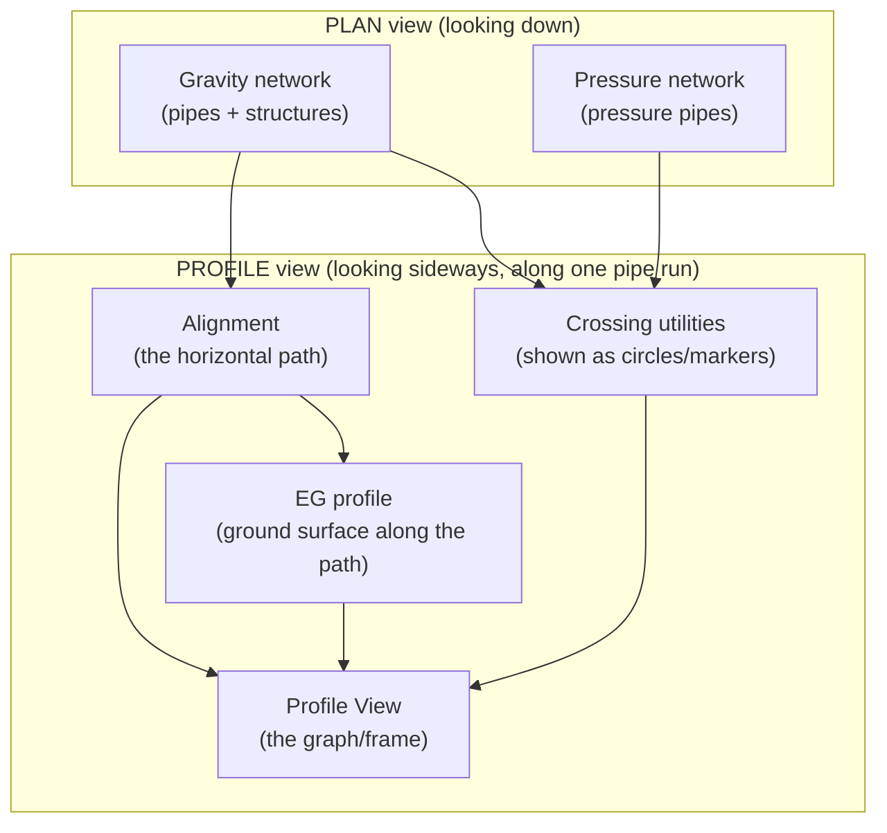
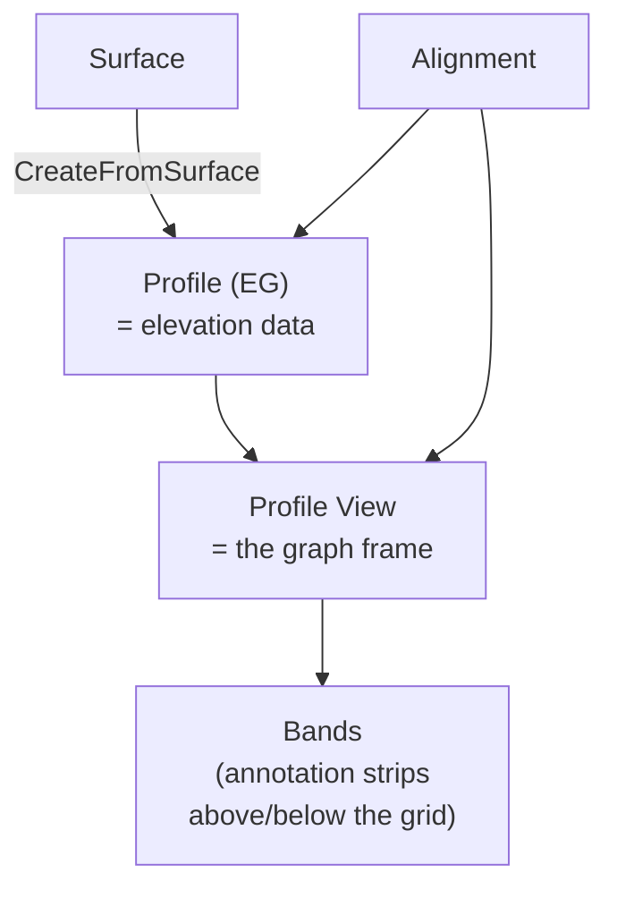

# Domain Primer — the Civil 3D concepts this project touches

!!! abstract "Why this page exists"
    You can be an excellent Python engineer and still get this project wrong,
    because the *hard* part isn't the code — it's knowing what an "IC," a "profile
    view," or a "crossing" actually **is** in Civil 3D, and how those concepts map
    to API objects. This page builds that mental model. If you already design
    drainage in Civil 3D, skim the API-mapping tables and move on.

---

## The domain in one picture

The whole project is a translation: take objects that live in **plan** (networks
of pipes) and produce a **profile** (a sideways slice along one pipe run) that
also shows everything crossing that slice.

---

## Pipe networks: pipes and structures

A **gravity pipe network** is Civil 3D's model of a sewer/drainage system. It has
two kinds of part:

- **Pipes** — the conduits. Each has a start point, an end point, a diameter, a
  slope, and (usually) a start and end **structure**.
- **Structures** — the nodes: manholes, inlets, and **Inspection Chambers (ICs)**.
  Each has a position, a rim (top) elevation and a sump (bottom) elevation.

An **Inspection Chamber** is just a *structure* of a particular part family — a
small access chamber on a drainage run. In the API it's a `Structure`; "IC" is a
naming/part-type convention, not a distinct class.

| Domain term | Civil 3D API | Key members (verify on your build) |
|---|---|---|
| Gravity network | `Network` | `GetPipeIds()`, `GetStructureIds()` |
| Pipe | `Pipe` | `StartPoint`, `EndPoint`, `InnerDiameterOrWidth`, `Slope`, `StartStructureId`, `EndStructureId` |
| Structure / IC | `Structure` | `Position`, `RimElevation`, `SumpElevation`, `PartType` |
| Pressure network | `PressureNetwork` (`PressurePipe`) | separate API family — see below |

!!! danger "Gravity and pressure are *different API families*"
    Gravity pipes (`Autodesk.Civil.DatabaseServices.Pipe`) and pressure pipes
    (`PressurePipe`) are **not** the same type and don't share a base you can
    treat uniformly. The reference code has *separate* code paths for each, and so
    will we. When we say "detect crossings from gravity **and** pressure networks,"
    that's two extraction passes and two label types — not one loop.

---

## Alignment: the horizontal path

An **alignment** is a horizontal route — a 2D path with a stationing system
("chainage"). Roads have alignments; so does any linear feature you want to
profile. For this project, **each pipe run gets its own alignment** built along
the pipe's centreline, so we can generate a profile view for it.

The critical property for us: an alignment has **stations** (distance along the
path from its start) and **offsets** (perpendicular distance from the path). The
`StationOffset` method converts a world `(x, y)` into `(station, offset)` — this
is how we find *where along the profile* a crossing pipe should be labelled.

!!! note "An alignment is a polyline, not a line"
    This is the single most important fact for correct crossing detection. An
    alignment is a sequence of **tangents and curves**. Its true shape is a
    *polyline*, retrievable via `alignment.GetPolyline()`. Testing geometry against
    the start→end straight line (as the reference does) throws that shape away. We
    use the real polyline, segment by segment. Hold onto this — it returns in
    stage 3.

---

## Profile and profile view: the sideways slice

Two concepts people conflate:

- A **Profile** is *data* — an elevation series along an alignment. The **EG
  (Existing Ground) profile** is sampled from a surface: "what's the ground
  elevation at each station along this path?" Created with
  `Profile.CreateFromSurface(...)`.
- A **Profile View** is the *drawing* — the graph/frame that displays profiles: a
  gridded box with stations across the bottom and elevations up the side, placed
  somewhere in model space. Created with `ProfileView.Create(...)`.

| Domain term | Civil 3D API | Created by |
|---|---|---|
| EG profile (data) | `Profile` | `Profile.CreateFromSurface(name, alnId, surfaceId, layer, style, labelSet)` |
| Profile view (frame) | `ProfileView` | `ProfileView.Create(alnId, insertPoint, name, bandSetId, styleId)` |
| Bands (annotation) | band set on the PV | `pv.Bands` / band-set style |

!!! tip "Why we place profile views on a grid"
    Hundreds of ICs means hundreds of profile views. Dropped at the same point
    they'd stack on top of each other. So we **lay them out on a grid** in model
    space (stage 5), each offset from the last — exactly what the reference's
    `next_grid_position` does, and one of the parts we keep.

---

## Profile-view parts: pipes *inside* the view

Here's a subtlety that trips everyone. When you "add a pipe to a profile view,"
Civil 3D doesn't move the pipe — it creates a **profile-view part**: a *wrapper*
object that represents the pipe **as drawn inside that specific profile view**.
The same physical pipe can appear in many profile views, each via its own
wrapper.

This matters because **crossing labels attach to the wrapper, not the pipe**. A
lot of the reference's complexity (`build_dynamic_ref_map`,
`get_wrapper_candidates_for_pv`, `resolve_wrapper_id_for_crossing`) is machinery
to find "which wrapper in this PV corresponds to this crossing pipe." We'll meet
this problem head-on in stages 6–7 and handle it cleanly.

!!! danger "Pipe ≠ its profile-view representation"
    Adding a pipe to a PV (`part.AddToProfileView(pvId)`) and *labelling* it are
    two steps against two different objects: the pipe/structure (the source) and
    the profile-view part (the wrapper). Confusing them is the source of most
    "label failed" errors in the reference.

---

## Crossings: the heart of the project

A **crossing** is another utility (gravity or pressure pipe) that passes over or
under the pipe run this profile view represents. In the profile view it appears
as a marker at the station where it crosses, ideally annotated with its size,
type, and elevation.

Two questions define a crossing, and the reference only asks the first:

1. **Does it cross in plan?** Does the other pipe's centreline intersect this
   alignment's path (the *real* polyline)?
2. **Is it a clash or does it clear?** At the crossing point, what's the vertical
   gap between the two pipes? Touching/overlapping = **clash**; adequate gap =
   **clearance**.

!!! success "We answer both — and make both checkable"
    The reference answers only Q1, with a broken geometry model. We answer Q1
    correctly (per-segment, angle-guarded, shared-structure-excluded) **and** Q2
    (interpolated z → clash/clearance verdict), then surface the verdict as both a
    **profile-view label** and a **plan-view marker** so an engineer can check the
    result in two independent views.

| Crossing concept | Where it shows | API |
|---|---|---|
| Gravity crossing marker | in the PV | add pipe as PV part, then `CrossingPipeProfileLabel` |
| Pressure crossing marker | in the PV | add pressure pipe as PV part, then `CrossingPressurePipeProfileLabel` |
| Station of crossing | drives label placement | `alignment.StationOffset(x, y)` at the crossing XY |
| Clash verdict (ours) | PV label text + plan marker | computed in DuckDB from interpolated z |

---

## The vocabulary you'll see in code

| Term | Means |
|---|---|
| **IC** | Inspection Chamber — a `Structure` in the gravity network |
| **EG** | Existing Ground — the surface-sampled profile |
| **PV** | Profile View — the graph frame |
| **PV part / wrapper** | a pipe/structure *as drawn inside* a PV |
| **station** | distance along an alignment |
| **offset** | perpendicular distance from an alignment |
| **ratio** | station normalised to `[0,1]` — some label overloads want this |
| **clash / clearance** | crossing with insufficient / adequate vertical gap |

!!! note "Keep this page open for the first few stages"
    The code stages assume these terms. When a function is called
    `add_parts_to_profile_view` or `station_to_ratio`, this page tells you what the
    words mean in Civil 3D — and why the step exists.

Next: **[Extraction](02-extraction.md)** — turning networks into flat rows and
loading them into DuckDB, building the reusable `helpers_network` module.
