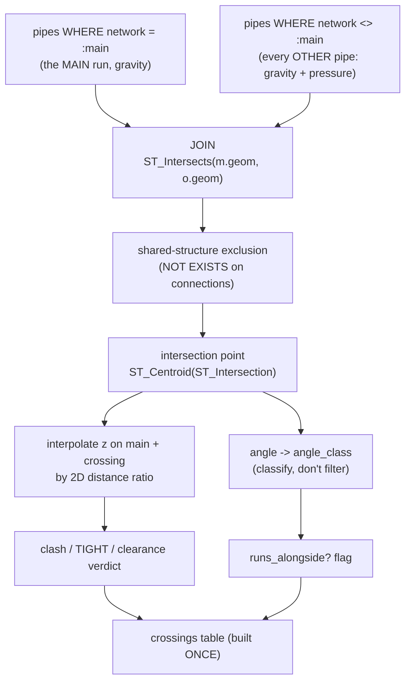

# Stage 3 — Crossing detection, done right

!!! abstract "Goal of this stage"
    Produce one authoritative **`crossings` table** in DuckDB: every pair of pipes
    from *different* networks that intersects in plan, each row carrying a **plan
    intersection point**, an **interpolated z on both pipes**, a **clash /
    clearance verdict**, and an **angle class** — computed **once** so every later
    stage just *queries* it per IC.

    This is the accuracy centrepiece. The value here is not "better plan geometry"
    (as we'll see, the reference's plan test is already exact for its case). The
    value is **semantics and structure**: angle *classification* instead of a
    silent filter, shared-structure exclusion, z/clash awareness, and compute-once
    query-many.

---

## What the reference actually does — and where it's genuinely weak

It's tempting to claim our detection is "more geometrically accurate." Read the
reference first; that claim is **false**, and saying so keeps us honest.

The reference (`v2`) builds one alignment per pipe run from the run's two end
structures — a **two-vertex seed polyline** (`sp → ep`), then tests each candidate
pipe against that single straight segment:

```python
# v2 reference — is_pipe_crossing(): both operands are straight 2-point segments
if not segments_intersect_2d(aln_sp.X, aln_sp.Y, aln_ep.X, aln_ep.Y,
                             sp.X, sp.Y, ep.X, ep.Y):
    return False
```

The author even notes it explicitly: *"sp/ep are the alignment start/end points —
used directly in the 2-D segment intersection test (no `GetPolyline()` needed)."*

!!! success "Correction — there is no bend/curve bug"
    An earlier draft of this page claimed the reference "collapses a curved
    alignment to its chord and misses crossings at bends." **That was wrong, and
    we're retracting it.** The reference's alignment is a *single straight segment*
    (one pipe run, two vertices), and a pipe is also a straight two-point segment.
    Segment-vs-segment intersection is **exact** here — there is no curve to
    approximate and no chord error. We won't invent a flaw to justify a technique.

So where is the reference genuinely weak? Four places — none of them the plan
intersection itself:

| # | Real weakness (from the code) | Consequence | Our upgrade |
|---|---|---|---|
| 1 | **Angle handling is a filter.** The "alongside" guard drops a pipe only if *both* endpoints sit within `tol` of the alignment; there's no angle test at all, and where an angle idea exists downstream it just `continue`s below 20°. | Glancing/near-parallel crossings vanish with (at best) a Skipped note — a real oblique clash can be dropped. | **Classify, don't filter.** Every crossing kept, tagged `PERPENDICULAR / OBLIQUE / NEAR_PARALLEL`. |
| 2 | **No shared-structure exclusion.** A pipe meeting the run at its own start/end IC intersects there and is reported as a "crossing." | False positives at every junction structure. | `NOT EXISTS` on the `connections` edge list. |
| 3 | **Purely 2D — no z.** `segments_intersect_2d` ignores Z entirely. | Lists crossings; can't say clash vs. clearance. | Interpolate z on both pipes → clash verdict. |
| 4 | **Recomputes inside the per-IC loop.** The whole crossing scan is nested per IC. | `O(ICs × networks × pipes)` re-scan. | Compute the table **once**, query per IC. |

!!! note "One honest geometric edge (scope, not bug)"
    The reference only ever builds **single-pipe** alignments, so its straight-chord
    test is always exact. *If* a run ever spanned multiple pipes, a single `sp→ep`
    chord would skip the intermediate vertices. Our per-pipe approach (option A —
    each main pipe is its own row) handles multi-segment runs naturally, because we
    never collapse a run to a chord in the first place. That's a **generalisation**,
    not a correctness fix.

---

## Extracting pressure networks (the second crossing source)

Stage 2 extracted gravity networks. Pressure pipes are a **separate, optional API
family**: the `AeccPressurePipesMgd` assembly is present only when the Pressure
Pipes module is installed, and pressure networks are enumerated through an
**extension**, not a method on `civdoc`.

!!! danger "The real pressure API — three things people get wrong"
    1. **The assembly is optional.** `clr.AddReference("AeccPressurePipesMgd")` can
       fail. Guard everything pressure behind a `HAS_PRESSURE` flag; degrade with a
       warning, don't crash.
    2. **Enumeration is an *extension static method*, not `civdoc.Something()`.**
       The correct call is
       `CivilDocumentPressurePipesExtension.GetPressurePipeNetworkIds(civdoc)` —
       the extension takes `civdoc` as an argument. There is **no**
       `civdoc.GetPressurePipeNetworkIds()`; that spelling does not exist.
    3. **The import itself must be guarded** — only import
       `CivilDocumentPressurePipesExtension` *after* the `AddReference` succeeds.

```python
# top of the loader/module — assembly guard (verified pattern from the reference)
import clr
try:
    clr.AddReference("AeccPressurePipesMgd")
    from Autodesk.Civil.ApplicationServices import CivilDocumentPressurePipesExtension
    HAS_PRESSURE = True
except Exception:
    HAS_PRESSURE = False
    CivilDocumentPressurePipesExtension = None
```

```python
# helpers_network.py — enumerate + extract pressure networks
def get_pressure_network_ids(civdoc, warnings):
    """All pressure-network ObjectIds via the extension static method.
    Returns [] (with a warning) if the pressure module isn't installed."""
    if not HAS_PRESSURE:
        warnings.append("AeccPressurePipesMgd not available; skipping pressure networks.")
        return []
    try:
        return list(CivilDocumentPressurePipesExtension.GetPressurePipeNetworkIds(civdoc))
    except Exception as e:
        warnings.append(f"Could not enumerate pressure networks: {e}")
        return []


def extract_pressure_pipes(tr, pnet, network_name, missing, skipped):
    """Flatten a PressureNetwork's pipes into the SAME row shape as gravity
    pipes, tagged role='pressure_cross'. Pressure pipes carry no start/end
    structures in our model, so those handles stay None."""
    rows = []
    for pid in pnet.GetPipeIds():
        try:
            p = tr.GetObject(pid, OpenMode.ForRead)
            sx, sy, sz = pt_xyz(get_member(p, "StartPoint", missing=missing))
            ex, ey, ez = pt_xyz(get_member(p, "EndPoint", missing=missing))
            dia = get_member(p, "InnerDiameter", float, None, missing)
            if dia is None:
                dia = get_member(p, "OuterDiameter", float, None, missing)
            rows.append({
                "handle": p.Handle.ToString(),
                "name": get_member(p, "Name", str, None, missing),
                "network": network_name, "role": "pressure_cross",
                "start_handle": None, "end_handle": None,
                "start_x": sx, "start_y": sy, "start_z": sz,
                "end_x": ex, "end_y": ey, "end_z": ez,
                "diameter": dia, "slope": None,
                "wkt": wkt_line(sx, sy, ex, ey),
            })
        except Exception as e:
            skipped.append({"pressure_pipe": str(pid), "reason": str(e)})
    return rows
```

!!! note "Same row shape, `role='pressure_cross'`"
    Pressure rows land in the **same `pipes` table** as gravity rows — same
    columns, `slope=None`, no structure handles — distinguished only by
    `role='pressure_cross'`. One table, one geometry set, one scan. If
    `HAS_PRESSURE` is false, the table simply contains no pressure rows and the
    crossing scan finds no pressure crossings (with a warning telling you why).

---

## The detection model — anchored to the main network

Two decisions define the model, and getting either wrong is a silent
false-negative:

**We detect crossings *of the main network*, not between every pair of
networks.** This project profiles one named gravity network and asks "what
crosses *it*?" A crossing between two *other* networks (say GN3 × GN4) will never
appear in any profile view we generate — it's noise. So the join is **anchored**:
one side is always the main network (a bound parameter), the other is everything
else.

**"Everything else" includes pressure pipes.** Gravity (`Pipe`) and pressure
(`PressurePipe`) are separate API families. Under **model A** we load both into
**one `pipes` table**, distinguished by the existing **`role` column**
(`'main'` / `'gravity_cross'` / `'pressure_cross'`) — no extra `kind` column
needed. A single spatial scan sees both, and the label stage (Stage 7) reads
`role` to pick the right label type. If pressure rows aren't in the table,
pressure crossings are simply never found.



!!! danger "Retracted from earlier drafts — two corrections"
    1. **No densified polyline / `alignments` table.** Pipes are two-vertex straight
       segments; `ST_Intersects` on the real `LINESTRING` is exact. There is nothing
       to densify, and detection needs no *created* alignment (that's a Stage-4
       write concern).
    2. **No symmetric all-network self-join.** The earlier `a.network <> b.network
       AND a.handle < b.handle` found crossings between *every* pair of networks and
       excluded pressure entirely. Both were wrong. The join is now **main-anchored**
       (`m.network = :main`, `o.network <> :main`) over a **gravity + pressure**
       table.

- **`m` = main, `o` = other** — the pair is directional by construction. No
  `a.handle < b.handle` dedup is needed (main is always `m`), and `m`/`o` tells
  the label stage which side is the *subject* pipe and which is the *crossing*
  utility — directionality a symmetric join would have thrown away.
- **`ST_Intersects` on the real pipe `LINESTRING`s** — exact for straight
  segments; no chord, no approximation.

!!! warning "Guard the main-network name — the quiet failure mode"
    `WHERE m.network = :main` means a **misspelled or empty** main name yields zero
    `m` rows → zero crossings → a result that looks like "no crossings found." That
    is the dangerous silent false-negative. **Check the main network exists before
    scanning** and warn loudly if not (shown below). This — not a redundant
    `o.network <> :main` clause — is the real guard. (`o.network <> :main` in the
    `WHERE` would be logically redundant with the join's `o.network <> m.network`
    once `m.network` is pinned; verified equal in the sandbox.)

---

## `crossings()` — one query, main-anchored, nothing dropped

Upgrades the foundation `_duckdb_engine.crossings()`: **main-anchored** join over a
**gravity + pressure** `pipes` table (model A, existing `role` column), `angle_class`
**instead of a filter**, a `runs_alongside` flag, directional `main`/`cross`
columns, and a precondition guard on the main-network name. The main network name,
clash clearance, and alongside tolerance are **bound / injected parameters**.

```python
# duckdb_engine.py — main-anchored crossing detection (model A)
_CROSSINGS_SQL = """
WITH cand AS (
  SELECT m.handle AS main_handle, m.name AS main_name, m.network AS main_net,
         m.diameter AS main_dia,
         o.handle AS cross_handle, o.name AS cross_name, o.network AS cross_net,
         o.role   AS cross_kind,                 -- 'gravity_cross' | 'pressure_cross'
         o.diameter AS cross_dia,
         m.start_x AS mx1, m.start_y AS my1, m.start_z AS mz1,
         m.end_x   AS mx2, m.end_y   AS my2, m.end_z   AS mz2,
         o.start_x AS ox1, o.start_y AS oy1, o.start_z AS oz1,
         o.end_x   AS ox2, o.end_y   AS oy2, o.end_z   AS oz2,
         ST_Centroid(ST_Intersection(m.geom, o.geom)) AS ipt
  FROM pipes m
  JOIN pipes o
    ON o.network <> m.network                    -- other networks only (excl. main-vs-main)
   AND ST_Intersects(m.geom, o.geom)
  WHERE m.network = $main                         -- ANCHOR: main network (bound param)
    AND NOT EXISTS (                               -- shared-structure exclusion
        SELECT 1 FROM connections cm JOIN connections co
          ON cm.structure_handle = co.structure_handle
        WHERE cm.pipe_handle = m.handle AND co.pipe_handle = o.handle)
),
xy AS (SELECT *, ST_X(ipt) AS cross_x, ST_Y(ipt) AS cross_y, ipt AS geom FROM cand),
interp AS (                                        -- z on each pipe by 2D distance ratio
  SELECT *,
    CASE WHEN sqrt((mx2-mx1)*(mx2-mx1)+(my2-my1)*(my2-my1))=0 THEN 0
         ELSE sqrt((cross_x-mx1)*(cross_x-mx1)+(cross_y-my1)*(cross_y-my1))
            / sqrt((mx2-mx1)*(mx2-mx1)+(my2-my1)*(my2-my1)) END AS tm,
    CASE WHEN sqrt((ox2-ox1)*(ox2-ox1)+(oy2-oy1)*(oy2-oy1))=0 THEN 0
         ELSE sqrt((cross_x-ox1)*(cross_x-ox1)+(cross_y-oy1)*(cross_y-oy1))
            / sqrt((ox2-ox1)*(ox2-ox1)+(oy2-oy1)*(oy2-oy1)) END AS to_
  FROM xy
),
geo AS (                                           -- angle computed, not filtered
  SELECT *,
    mz1 + tm*(mz2-mz1) AS main_z,
    oz1 + to_*(oz2-oz1) AS cross_z,
    degrees(acos(least(1.0, greatest(-1.0, abs(
        ((mx2-mx1)*(ox2-ox1) + (my2-my1)*(oy2-oy1))
      / (sqrt((mx2-mx1)*(mx2-mx1)+(my2-my1)*(my2-my1))
       * sqrt((ox2-ox1)*(ox2-ox1)+(oy2-oy1)*(oy2-oy1))))
    )))) AS angle_deg
  FROM interp
)
SELECT main_handle, main_name, main_net, main_dia,
       cross_handle, cross_name, cross_net, cross_kind, cross_dia,
       cross_x, cross_y, main_z, cross_z,
       abs(main_z - cross_z) AS dz,
       angle_deg,
       CASE WHEN angle_deg >= 60 THEN 'PERPENDICULAR'
            WHEN angle_deg >= {min_oblique} THEN 'OBLIQUE'
            ELSE 'NEAR_PARALLEL' END AS angle_class,
       -- runs_alongside: NEAR_PARALLEL AND intersection mid-span on BOTH pipes
       -- (both distance-ratios strictly interior) => parallel neighbour, not a cross
       (angle_deg < {min_oblique}
         AND tm > {edge} AND tm < 1-{edge}
         AND to_ > {edge} AND to_ < 1-{edge}) AS runs_alongside,
       CASE WHEN abs(main_z - cross_z) - (main_dia + cross_dia)/2.0 <= 0 THEN 'CLASH'
            WHEN abs(main_z - cross_z) - (main_dia + cross_dia)/2.0 <  {clear} THEN 'TIGHT'
            ELSE 'CLEAR' END AS verdict,
       -- geom column for the intersection point
       geom
FROM geo
ORDER BY verdict, dz
"""


def main_network_exists(con, main_network):
    row = con.execute("SELECT count(*) FROM pipes WHERE network = ?",
                      [main_network]).fetchone()
    return row[0] > 0


def build_crossings(con, main_network, min_oblique=20.0, clearance=0.30,
                    alongside_edge=0.05):
    """Build the crossings table for ONE main gravity network. Raises if the
    named network has no gravity pipes -- the silent-empty guard."""
    if not main_network:
        raise ValueError("main_network name is required (IN[0]).")
    if not main_network_exists(con, main_network):
        raise ValueError(f"Main network {main_network!r} not found among gravity "
                         f"pipes -- check the name; a wrong name yields 0 crossings.")
    sql = _CROSSINGS_SQL.format(min_oblique=min_oblique, clear=clearance,
                                edge=alongside_edge)
    con.execute(f"CREATE OR REPLACE TABLE crossings AS ({sql})", {"main": main_network})
    return con.execute("SELECT count(*) FROM crossings").fetchone()[0]
```

!!! note "`role` carries the discriminator — no `kind` column"
    We reuse the schema's existing **`role`** column (`'main'` /
    `'gravity_cross'` / `'pressure_cross'`) rather than adding a redundant `kind`.
    Gravity extraction (Stage 2) writes `role='main'` for the profiled network and
    `role='gravity_cross'` for the rest; the pressure extractor writes
    `role='pressure_cross'` into the **same** table. The crossings SQL aliases
    `o.role AS cross_kind` in its output purely for readability — the *source* is
    `role`. Stage 7 reads it to choose `CrossingPipeProfileLabel` vs
    `CrossingPressurePipeProfileLabel`.

### Why classify instead of filter

The foundation draft did `if angle < 20: continue` — a **filter** that dropped the
crossing (with a Skipped note, but gone from the results). Three reasons the
classified version is better, and why it directly serves checkability:

- **A 15° crossing is still a crossing.** Two utilities meeting obliquely *do*
  physically cross; the label placement is just less certain. Filtering drops a
  real (possibly clashing) crossing — the exact false-negative we fault the
  reference for.
- **The engineer sees everything and judges.** `angle_class` lets the audit table
  and the plan marker (Stage 8) *show* the glancing ones, colour-coded, instead of
  hiding them behind a threshold nobody can inspect.
- **The threshold stops being a correctness knob.** `min_oblique` now only moves
  rows between `OBLIQUE` and `NEAR_PARALLEL` — a display/priority choice, not a
  detection decision. Nothing disappears.

!!! tip "`runs_alongside` — folded in, kept as its own boolean"
    We considered a separate `ON_ALIGN_TOL` exclusion parameter (the reference's
    `endpoint_on_alignment` idea). We **folded it into the same query as a boolean
    column** instead, because it's cheap and keeps the classifier in one place:
    `runs_alongside` is true only when the pipe is `NEAR_PARALLEL` **and** the
    intersection sits mid-span on *both* pipes (both distance-ratios strictly
    interior). That's the signature of a **parallel neighbour that merely clips**,
    not a genuine crossing. It's the one class we exclude **from labels** (Stage 7)
    — but it stays **in the table**, tagged, so it's auditable, never silently
    dropped.

!!! note "A perfectly parallel pipe never appears at all"
    Worth understanding: `runs_alongside` catches the *near*-parallel-but-touching
    case. A **perfectly** parallel pipe doesn't intersect the main pipe, so
    `ST_Intersects` is false and it never becomes a crossing row in the first
    place. The flag exists for the convergent-but-glancing case that *does* clip
    within the segment — verified in the sandbox: a 4° convergent pair produces a
    row with `runs_alongside = true`; a truly parallel pair produces no row.

!!! warning "z semantics unverified — verdict is provisional (concern C2)"
    `z_a` / `z_b` interpolate the pipes' stored endpoint z, **assumed to be
    invert** on this build. If the API returns centreline or crown, the clash gap
    is off by up to a diameter. Stage 9 includes a first-run probe to confirm
    invert-vs-centreline. Until then treat `CLASH` / `TIGHT` / `CLEAR` as
    **provisional**; the plan crossing itself (the geometry) is robust regardless.

---

## Stage-3 checkpoint — a standalone crossing-audit tool

Read-only: extract gravity **and** pressure → load → `build_crossings` → report.
Nothing is drawn. `IN[0]` = main network name; optional `IN[1]` = a `.duckdb`
file path for EDA (omit for in-memory ETL). This is the **complete** module.

```python
# stage3_crossings.py  —  Stage-3 checkpoint (complete)
import traceback
from Autodesk.AutoCAD.DatabaseServices import OpenMode
from automations import helpers_network as net
from automations import duckdb_engine as duck


def run(context):
    civdoc, tr, IN = context["civdoc"], context["tr"], context["IN"]
    data = {"Warnings": [], "Skipped": [], "Items": []}
    missing = set()
    try:
        main_network = IN[0] if (len(IN) > 0 and IN[0]) else None

        pipes, structs, conns = [], [], []

        # --- gravity networks: main + gravity_cross ---
        gravity_ids = list(civdoc.GetPipeNetworkIds())
        for nid in gravity_ids:
            n = tr.GetObject(nid, OpenMode.ForRead)
            nname = net.get_member(n, "Name", str, "", missing)
            role = "main" if (main_network and nname == main_network) else "gravity_cross"
            pr, cr = net.extract_pipes(tr, n, nname, role, missing, data["Skipped"])
            pipes += pr
            conns += cr
            structs += net.extract_structures(tr, n, nname, missing, data["Skipped"])

        # --- pressure networks: optional, via the extension (may be empty) ---
        pressure_ids = net.get_pressure_network_ids(civdoc, data["Warnings"])
        for nid in pressure_ids:
            pn = tr.GetObject(nid, OpenMode.ForRead)
            pname = net.get_member(pn, "Name", str, "", missing)
            pipes += net.extract_pressure_pipes(tr, pn, pname, missing, data["Skipped"])

        # --- DuckDB: load then build crossings ONCE ---
        duckdb_path = IN[1] if (len(IN) > 1 and IN[1]) else None
        con = duck.connect(duckdb_path)                       # None = in-memory ETL
        duck.load(con, {"pipes": pipes, "structures": structs, "connections": conns})

        n_cross = duck.build_crossings(con, main_network,     # raises on wrong/empty name
                                       min_oblique=20.0, clearance=0.30)

        if missing:
            data["Warnings"].append("Unresolved members (pin spellings): "
                                    + ", ".join(sorted(missing)))
        data["Counts"] = {
            "pipes": len(pipes), "structures": len(structs),
            "gravity_networks": len(gravity_ids),
            "pressure_networks": len(pressure_ids),
            "crossings": n_cross,                              # build_crossings returns an int
        }
        data["Crossings"] = con.execute("""
            SELECT main_name, cross_name, cross_net, cross_kind,
                   verdict, angle_class, runs_alongside,
                   round(dz, 3) AS dz, round(angle_deg, 1) AS deg
            FROM crossings
            ORDER BY runs_alongside, verdict, dz
        """).fetchall()
        # prove the loaded tables are queryable, per role
        data["Items"] = con.execute("""
            SELECT role, count(*) AS n FROM pipes GROUP BY role ORDER BY 2 DESC
        """).fetchall()
    except Exception as e:
        data["Warnings"].append(str(e))
        data["Warnings"].append(traceback.format_exc())
    return data
```

!!! warning "Bugs fixed from the first-draft checkpoint"
    - `build_crossings` returns an **int** — use it directly (`n_cross`), never
      `len(n)`.
    - There is **no** `civdoc.GetPressureNetworkIds()` /
      `GetPressurePipeNetworkIds()`. Enumerate via the guarded helper
      `net.get_pressure_network_ids(civdoc, warnings)` → the extension static
      method — which also degrades cleanly when the module is absent.
    - `duck.load(con, extract)` takes the payload dict
      `{"pipes", "structures", "connections"}` — pass `conns`, don't drop it (the
      shared-structure exclusion needs it).

!!! success "What to check in the Watch node"
    - **Counts.crossings** > 0 and roughly matches what you eyeball in plan.
    - Every row has a `verdict`, an `angle_class`, and a `runs_alongside` flag —
      **nothing filtered out**.
    - Rows with `runs_alongside = true` should be pipes you'd agree run *alongside*,
      not across — sanity-check a couple.
    - Every `cross_net` is a network **other than** the main one, and both
      `gravity_cross` and `pressure_cross` `cross_kind` values appear (pressure is
      being scanned). `Items` shows per-`role` counts — confirm `main`,
      `gravity_cross`, and `pressure_cross` are all present (unless the pressure
      module is absent, in which case a Warning says so).
    - Pick a junction where the main run meets another network at a shared
      structure and confirm it is **absent** (shared-structure exclusion working).
    - Try a deliberately **wrong `IN[0]`** once — `build_crossings` should *raise*
      (main network not found), not silently return zero.

    This checkpoint is already a useful clash-audit report on its own — before a
    single alignment or profile view is drawn.

!!! tip "Compute once, query per IC"
    `crossings` is built **once** for the main network. Every later stage filters
    it by the run it's drawing (`WHERE main_handle = ?`). Compute-once/query-many
    is what makes the project both correct (one geometry path) and fast (no per-IC
    re-scan) — the structural fix for the reference's nested loop.

Next: **[Alignment + profile creation](04-alignment-profile.md)** — the verified
`PolylineOptions → Alignment.Create → Profile.CreateFromSurface` chain (from the
v2 reference, lines 1364–1410), building `helpers_alignment` for the write phase.
