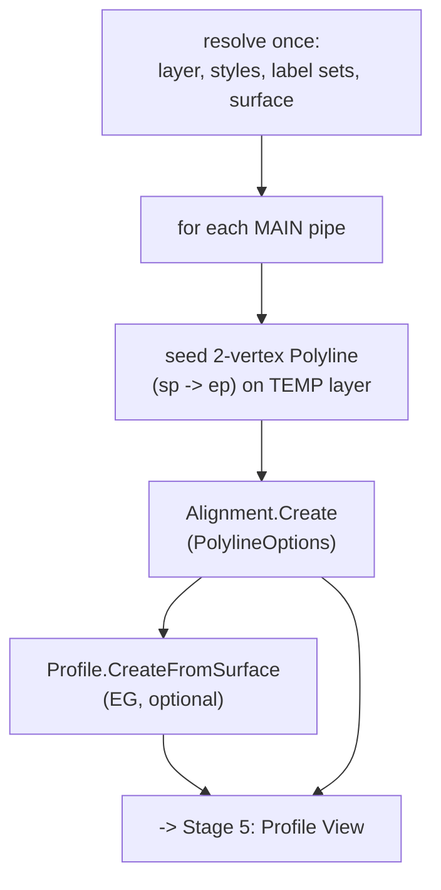

# Stage 4 — Alignment + surface profile creation

!!! abstract "Goal of this stage"
    The write phase begins. For each **main** pipe (option A: one alignment per
    pipe run), build a Civil 3D **alignment** along the pipe, then sample an
    **existing-ground (EG) profile** from a surface. Along the way we build
    `helpers_core` (layers, styles, surface, unique names) and `helpers_alignment`
    (the creation chain). Every style/layer path here is taken from the **verified
    v2 reference** — this is the part the reference genuinely got right.

    Nothing about crossing *detection* changes; this stage produces the geometry
    the profile views (Stage 5) and labels (Stage 7) will hang off.

---

## Where this sits in the pipeline



!!! note "Resolve styles ONCE, outside the loop"
    Style/layer/label-set/surface resolution is done **once before** the per-pipe
    loop, not per pipe. These lookups walk collections and don't change between
    pipes; resolving them repeatedly is wasted work inside a hot loop over hundreds
    of ICs. The loop body only does the per-pipe geometry.

---

## `helpers_core` — layers, styles, surfaces, unique names

These four helpers are used by every write stage. All are lifted from the v2
reference and upgraded for the 2025 CPython3 marshalling quirks.

### The ObjectId unwrap guard (a real 2025 quirk)

Under CPython3/pythonnet, some collection accessors — `get_Item(name)`,
`ToObjectIds()` — can return an `ObjectId` **wrapped in a one-element tuple**
instead of the bare `ObjectId`. Passing that tuple straight into an API call that
expects an `ObjectId` fails with a confusing type error. One public helper
normalises it everywhere.

```python
# helpers_core.py
def unwrap_oid(item):
    """Some CPython3 collection accessors return an ObjectId wrapped in a tuple.
    Return the bare ObjectId. Detect the real thing by its IsNull member."""
    if hasattr(item, "IsNull"):        # already a bare ObjectId
        return item
    if isinstance(item, tuple) and item and hasattr(item[0], "IsNull"):
        return item[0]
    return item                        # leave anything else untouched
```

!!! danger "Reference trap → why it fails → our fix"
    **Trap.** The reference calls `style_coll.get_Item(name)` and passes the result
    straight into `Alignment.Create`. **Why it fails (sometimes).** Under CPython3
    the accessor may hand back `(ObjectId,)` — a tuple — and `Alignment.Create`
    rejects it with a marshalling error that names neither the tuple nor the call.
    **Fix.** Route every id that comes out of a collection through `unwrap_oid`, so
    a tuple or a bare id both yield a bare `ObjectId`.

### Layer, style, and surface resolution

```python
# helpers_core.py
from Autodesk.AutoCAD.DatabaseServices import OpenMode, LayerTableRecord
from Autodesk.Civil.DatabaseServices import ObjectId   # ObjectId.Null


def ensure_layer(tr, db, layer_name):
    """Return the ObjectId of layer_name, creating it if absent. Unlocks it if
    locked so we can host temporary seed geometry without an exception."""
    lt = tr.GetObject(db.LayerTableId, OpenMode.ForRead)
    for lid in lt:
        ltr = tr.GetObject(lid, OpenMode.ForRead)
        if ltr.Name.lower() == layer_name.lower():
            if ltr.IsLocked:
                tr.GetObject(lid, OpenMode.ForWrite).IsLocked = False
            return lid
    lt.UpgradeOpen()
    rec = LayerTableRecord()
    rec.Name = layer_name
    rec.IsLocked = False
    new_id = lt.Add(rec)
    tr.AddNewlyCreatedDBObject(rec, True)
    return new_id


def get_style_id(style_coll, desired_name, warnings, kind):
    """Resolve a style ObjectId from a collection.
      - desired_name present + found -> that style
      - name missing/not found       -> warn, fall back to the FIRST available
      - collection empty             -> raise (template not set up)
    Returns (ObjectId, resolved_name). Every id is unwrapped."""
    try:
        ids = [unwrap_oid(i) for i in style_coll.ToObjectIds()]
    except Exception:
        ids = []
    if not ids:
        raise Exception(f"No {kind} in drawing. Import styles from the template.")
    if desired_name:
        try:
            if style_coll.Contains(desired_name):
                return unwrap_oid(style_coll.get_Item(desired_name)), desired_name
        except Exception:
            pass
        warnings.append(f"{kind} '{desired_name}' not found; using first available.")
    return ids[0], "<FirstAvailable>"


def find_surface_id(tr, civdoc, surface_name):
    """Surface ObjectId by name, or ObjectId.Null if name is empty/not found."""
    if not surface_name:
        return ObjectId.Null
    for sid in civdoc.GetSurfaceIds():
        nm = getattr(tr.GetObject(sid, OpenMode.ForRead), "Name", "")
        if str(nm).strip().lower() == surface_name.strip().lower():
            return sid
    return ObjectId.Null


def build_unique_name(existing_set, base):
    """A name not already in existing_set; append ' 1', ' 2', ... if taken.
    Records the chosen name in existing_set to prevent reuse within a run."""
    if base not in existing_set:
        existing_set.add(base)
        return base
    i = 1
    while True:
        cand = f"{base} {i}"
        if cand not in existing_set:
            existing_set.add(cand)
            return cand
        i += 1
```

!!! tip "Style resolution doctrine: warn-and-degrade, but raise on empty"
    Missing a *named* style is recoverable — warn and use the first available, so a
    batch of hundreds doesn't die on one style typo (Recipe 3). An *empty*
    collection is not recoverable — it means the drawing template lacks the style
    family entirely, so we **raise**. That distinction (degrade vs. raise) is the
    reference's one genuinely good error-handling instinct, kept verbatim.

---

## `helpers_alignment` — the creation chain

The sequence the reference proved out (v2 lines 1364-1398), cleaned up. Two calls:
seed an alignment from two points, then sample an EG profile.

```python
# helpers_alignment.py
from Autodesk.AutoCAD.DatabaseServices import OpenMode, Polyline
from Autodesk.AutoCAD.Geometry import Point2d
from Autodesk.Civil.DatabaseServices import Alignment, PolylineOptions, Profile, ObjectId


def create_alignment_from_points(civdoc, tr, ms, sp, ep, name,
                                 layer_id, style_id, labelset_id,
                                 site_id=None):
    """Create a 2-vertex alignment from world points sp -> ep.
      - seeds a temporary AutoCAD Polyline (Civil 3D consumes it and, with
        EraseExistingEntities=True, deletes the seed afterwards).
      - siteId accepts ObjectId.Null (siteless); style_id + labelset_id MUST be
        real ids (resolved + unwrapped upstream).
    Returns the alignment ObjectId."""
    site_id = ObjectId.Null if site_id is None else site_id

    pl = Polyline()
    pl.AddVertexAt(0, Point2d(sp[0], sp[1]), 0.0, 0.0, 0.0)
    pl.AddVertexAt(1, Point2d(ep[0], ep[1]), 0.0, 0.0, 0.0)
    pl.LayerId = layer_id
    pl_id = ms.AppendEntity(pl)
    tr.AddNewlyCreatedDBObject(pl, True)

    plops = PolylineOptions()
    plops.PlineId = pl_id
    plops.AddCurvesBetweenTangents = False       # two-vertex run: no curve fitting
    plops.EraseExistingEntities = True           # Civil 3D deletes the seed polyline

    return Alignment.Create(civdoc, plops, name, site_id,
                            layer_id, style_id, labelset_id)


def create_eg_profile(alignment_id, surface_id, aln_layer_id,
                      profile_style_id, profile_labelset_id, name):
    """Sample an existing-ground profile from a surface along the alignment.
    Returns the profile ObjectId, or ObjectId.Null if there's no surface."""
    if surface_id == ObjectId.Null:
        return ObjectId.Null
    return Profile.CreateFromSurface(name, alignment_id, surface_id,
                                     aln_layer_id, profile_style_id,
                                     profile_labelset_id)
```

!!! danger "`site_id` may be `ObjectId.Null`; styles may NOT"
    `Alignment.Create` accepts `ObjectId.Null` for the site (a siteless
    alignment). It does **not** accept null for `style_id` or `labelset_id` — those
    must be real, resolved, unwrapped ids from
    `civdoc.Styles.AlignmentStyles` and
    `civdoc.Styles.LabelSetStyles.AlignmentLabelSetStyles`. Pass a null style and
    the call throws. This is why style resolution (with its raise-on-empty) runs
    *before* the loop: no pipe should reach `create_alignment_from_points` without
    valid style ids in hand.

!!! note "Why seed a polyline at all?"
    `Alignment.Create(PolylineOptions)` builds the alignment from an **existing
    AutoCAD polyline** in model space — it doesn't take raw points. So we create a
    throwaway 2-vertex `Polyline`, hand its `ObjectId` to `PolylineOptions.PlineId`,
    and set `EraseExistingEntities=True` so Civil 3D removes the seed once the
    alignment exists. The `TEMP` layer just hosts these seeds transiently.

---

## Wiring it into `run(context)` — the stage-4 checkpoint

Resolve everything once, then loop the **main** pipes (queried from the DuckDB
`pipes` table, `role='main'`), creating an alignment + EG profile for each. Uses
the transaction/marshalling doctrine: one transaction (loader-owned), per-item
`try/except` so one bad pipe is Skipped, not fatal.

```python
# stage4_alignments.py  (builds on the stage-3 module)
import traceback
from Autodesk.AutoCAD.DatabaseServices import OpenMode
from Autodesk.AutoCAD.ApplicationServices.Core import Application
from automations import helpers_core as core
from automations import helpers_alignment as al
from automations import duckdb_engine as duck

TEMP_LAYER = "_TEMP_ALIGN_SEED"


def run(context):
    civdoc, tr, IN = context["civdoc"], context["tr"], context["IN"]
    db = context["db"]                   # AutoCAD Database (Recipe 7/8 contract)
    data = {"Warnings": [], "Skipped": [], "Items": []}
    missing = set()
    try:
        main_network = IN[0] if (len(IN) > 0 and IN[0]) else None
        surface_name = IN[2] if (len(IN) > 2 and IN[2]) else None

        # --- DuckDB connection from the pipeline (carried under a DISTINCT key,
        # NOT context["db"] which is the AutoCAD Database). See note below. ---
        con = context["duck"]            # the DuckDB connection built in Stage 2/3

        # --- resolve ONCE ---
        ms = tr.GetObject(db.CurrentSpaceId, OpenMode.ForWrite)
        layer_id = core.ensure_layer(tr, db, TEMP_LAYER)
        aln_style_id, _ = core.get_style_id(civdoc.Styles.AlignmentStyles,
                                            None, data["Warnings"], "Alignment Style")
        aln_labelset_id, _ = core.get_style_id(
            civdoc.Styles.LabelSetStyles.AlignmentLabelSetStyles,
            None, data["Warnings"], "Alignment Label Set")
        surface_id = core.find_surface_id(tr, civdoc, surface_name)
        prof_style_id, _ = core.get_style_id(civdoc.Styles.ProfileStyles,
                                             None, data["Warnings"], "Profile Style")
        prof_labelset_id, _ = core.get_style_id(
            civdoc.Styles.LabelSetStyles.ProfileLabelSetStyles,
            None, data["Warnings"], "Profile Label Set")

        # --- the MAIN pipes to profile, straight from DuckDB (option A) ---
        main_pipes = con.execute("""
            SELECT handle, name, start_x, start_y, end_x, end_y
            FROM pipes WHERE role = 'main' ORDER BY name
        """).fetchall()

        names = set()
        for handle, pname, sx, sy, ex, ey in main_pipes:
            try:
                aln_name = core.build_unique_name(names, f"ALN - {pname or handle}")
                aln_id = al.create_alignment_from_points(
                    civdoc, tr, ms, (sx, sy), (ex, ey), aln_name,
                    layer_id, aln_style_id, aln_labelset_id)   # site defaults to Null
                aln = tr.GetObject(aln_id, OpenMode.ForRead)

                prof_id = al.create_eg_profile(
                    aln_id, surface_id, aln.LayerId,
                    prof_style_id, prof_labelset_id, f"EG - {aln_name}")

                data["Items"].append({
                    "pipe": handle, "alignment": aln_name,
                    "profile": (None if prof_id.IsNull else f"EG - {aln_name}"),
                })
            except Exception as e:
                data["Skipped"].append({"pipe": handle, "reason": str(e)})

        data["Counts"] = {"main_pipes": len(main_pipes),
                          "alignments": len(data["Items"])}
    except Exception as e:
        data["Warnings"].append(str(e))
        data["Warnings"].append(traceback.format_exc())
    return data
```

!!! danger "Name collision: `context[\"db\"]` is the AutoCAD Database, not DuckDB"
    The Recipe 7/8 context is `{doc, db, ed, civdoc, tr, IN}` — there `db` is the
    **AutoCAD `Database`**. Do **not** reuse it for the DuckDB connection. This
    project carries the DuckDB connection under a **distinct key**
    (`context["duck"]`), added by the pipeline once Stage 2/3 has built and loaded
    it. Confusing the two hands you an AutoCAD `Database` where you expect a DuckDB
    `con` — an error that surfaces far from its cause. (Alternative: rebuild/reload
    the DuckDB connection per stage from a file path; carrying it is cheaper when
    stages share one in-memory database within the run.)

!!! success "Stage-4 checkpoint"
    In the Watch node you should see one `Items` entry per main pipe with an
    `alignment` name and (if a surface was supplied) a `profile` name. In the
    drawing: one alignment per main pipe run, the EG profile computed, and **no
    leftover seed polylines** on the `_TEMP_ALIGN_SEED` layer (proof
    `EraseExistingEntities` worked). A pipe that fails lands in `Skipped` with its
    handle — the other alignments still get built.

!!! warning "One transaction, per-item try/except — never per-item commits"
    The loop runs inside the loader's single open transaction. Each pipe is wrapped
    in `try/except` for isolation, but we do **not** commit per pipe: a Civil 3D
    `Commit` triggers an expensive dependency re-solve, so hundreds of per-item
    commits would crawl. One commit at the end (loader-owned). Batch only if undo
    granularity or lock-hold time forces it.

Next: **[Profile View + grid layout](05-profile-view.md)** — placing a profile
view per alignment on a non-overlapping grid, wiring band inputs, using the
`create_profile_view_unique` retry pattern from the reference.
