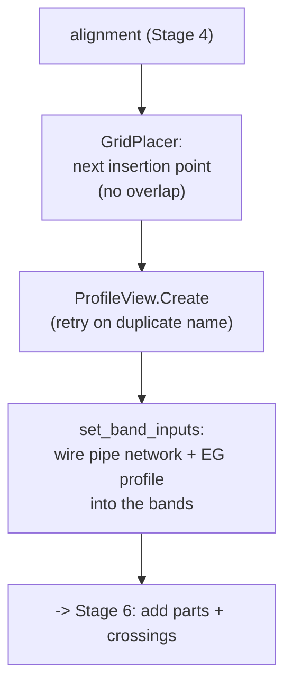

# Stage 5 — Profile View + grid layout

!!! abstract "Goal of this stage"
    For each alignment from Stage 4, create a **Profile View** — the gridded frame
    that displays the EG profile — and place it on a **non-overlapping grid** in
    model space so hundreds of them don't stack on one point. Then wire the
    **band** data sources so the strips under the grid show pipe and surface data.
    We build `helpers_profileview`: `GridPlacer`, `create_profile_view_unique`,
    and `set_band_inputs`.

    Still no crossings drawn — this stage produces empty-but-placed profile views.
    Running it alone gives you a wall of correctly-laid-out frames.

---

## The three sub-problems



1. **Where** to put each PV so they tile without overlapping (`GridPlacer`).
2. **Creating** the PV robustly, since a duplicate name throws (`create_profile_view_unique`).
3. **Wiring** the bands to their data sources (`set_band_inputs`).

---

## Grid layout — a stateful placer

The reference used a closure over a mutable `place` dict. We make it an explicit
small class — same math, but the state is named and the helper is reusable
outside one function.

```python
# helpers_profileview.py
class GridPlacer:
    """Lays profile views out left-to-right, top-to-bottom on a grid.
    Civil 3D auto-sizes the PV; the width/height here only drive spacing."""
    def __init__(self, base_x, base_y, columns=5,
                 spacing_x=25.0, spacing_y=40.0):
        self.base_x = base_x
        self.columns = max(1, int(columns))
        self.spacing_x = spacing_x
        self.spacing_y = spacing_y
        self.col = 0
        self.x = base_x
        self.y = base_y
        self.row_h = 0.0

    def current(self):
        """The insertion point for the PV about to be created (x, y, 0)."""
        return (self.x, self.y, 0.0)

    def advance(self, pv_w, pv_h):
        """Move the cursor after placing a PV of size pv_w x pv_h."""
        self.row_h = max(self.row_h, pv_h)
        self.col += 1
        if self.col >= self.columns:
            self.col = 0
            self.x = self.base_x
            self.y = self.y - (self.row_h + self.spacing_y)   # next row, downward
            self.row_h = 0.0
        else:
            self.x = self.x + (pv_w + self.spacing_x)          # next column, rightward
```

!!! tip "Start the grid clear of the network in plan"
    Seed `base_x` / `base_y` from the network extents plus a margin
    (`compute_network_extents` + `MARGIN`), so the wall of profile views sits
    *beside* the pipe network rather than on top of it. `compute_network_extents`
    is the reference's helper (walks structure + pipe coordinates for min/max) —
    kept as-is in `helpers_core`.

!!! note "Estimated size is fine — Civil 3D resizes the PV"
    The PV's real footprint depends on its elevation range and station length,
    which you don't know until it exists. Feed `advance()` a generous estimate
    (e.g. `MAX_PV_WIDTH`, a nominal height); the only effect of being slightly off
    is a little extra whitespace between frames. Don't over-engineer exact sizing.

---

## Creating the profile view — retry on duplicate

`ProfileView.Create` throws an `ArgumentException` if the name already exists.
Rather than pre-checking (racy, and PV-name enumeration is unreliable under
CPython3), the reference **tries, catches the duplicate, and retries** with a
suffix. Kept — it's the pragmatic, correct pattern.

```python
# helpers_profileview.py
from Autodesk.AutoCAD.DatabaseServices import ObjectId
from Autodesk.AutoCAD.Geometry import Point3d
from Autodesk.Civil.DatabaseServices import ProfileView


def create_profile_view_unique(aln_id, insert_pt, bandset_id, pv_style_id,
                               base_name, max_tries=5000):
    """Create a ProfileView, retrying with an integer suffix on duplicate names.
    insert_pt is an (x, y, z) tuple. Returns (pv_id, resolved_name).
    Re-raises any exception that is NOT a duplicate-name error."""
    pt = Point3d(insert_pt[0], insert_pt[1], insert_pt[2])
    for i in range(max_tries):
        name = base_name if i == 0 else f"{base_name} ({i})"
        try:
            pv_id = ProfileView.Create(aln_id, pt, name, bandset_id, pv_style_id)
            return pv_id, name
        except Exception as e:
            if "duplicat" in str(e).lower():      # matches 'duplicate' / 'duplicated'
                continue
            raise                                 # a real error -> surface it
    raise Exception(f"Could not find a unique Profile View name from '{base_name}'.")
```

!!! danger "Reference trap → why it fails → our fix"
    **Trap.** Pre-listing existing PV names to avoid collisions.
    **Why it fails.** PV-name enumeration is unreliable under CPython3, and even a
    correct list is racy if anything else creates a PV mid-run. **Fix.** Don't
    predict — **attempt and recover**: catch *only* the duplicate-name exception and
    retry with a suffix; re-raise everything else so real failures (bad style,
    null alignment) aren't silently looped over. Note the `continue` is guarded by
    the duplicate-string check — a blanket `except: continue` would spin 5000 times
    on a genuine error.

---

## Wiring the bands

A freshly created PV has **empty bands** — the annotation strips above/below the
grid exist but point at no data. `set_band_inputs` connects them:

- **PipeNetwork / SectionalData** bands → the pipe network (`datasource_id`)
- **ProfileData** bands → the EG surface profile (`surface_profile_id`)

```python
# helpers_profileview.py
from Autodesk.Civil import BandType


def set_band_inputs(pv, datasource_id, surface_profile_id, warnings):
    """Connect the PV's bands to their data sources and enable labels.
    Applies to both bottom and top band items (templates vary). Null ids are
    skipped, so a PV with no surface still gets its pipe bands wired."""
    def apply(items):
        changed = False
        for item in items:
            try:
                bt = item.BandType
                if (bt in (BandType.PipeNetwork, BandType.SectionalData)
                        and datasource_id != ObjectId.Null):
                    item.DataSourceId = datasource_id
                    item.ShowLabels = True
                    changed = True
                if bt == BandType.ProfileData and surface_profile_id != ObjectId.Null:
                    item.Profile1Id = surface_profile_id
                    item.Profile2Id = surface_profile_id
                    item.ShowLabels = True
                    changed = True
            except Exception as e:
                warnings.append(f"band wire failed ({bt}): {e}")
        return changed

    for get, set_ in (("GetBottomBandItems", "SetBottomBandItems"),
                      ("GetTopBandItems", "SetTopBandItems")):
        try:
            items = getattr(pv.Bands, get)()
            if apply(items):
                getattr(pv.Bands, set_)(items)      # write-back is REQUIRED
        except Exception:
            pass
```

!!! danger "Bands need a write-back — mutating the list isn't enough"
    `GetBottomBandItems()` returns a **copy**. Setting `item.DataSourceId` on it
    changes nothing in the drawing until you call `SetBottomBandItems(items)` to
    push the modified collection back. Forgetting the write-back is a classic
    silent no-op: the code runs, no error, and the bands stay empty. The
    get -> mutate -> set round-trip is mandatory.

!!! note "The band data source is a pipe network id"
    `datasource_id` is the ObjectId of the pipe network whose data fills the bands
    (resolved by name, like the styles in Stage 4). If it's not found we leave it
    `ObjectId.Null` and the bands stay empty — a warning, not a fatal error.

---

## Stage-5 checkpoint — a wall of placed, banded profile views

Reconnect to the DuckDB file (stage-independence), resolve PV styles once, then
per main pipe: create the alignment + profile (Stage 4), place a PV on the grid,
and wire its bands. This is the **complete** module.

```python
# stage5_profile_views.py
import traceback
from Autodesk.AutoCAD.DatabaseServices import SymbolUtilityServices, OpenMode, ObjectId
from Autodesk.AutoCAD.Runtime import RXClass
from Autodesk.Civil.DatabaseServices import ProfileView
from automations import helpers_core as core
from automations import helpers_alignment as al
from automations import helpers_profileview as pvh
from automations import duckdb_engine as duck

TEMP_LAYER = "_TEMP_ALIGN_SEED"
MAX_PV_WIDTH, MAX_PV_HEIGHT = 1200.0, 400.0
MARGIN_X, MARGIN_Y = 1000.0, 50.0


def run(context):
    civdoc, tr, IN = context["civdoc"], context["tr"], context["IN"]
    db = context["db"]                               # AutoCAD Database
    data = {"Warnings": [], "Skipped": [], "Items": []}
    try:
        surface_name  = IN[0] if (len(IN) > 0 and IN[0]) else None
        duckdb_path   = IN[1] if (len(IN) > 1 and IN[1]) else None
        band_net_name = IN[2] if (len(IN) > 2 and IN[2]) else None
        con = duck.connect(duckdb_path)              # reconnect; no live con from stage 3/4

        ms = tr.GetObject(db.CurrentSpaceId, OpenMode.ForWrite)

        # --- resolve ONCE ---
        layer_id = core.ensure_layer(tr, db, TEMP_LAYER)
        aln_style_id, _    = core.get_style_id(civdoc.Styles.AlignmentStyles, None, data["Warnings"], "Alignment Style")
        aln_labelset_id, _ = core.get_style_id(civdoc.Styles.LabelSetStyles.AlignmentLabelSetStyles, None, data["Warnings"], "Alignment Label Set")
        prof_style_id, _   = core.get_style_id(civdoc.Styles.ProfileStyles, None, data["Warnings"], "Profile Style")
        prof_lblset_id, _  = core.get_style_id(civdoc.Styles.LabelSetStyles.ProfileLabelSetStyles, None, data["Warnings"], "Profile Label Set")
        pv_style_id, _     = core.get_style_id(civdoc.Styles.ProfileViewStyles, None, data["Warnings"], "Profile View Style")
        bandset_id, _      = core.get_style_id(civdoc.Styles.ProfileViewBandSetStyles, None, data["Warnings"], "Profile View Band Set")
        surface_id = core.find_surface_id(tr, civdoc, surface_name)

        # band data source (a pipe network id, by name; optional)
        datasource_id = ObjectId.Null
        if band_net_name:
            for oid in civdoc.GetPipeNetworkIds():
                if getattr(tr.GetObject(oid, OpenMode.ForRead), "Name", "") == band_net_name:
                    datasource_id = oid
                    break
        
        # grid seeded beside the network extents
        _, _, maxx, maxy = con.execute("""
                    with e as (select st_extent_agg(geom) extent from structures)
                   select st_xmin(extent), st_ymin(extent), st_xmax(extent), st_ymax(extent) from e;
                """).fetchone()
        placer = pvh.GridPlacer(maxx + MARGIN_X, maxy + MARGIN_Y, columns=5)

        # existing alignment names -> avoid duplicate-name errors
        alignment_names = set(getattr(tr.GetObject(a, OpenMode.ForRead), "Name", "")
                    for a in civdoc.GetAlignmentIds())

        # existing profile view names -> avoid duplicate-name errors
        # 1. Fetch all object IDs in Model Space
        ms_id = SymbolUtilityServices.GetBlockModelSpaceId(db)
        ms = tr.GetObject(ms_id, OpenMode.ForRead)
        # 2. Filter for ProfileView IDs using a single-line list comprehension
        pv_class = RXClass.GetClass(ProfileView)
        profile_view_ids = set(obj_id for obj_id in ms if obj_id.ObjectClass.IsDerivedFrom(pv_class))
        profile_view_names = set(getattr(tr.GetObject(pv_id, OpenMode.ForRead), "Name", "") 
            for pv_id in profile_view_ids)
        
        main_pipes = con.execute("""
            SELECT handle, name, start_x, start_y, end_x, end_y
            FROM pipes WHERE role = 'main' ORDER BY name desc limit 6
        """).fetchall()

        for handle, pname, sx, sy, ex, ey in main_pipes:
            try:
                aln_name = core.build_unique_name(alignment_names, f"ALN - {pname or handle}")
                aln_id = al.create_alignment_from_points(
                    civdoc, tr, ms, (sx, sy), (ex, ey), aln_name,
                    layer_id, aln_style_id, aln_labelset_id)
                aln = tr.GetObject(aln_id, OpenMode.ForRead)
                prof_id = al.create_eg_profile(aln_id, surface_id, aln.LayerId,
                                               prof_style_id, prof_lblset_id, f"EG - {aln_name}")

                pv_name = core.build_unique_name(profile_view_names, f"PV - {aln_name}")
                pv_id, pv_name = pvh.create_profile_view_unique(
                    aln_id, placer.current(), bandset_id, pv_style_id, pv_name)
                placer.advance(MAX_PV_WIDTH, MAX_PV_HEIGHT)

                pv = tr.GetObject(pv_id, OpenMode.ForWrite)
                pvh.set_band_inputs(pv, datasource_id, prof_id, data["Warnings"])

                data["Items"].append({"pipe": handle, "pv": pv_name,
                                      "profile": (None if prof_id.IsNull else f"EG - {aln_name}")})
            except Exception as e:
                data["Skipped"].append({"pipe": handle, "reason": str(e)})

        data["Counts"] = {"main_pipes": len(main_pipes), "profile_views": len(data["Items"])}
    except Exception as e:
        data["Warnings"].append(str(e)); data["Warnings"].append(traceback.format_exc())
    return data
```

!!! success "Stage-5 checkpoint"
    You should see a **tiled wall** of profile views beside the pipe network — one
    per main pipe, none overlapping, each with an EG profile line and populated
    bands (if a surface and band network were supplied). `Items` lists one PV name
    per pipe; failures land in `Skipped`. Zoom to extents and confirm the grid
    reads left-to-right, top-to-bottom with clean gaps.

!!! warning "`compute_network_extents` signature"
    The reference's `compute_network_extents(tr, net)` took a network *object*.
    Here it's `compute_network_extents(tr, civdoc, network_name)` — it resolves the
    named network internally and returns `(minx, miny, maxx, maxy)`, falling back
    to the drawing extents if the name is empty. Keep it in `helpers_core` beside
    the other resolvers.

Next: **[Adding parts & crossings to the PV](06-add-parts.md)** — draw the main
pipe and structures into each view, then the crossing utilities from the DuckDB
`crossings` table, meeting the profile-view-part (wrapper) problem head-on.
