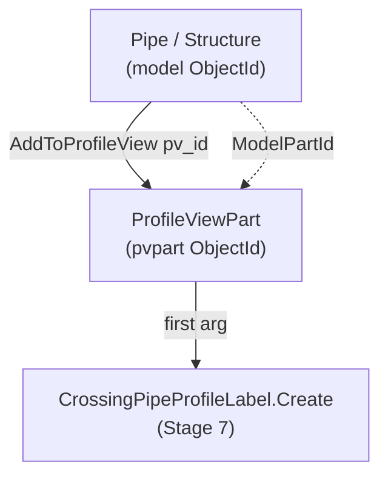

# Stage 6 — Adding parts & crossings to the Profile View

!!! abstract "Goal of this stage"
    Draw geometry *into* each profile view: first the **main pipe and its two
    structures**, then every **crossing pipe** the DuckDB `crossings` table
    reported for that main pipe — gravity and (if present) pressure. The single
    most important thing this stage does is capture the **`ProfileViewPart`
    ObjectId** that `AddToProfileView()` returns, because that id — not the pipe id
    — is the mandatory first argument to the crossing-label calls in Stage 7.

    We build `helpers_network`'s part-adding utilities and meet the two hazards the
    reference hit head-on: **void-returning `AddToProfileView`** and the
    **pressure-network availability guard**.

---

## What "adding a part" actually produces

When you call `part.AddToProfileView(pv_id)`, Civil 3D draws that pipe/structure
in the view and creates a new lightweight entity — a **`ProfileViewPart`** (or
**`ProfileViewPressurePart`** for pressure pipes) — that represents *this pipe as
seen in this particular profile view*. It has its own ObjectId.



!!! danger "The pvpart id is the whole reason this stage exists"
    `CrossingPipeProfileLabel.Create(pvpart_oid, pv_oid, style)` wants the
    **ProfileViewPart** id, not the pipe's model id. A pipe can appear in many
    profile views; each appearance is a distinct ProfileViewPart. Label the wrong
    one and the label lands in the wrong view — or the `Create` call rejects the id
    outright. So Stage 6 must **return a `{model_oid: pvpart_oid}` map** that Stage
    7 consumes. Everything below exists to build that map reliably.

---

## Hazard 1 — `AddToProfileView` may return void

In Civil 3D 2025 `AddToProfileView` is *documented* to return the ProfileViewPart
ObjectId. In practice, under CPython3/pythonnet it **sometimes returns `None`**
(void marshalling). If we trusted the return value alone, those parts would be
drawn but absent from our map — and unlabellable in Stage 7.

The reference's fix — kept verbatim because it's correct — is a **ModelSpace
fallback scan**: for any part whose `AddToProfileView` gave us nothing, walk
ModelSpace for `ProfileViewPart` entities whose `ModelPartId` matches the part we
just added, and recover the pvpart id that way.

```python
# helpers_network.py
from Autodesk.AutoCAD.DatabaseServices import SymbolUtilityServices, OpenMode


def scan_pvparts_from_modelspace(tr, db, missing_oids, pvpart_class, warnings):
    """Recover ProfileViewPart ids by scanning ModelSpace for entities of
    pvpart_class whose ModelPartId matches one of missing_oids.
    Returns {model_part_oid: pvpart_oid}. Used only when AddToProfileView
    returned void/None for those parts."""
    found = {}
    if not missing_oids or pvpart_class is None:
        return found
    target = {str(o): o for o in missing_oids}      # compare by string form
    try:
        ms = tr.GetObject(SymbolUtilityServices.GetBlockModelSpaceId(db), OpenMode.ForRead)
        for eid in ms:
            try:
                obj = tr.GetObject(eid, OpenMode.ForRead)
                if isinstance(obj, pvpart_class):
                    key = str(obj.ModelPartId)
                    if key in target:
                        found[target[key]] = eid
            except Exception:
                pass
    except Exception as e:
        warnings.append(f"ProfileViewPart fallback scan error: {e}")
    return found
```

The add helpers use the scan only as a fallback — the fast path is the return
value.

```python
# helpers_network.py
def add_parts_to_profile_view(tr, db, ids_to_add, pv_id,
                              pvpart_class, has_pvpart, warnings):
    """Add gravity parts (Pipe/Structure) to a PV. Returns {model_oid: pvpart_oid}.
    Fast path: trust AddToProfileView's return. Fallback: ModelSpace scan for
    any part that returned void."""
    pvpart_map = {}
    for oid in ids_to_add:
        try:
            part = tr.GetObject(oid, OpenMode.ForWrite)
            if hasattr(part, "AddToProfileView"):
                result = part.AddToProfileView(pv_id)
                try:
                    if result is not None and not result.IsNull:
                        pvpart_map[oid] = result
                except Exception:
                    pass                              # void return -> fallback later
        except Exception as e:
            warnings.append(f"AddToProfileView failed for {oid}: {e}")

    missing = [o for o in ids_to_add if o not in pvpart_map]
    if missing and has_pvpart:
        recovered = scan_pvparts_from_modelspace(tr, db, missing, pvpart_class, warnings)
        if recovered:
            pvpart_map.update(recovered)
            warnings.append(f"{len(recovered)} gravity ProfileViewPart id(s) "
                            f"recovered via ModelSpace scan.")
    return pvpart_map


def add_pressure_pipes_to_profile_view(tr, db, pressure_pipe_ids, pv_id,
                                       pvpressurepart_class, has_pvpressurepart, warnings):
    """Same contract for pressure pipes -> ProfileViewPressurePart. The returned
    pvpart id is required by CrossingPressurePipeProfileLabel.Create (Stage 7)."""
    pvpart_map = {}
    for oid in pressure_pipe_ids:
        try:
            ppart = tr.GetObject(oid, OpenMode.ForWrite)
            if hasattr(ppart, "AddToProfileView"):
                result = ppart.AddToProfileView(pv_id)
                try:
                    if result is not None and not result.IsNull:
                        pvpart_map[oid] = result
                except Exception:
                    pass
        except Exception as e:
            warnings.append(f"Pressure AddToProfileView failed for {oid}: {e}")

    missing = [o for o in pressure_pipe_ids if o not in pvpart_map]
    if missing and has_pvpressurepart:
        recovered = scan_pvparts_from_modelspace(tr, db, missing, pvpressurepart_class, warnings)
        if recovered:
            pvpart_map.update(recovered)
            warnings.append(f"{len(recovered)} pressure ProfileViewPart id(s) "
                            f"recovered via ModelSpace scan.")
    return pvpart_map
```

!!! note "Why compare `ModelPartId` by string"
    `ObjectId` equality/hashing across a marshalling boundary is not reliable
    enough to use as a dict key here. Stringifying both sides (`str(obj.ModelPartId)`
    vs `str(target_oid)`) gives a stable, comparable key. It's slightly ugly but
    it's the pattern that actually works under CPython3 — kept from the reference.

---

## Hazard 2 — pressure networks may not exist / may not be loaded

The pressure-pipe API lives in a **separate assembly** (`AeccPressurePipesMgd`)
that isn't guaranteed to be present. Reference/probe it once, guarded, and pass
the resulting flag + class down as parameters (never module globals — your
convention). This block lives **inside the .py module**:

```python
# stage6_add_parts.py  (top of module)
import clr

HAS_PRESSURE = False
try:
    clr.AddReference("AeccPressurePipesMgd")
    from Autodesk.Civil.ApplicationServices import CivilDocumentPressurePipesExtension
    HAS_PRESSURE = True
except Exception:
    CivilDocumentPressurePipesExtension = None

# ProfileViewPressurePart availability is a SEPARATE guard from HAS_PRESSURE
HAS_PVPRESSUREPART = False
try:
    from Autodesk.Civil.DatabaseServices import ProfileViewPressurePart
    HAS_PVPRESSUREPART = True
except Exception:
    ProfileViewPressurePart = None

from Autodesk.Civil.DatabaseServices import ProfileViewPart   # gravity: essentially always present
HAS_PVPART = True
```

!!! danger "Reference trap → why it fails → our fix"
    **Trap.** Treating "pressure API available" and "ProfileViewPressurePart
    importable" as one flag. **Why it fails.** They're in different namespaces and
    can differ by version — you can have the pressure app extension yet still fail
    to import the pressure *profile-view-part* class, so a single flag either
    over-promises (crash) or over-restricts (skips pressure needlessly). **Fix.**
    **Two independent guards**: `HAS_PRESSURE` (can we enumerate pressure networks?)
    and `HAS_PVPRESSUREPART` (can we build the pvpart map for them?). Pass both down.

---

## The DuckDB contrast — where the crossing parts come from

This is the stage where our framework diverges hardest from the reference.

!!! danger "Reference trap → why it fails → our fix"
    **Trap.** The reference discovers crossing parts *here*, inside the per-PV loop:
    for every profile view it re-walks **every pipe of every other network** and
    runs `is_pipe_crossing(aln, sp, ep, gsp, gep, tol)` to decide what to add
    (v2 ~line 1444). **Why it fails.** It's $O(\text{ICs} \times \text{networks}
    \times \text{pipes})$ — the same geometry recomputed hundreds of times — and
    the crossing test is entangled with the drawing loop, so detection bugs and
    drawing bugs can't be debugged apart. **Fix.** Detection already happened
    **once** in Stage 3 and lives in the DuckDB `crossings` table. Stage 6 just
    **queries** which pipes cross this main pipe and maps their handles to
    ObjectIds. No geometry math in the drawing loop.

```python
# per main pipe, inside run():  which pipes cross me, by handle?
rows = con.execute("""
    SELECT cross_handle, cross_kind          -- 'gravity_cross' | 'pressure_cross'
    FROM crossings
    WHERE main_handle = ? AND runs_alongside = FALSE
""", [main_handle]).fetchall()

gravity_handles  = [h for h, k in rows if k == 'gravity_cross']
pressure_handles = [h for h, k in rows if k == 'pressure_cross']
```

Handles are then resolved to live ObjectIds via a **handle→ObjectId index** built
once from the drawing (see note). We add the gravity crossings (+ their end
structures) and, if `HAS_PRESSURE and HAS_PVPRESSUREPART`, the pressure crossings.

!!! note "Handle -> ObjectId, built once"
    DuckDB stores AutoCAD **handles** (stable, portable strings), not ObjectIds
    (session-bound). Build one dict `{handle: ObjectId}` by walking each network's
    pipes/structures at the start of the stage (`db.GetObjectId(False, Handle(h), 0)`
    also works but the walk is simpler and validates existence). Look up handles
    against it; a handle absent from the index means the pipe was deleted since
    extraction — log to `Skipped`, don't crash.

---

## The three helpers this stage relies on

The checkpoint below calls three functions that must be defined, not assumed.
Two are ours (`build_handle_index`, `iter_main_pvs`); one is lifted verbatim from
the verified v2 reference (`get_pipe_end_structure_ids`).

```python
# helpers_network.py
from Autodesk.AutoCAD.DatabaseServices import OpenMode, Handle


def build_handle_index(db, tr, civdoc, has_pressure, pressure_ext, warnings):
    """Map every gravity (and, if available, pressure) pipe/structure HANDLE to
    its live ObjectId for this session. DuckDB stores handles (portable, stable);
    the drawing needs ObjectIds (session-bound). Returns {handle_str: ObjectId}.

    Uses Database.GetObjectId(add=False, Handle, reserved=0) — the direct, correct
    inverse of `oid.Handle.ToString()` used by extraction. A handle that no longer
    resolves (part deleted since extraction) is simply skipped, not fatal."""
    index = {}

    def add_net(net_id):
        net = tr.GetObject(net_id, OpenMode.ForRead)
        for oid in list(net.GetPipeIds()) + list(net.GetStructureIds()):
            try:
                index[tr.GetObject(oid, OpenMode.ForRead).Handle.ToString()] = oid
            except Exception:
                pass

    for gid in civdoc.GetPipeNetworkIds():
        try:
            add_net(gid)
        except Exception as e:
            warnings.append(f"handle-index gravity net skipped: {e}")

    if has_pressure and pressure_ext is not None:
        try:
            for pid in pressure_ext.GetPressurePipeNetworkIds(civdoc):
                pnet = tr.GetObject(pid, OpenMode.ForRead)
                for oid in pnet.GetPipeIds():
                    try:
                        index[tr.GetObject(oid, OpenMode.ForRead).Handle.ToString()] = oid
                    except Exception:
                        pass
        except Exception as e:
            warnings.append(f"handle-index pressure nets skipped: {e}")

    return index


def get_pipe_end_structure_ids(pipe_obj):
    """(start_structure_id, end_structure_id) for a Pipe OBJECT (not an id).
    Verbatim from v2: tries the direct *Id properties, then the older object-
    reference properties that expose an .ObjectId. Returns (None, None) on failure.
    NOTE: takes the opened pipe object, so callers pass tr.GetObject(pid, ...)."""
    for a, b in (("StartStructureId", "EndStructureId"),
                 ("StartStructure",   "EndStructure")):
        if hasattr(pipe_obj, a) and hasattr(pipe_obj, b):
            try:
                sv, ev = getattr(pipe_obj, a), getattr(pipe_obj, b)
                if hasattr(sv, "ObjectId"): sv = sv.ObjectId
                if hasattr(ev, "ObjectId"): ev = ev.ObjectId
                return sv, ev
            except Exception:
                pass
    return None, None
```

!!! tip "Prefer the stored handles over re-deriving structures"
    Extraction (Stage 2) already wrote each pipe's `start_handle` / `end_handle`
    into the `pipes` table. So the cheapest way to attach a crossing pipe's
    structures is to read those two handle columns and look them up in the index —
    no live pipe object needed. `get_pipe_end_structure_ids` is the fallback for
    when you only hold an ObjectId (e.g. the main pipe) and want its structures
    without a DuckDB round-trip. The checkpoint below shows both paths.

`iter_main_pvs` is the bridge from Stages 4-5: it re-creates (or looks up) the
alignment + profile view for each main pipe and yields the ids Stage 6 needs. In
the full orchestrator (Stage 8) this is one fused loop; here it is shown as a
generator so Stage 6 reads independently.

```python
# stage6_add_parts.py
def iter_main_pvs(context, con, h2id):
    """Yield (main_handle, pv_id, main_pipe_id, start_struct_id, end_struct_id)
    for each main pipe. Resolves the main pipe + its two structures straight from
    the DuckDB `pipes` row's handle columns via the handle index. pv_id comes from
    the profile view created for this pipe in Stage 5 (looked up by PV name, or
    carried in-run by the orchestrator). Rows whose main handle is absent from the
    drawing are skipped by the caller."""
    import helpers_profileview as pvh
    civdoc, tr = context["civdoc"], context["tr"]
    rows = con.execute("""
        SELECT handle, name, start_handle, end_handle
        FROM pipes WHERE role = 'main' ORDER BY name
    """).fetchall()
    for main_handle, pname, sh, eh in rows:
        main_pipe_id = h2id.get(main_handle)
        if main_pipe_id is None:
            continue                                   # deleted since extraction
        s1 = h2id.get(sh)
        s2 = h2id.get(eh)
        pv_id = pvh.find_profile_view_id_by_name(tr, civdoc, f"PV - ALN - {pname or main_handle}")
        if pv_id is None:
            continue                                   # PV not built (Stage 5 skip)
        yield main_handle, pv_id, main_pipe_id, s1, s2
```

!!! warning "`iter_main_pvs` is a seam, not a finished contract"
    How `pv_id` is obtained depends on how Stages 4-6 are fused. Two honest options:
    **(a)** the orchestrator (Stage 8) carries an in-run `{main_handle: pv_id}` map
    built as it creates each PV — no name lookup, no ambiguity; **(b)** standalone,
    look the PV up by its deterministic name (shown above), which relies on the
    Stage-5 naming convention holding exactly. Option (a) is what the final
    orchestrator uses; the name lookup here is the fallback that lets Stage 6 run on
    its own.

The name lookup reuses the Stage-5 `SymbolUtilityServices` + `RXClass` ProfileView
enumeration:

```python
# helpers_profileview.py
from Autodesk.AutoCAD.DatabaseServices import SymbolUtilityServices, OpenMode
from Autodesk.AutoCAD.Runtime import RXClass
from Autodesk.Civil.DatabaseServices import ProfileView


def find_profile_view_id_by_name(tr, civdoc, name):
    """ObjectId of the ProfileView called `name`, or None. Enumerates ModelSpace
    ProfileView entities by RXClass (the reliable CPython3 way — see Stage 5)."""
    db = civdoc.Database
    ms = tr.GetObject(SymbolUtilityServices.GetBlockModelSpaceId(db), OpenMode.ForRead)
    pv_class = RXClass.GetClass(ProfileView)
    for oid in ms:
        if oid.ObjectClass.IsDerivedFrom(pv_class):
            if getattr(tr.GetObject(oid, OpenMode.ForRead), "Name", "") == name:
                return oid
    return None
```

---

## Stage-6 checkpoint — parts drawn, pvpart map captured

Per main pipe: add main pipe + 2 structures, then the DuckDB-reported crossings.
Collect the pvpart maps for Stage 7. (Alignment/PV creation from Stages 4-5 is
assumed done and the pv_id carried; shown condensed.)

```python
# stage6_add_parts.py  (imports + guards at top of module — see Hazard 2 block)
import traceback
from Autodesk.AutoCAD.DatabaseServices import OpenMode
import helpers_network as net
import helpers_profileview as pvh
import duckdb_engine as duck
# HAS_PRESSURE / CivilDocumentPressurePipesExtension / ProfileViewPart /
# HAS_PVPART / ProfileViewPressurePart / HAS_PVPRESSUREPART are defined at the
# top of THIS module by the Hazard-2 guard block above.


def run(context):
    civdoc, tr, IN = context["civdoc"], context["tr"], context["IN"]
    db = context["db"]                       # AutoCAD Database (Recipe 7/8 contract)
    data = {"Warnings": [], "Skipped": [], "Items": []}
    try:
        duckdb_path = IN[1] if (len(IN) > 1 and IN[1]) else None
        con = duck.connect(duckdb_path)      # path -> persistent file; None -> in-memory ETL

        h2id = net.build_handle_index(db, tr, civdoc, HAS_PRESSURE,
                                      CivilDocumentPressurePipesExtension, data["Warnings"])

        for main_handle, pv_id, main_pipe_id, s1, s2 in iter_main_pvs(context, con, h2id):
            # 1) main pipe + its two structures
            main_ids = [x for x in (main_pipe_id, s1, s2) if x and not x.IsNull]
            pvpart_main = net.add_parts_to_profile_view(
                tr, db, main_ids, pv_id, ProfileViewPart, HAS_PVPART, data["Warnings"])

            # 2) crossings from DuckDB (detected once, in Stage 3)
            rows = con.execute("""SELECT cross_handle, cross_kind FROM crossings
                                  WHERE main_handle = ? AND runs_alongside = FALSE""",
                               [main_handle]).fetchall()
            grav_ids = [h2id[h] for h, k in rows if k == 'gravity_cross' and h in h2id]
            pres_ids = [h2id[h] for h, k in rows if k == 'pressure_cross' and h in h2id]

            # attach each gravity crossing pipe's end structures too. get_pipe_end_
            # structure_ids takes the OPENED pipe object, so we open it first.
            grav_all = list(grav_ids)
            for gid in grav_ids:
                pipe_obj = tr.GetObject(gid, OpenMode.ForRead)
                s_start, s_end = net.get_pipe_end_structure_ids(pipe_obj)
                grav_all += [x for x in (s_start, s_end) if x and not x.IsNull]

            pvpart_grav = net.add_parts_to_profile_view(
                tr, db, grav_all, pv_id, ProfileViewPart, HAS_PVPART, data["Warnings"])

            pvpart_pres = {}
            if HAS_PRESSURE and HAS_PVPRESSUREPART and pres_ids:
                pvpart_pres = net.add_pressure_pipes_to_profile_view(
                    tr, db, pres_ids, pv_id, ProfileViewPressurePart,
                    HAS_PVPRESSUREPART, data["Warnings"])

            data["Items"].append({
                "main": main_handle,
                "gravity_crossings": len(pvpart_grav),
                "pressure_crossings": len(pvpart_pres),
                # pvpart maps handed to Stage 7 (persisted in-run, not in DuckDB)
            })
    except Exception as e:
        data["Warnings"].append(str(e))
        data["Warnings"].append(traceback.format_exc())
    return data
```

!!! success "Stage-6 checkpoint"
    Open a profile view whose main pipe the `crossings` table said is crossed. You
    should see the **main pipe + its structures** drawn, plus a **marker for each
    crossing pipe** at the right station — one per non-`runs_alongside` row for that
    main pipe. Counts in `Items` should match `SELECT count(*) ... GROUP BY
    cross_kind` from the table. Any handle missing from the drawing shows in
    `Skipped`; no labels yet (that's Stage 7).

!!! tip "This stage is where the Stage-5 empty bands finally fill"
    After Stage 5 the profile view's **Pipe Data / Invert / Rim** bands are labelled
    but their value cells are **blank** — correct, because those bands annotate the
    pipe *parts drawn in the view*, and Stage 5 drew none. The genuine acceptance
    test for `set_band_inputs` is therefore **here**: once `add_parts_to_profile_view`
    adds the main pipe, re-open the view and confirm the Invert/Rim/Pipe Data cells
    now show numbers. If they are *still* blank after parts are added, the fault is
    upstream in Stage 5's band wiring — either `datasource_id` didn't resolve to the
    right pipe network, or the `Get…BandItems → mutate → Set…BandItems` write-back
    was skipped. Blank bands with parts present is a real defect; blank bands with
    no parts is not.

!!! warning "Pvpart maps are in-run state, not DuckDB"
    The `{model_oid: pvpart_oid}` maps are session objects (ObjectIds don't persist
    across sessions), so they live in memory and are handed straight to Stage 7
    within the same run — never written to the DuckDB file. DuckDB carries the
    *detection facts* (handles, classes, geometry); the drawing carries the
    *session ids*. Keep that split clean.

Next: **[Crossing labels](07-labels.md)** — `CrossingPipeProfileLabel` (gravity)
and `CrossingPressurePipeProfileLabel` (pressure, station-ratio), consuming the
pvpart maps built here, replacing the v3 style-archaeology with a lean resolver.
