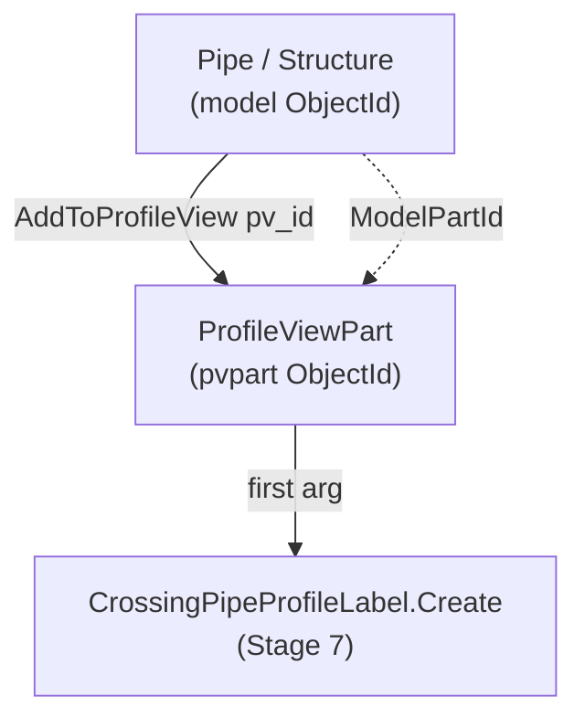

# Stage 6 — Adding parts & crossings to the Profile View

!!! abstract "Goal of this stage"
    Draw geometry *into* each profile view: first the **main pipe and its two
    structures**, then every **crossing pipe** the DuckDB `crossings` table
    reported for that main pipe — gravity and (if present) pressure. The single
    most important thing this stage does is capture the **`ProfileViewPart`
    ObjectId** that `AddToProfileView()` returns, because that id — not the pipe id
    — is the mandatory first argument to the crossing-label calls in Stage 7.

    We build `helpers_network`'s part-adding utilities and meet the two hazards the
    reference hit head-on: **void-returning `AddToProfileView`** and the
    **pressure-network availability guard**.

---

## What "adding a part" actually produces

When you call `part.AddToProfileView(pv_id)`, Civil 3D draws that pipe/structure
in the view and creates a new lightweight entity — a **`ProfileViewPart`** (or
**`ProfileViewPressurePart`** for pressure pipes) — that represents *this pipe as
seen in this particular profile view*. It has its own ObjectId.



!!! danger "The pvpart id is the whole reason this stage exists"
    `CrossingPipeProfileLabel.Create(pvpart_oid, pv_oid, style)` wants the
    **ProfileViewPart** id, not the pipe's model id. A pipe can appear in many
    profile views; each appearance is a distinct ProfileViewPart. Label the wrong
    one and the label lands in the wrong view — or the `Create` call rejects the id
    outright. So Stage 6 must **return a `{model_oid: pvpart_oid}` map** that Stage
    7 consumes. Everything below exists to build that map reliably.

---

## Hazard 1 — `AddToProfileView` may return void

In Civil 3D 2025 `AddToProfileView` is *documented* to return the ProfileViewPart
ObjectId. In practice, under CPython3/pythonnet it **sometimes returns `None`**
(void marshalling). If we trusted the return value alone, those parts would be
drawn but absent from our map — and unlabellable in Stage 7.

The reference's fix — kept verbatim because it's correct — is a **ModelSpace
fallback scan**: for any part whose `AddToProfileView` gave us nothing, walk
ModelSpace for `ProfileViewPart` entities whose `ModelPartId` matches the part we
just added, and recover the pvpart id that way.

```python
# helpers_network.py
from Autodesk.AutoCAD.DatabaseServices import SymbolUtilityServices, OpenMode


def scan_pvparts_from_modelspace(tr, db, missing_oids, pvpart_class, warnings):
    """Recover ProfileViewPart ids by scanning ModelSpace for entities of
    pvpart_class whose ModelPartId matches one of missing_oids.
    Returns {model_part_oid: pvpart_oid}. Used only when AddToProfileView
    returned void/None for those parts."""
    found = {}
    if not missing_oids or pvpart_class is None:
        return found
    target = {str(o): o for o in missing_oids}      # compare by string form
    try:
        ms = tr.GetObject(SymbolUtilityServices.GetBlockModelSpaceId(db), OpenMode.ForRead)
        for eid in ms:
            try:
                obj = tr.GetObject(eid, OpenMode.ForRead)
                if isinstance(obj, pvpart_class):
                    key = str(obj.ModelPartId)
                    if key in target:
                        found[target[key]] = eid
            except Exception:
                pass
    except Exception as e:
        warnings.append(f"ProfileViewPart fallback scan error: {e}")
    return found
```

The add helpers use the scan only as a fallback — the fast path is the return
value.

```python
# helpers_network.py
def add_parts_to_profile_view(tr, db, ids_to_add, pv_id,
                              pvpart_class, has_pvpart, warnings):
    """Add gravity parts (Pipe/Structure) to a PV. Returns {model_oid: pvpart_oid}.
    Fast path: trust AddToProfileView's return. Fallback: ModelSpace scan for
    any part that returned void."""
    pvpart_map = {}
    for oid in ids_to_add:
        try:
            part = tr.GetObject(oid, OpenMode.ForWrite)
            if hasattr(part, "AddToProfileView"):
                result = part.AddToProfileView(pv_id)
                try:
                    if result is not None and not result.IsNull:
                        pvpart_map[oid] = result
                except Exception:
                    pass                              # void return -> fallback later
        except Exception as e:
            warnings.append(f"AddToProfileView failed for {oid}: {e}")

    missing = [o for o in ids_to_add if o not in pvpart_map]
    if missing and has_pvpart:
        recovered = scan_pvparts_from_modelspace(tr, db, missing, pvpart_class, warnings)
        if recovered:
            pvpart_map.update(recovered)
            warnings.append(f"{len(recovered)} gravity ProfileViewPart id(s) "
                            f"recovered via ModelSpace scan.")
    return pvpart_map


def add_pressure_pipes_to_profile_view(tr, db, pressure_pipe_ids, pv_id,
                                       pvpressurepart_class, has_pvpressurepart, warnings):
    """Same contract for pressure pipes -> ProfileViewPressurePart. The returned
    pvpart id is required by CrossingPressurePipeProfileLabel.Create (Stage 7)."""
    pvpart_map = {}
    for oid in pressure_pipe_ids:
        try:
            ppart = tr.GetObject(oid, OpenMode.ForWrite)
            if hasattr(ppart, "AddToProfileView"):
                result = ppart.AddToProfileView(pv_id)
                try:
                    if result is not None and not result.IsNull:
                        pvpart_map[oid] = result
                except Exception:
                    pass
        except Exception as e:
            warnings.append(f"Pressure AddToProfileView failed for {oid}: {e}")

    missing = [o for o in pressure_pipe_ids if o not in pvpart_map]
    if missing and has_pvpressurepart:
        recovered = scan_pvparts_from_modelspace(tr, db, missing, pvpressurepart_class, warnings)
        if recovered:
            pvpart_map.update(recovered)
            warnings.append(f"{len(recovered)} pressure ProfileViewPart id(s) "
                            f"recovered via ModelSpace scan.")
    return pvpart_map
```

!!! note "Why compare `ModelPartId` by string"
    `ObjectId` equality/hashing across a marshalling boundary is not reliable
    enough to use as a dict key here. Stringifying both sides (`str(obj.ModelPartId)`
    vs `str(target_oid)`) gives a stable, comparable key. It's slightly ugly but
    it's the pattern that actually works under CPython3 — kept from the reference.

---

## PV-part styles — set after add, and pressure is a special case

A profile-view part has **no style of its own**. How a pipe or structure *draws*
in a profile view is governed by that part's **network part style** — the same
style you set in Prospector. So restyling is: resolve the network style, then set
it on the **model part** (the pipe/structure), after it has been added. The pvpart
tracks the model part; restyle the model part and the view follows.

!!! danger "Reference trap 1 — there is no `AddToProfileView` style overload"
    `AddToProfileView` has exactly one signature: `part.AddToProfileView(pv_id)`.
    Passing a style `ObjectId` fails with a .NET overload-resolution error. Style is
    set **separately, after add** — never during.

!!! danger "Reference trap 2 — `civdoc.Styles.ProfileViewPartStyles` does not exist"
    `StylesRoot` has no such collection; reaching for it throws
    `'StylesRoot' object has no attribute 'ProfileViewPartStyles'`. There is no
    distinct "profile-view part style" object at all. The part's network style
    governs its appearance everywhere — in the model and in every profile view.

### Gravity part style — resolved by name from `PipeStyles`

```python
# helpers_network.py
def resolve_part_styles(civdoc, grav_name, warnings):
    """Resolve the GRAVITY part style that governs profile-view display.
    Access pattern VERIFIED for Civil 3D 2025.2.5: PipeStyleCollection is not
    Python-indexable; use Contains + get_Item(name) for by-name and get_Item(0)
    for the default."""
    coll = getattr(civdoc.Styles, "PipeStyles", None)
    if coll is None:
        warnings.append("resolve_part_styles: PipeStyles collection absent; gravity style left unset.")
        return None
    try:
        if grav_name and coll.Contains(grav_name):
            return coll.get_Item(grav_name)     # by-name (NOT coll[grav_name])
        return coll.get_Item(0)                  # first/default (NOT coll[0])
    except Exception as e:
        warnings.append(f"resolve_part_styles: gravity style resolution failed: {e}")
        return None
```

!!! note "Collection access is `get_Item`, not indexing"
    `PipeStyleCollection` is **not** Python-indexable: `coll[0]` / `coll[name]`
    throw `TypeError: unindexable object`. Use `Contains(name)` + `get_Item(name)`
    (by name) or `get_Item(0)` (default). Verified by probe on 2025.2.5.

### Pressure part style — copied from a live pipe

On Civil 3D 2025 pressure styles are **not reachable by name**: there is no
`PressurePipeStyles` collection under `civdoc.Styles`, and `PressurePipeStyle.Name`
is write-only. The workaround is to copy a live pressure pipe's `StyleId` via the
bound getter `p.get_StyleId()` (readable even though `p.StyleId` is write-only for
assignment).

```python
# helpers_network.py
def pressure_style_from_sample(tr, civdoc, get_pressure_ids, warnings, pipe_name=None):
    """Return a pressure-pipe StyleId to apply to crossing pressure PV parts.
    Optionally match a specific pipe by name; otherwise use the first pressure pipe.
    Returns an ObjectId or None."""
    try:
        for nid in get_pressure_ids(civdoc):
            pnet = tr.GetObject(nid, OpenMode.ForRead)
            for pid in pnet.GetPipeIds():
                p = tr.GetObject(pid, OpenMode.ForRead)
                if pipe_name is not None:
                    try:
                        if getattr(p, "Name", None) != pipe_name:
                            continue
                    except Exception:
                        continue
                sid = p.get_StyleId()           # readable; direct '=' assignment is not
                if sid is not None and not sid.IsNull:
                    return sid
    except Exception as e:
        warnings.append(f"pressure_style_from_sample failed: {e}")
    return None
```

### Applying styles — `set_pvpart_styles`

```python
# helpers_network.py
def set_pvpart_styles(tr, pvpart_map, style_id, warnings):
    """Apply the display style for parts drawn in a profile view.
    pvpart_map: {model_oid: pvpart_oid} as returned by add_*_to_profile_view.
    style_id: ObjectId of the target network part style; None/Null -> no-op.
    Sets StyleId on the MODEL part (model_oid), not the pvpart. Called once
    for gravity parts, once for pressure parts, after add."""
    if style_id is None:
        return
    try:
        if style_id.IsNull:
            return
    except Exception:
        return
    applied = 0
    for model_oid, pvpart_oid in pvpart_map.items():
        try:
            part = tr.GetObject(model_oid, OpenMode.ForWrite)
            part.StyleId = style_id
            # read-back: confirm the write took (gravity only — pressure throws here, see C7)
            if part.StyleId == style_id:
                applied += 1
            else:
                warnings.append(f"set_pvpart_styles: StyleId did not stick on {model_oid} "
                                f"(read-back != target)")
        except Exception as e:
            warnings.append(f"set_pvpart_styles: could not set style on {model_oid}: {e}")
    warnings.append(f"set_pvpart_styles: applied {applied}/{len(pvpart_map)} part styles.")
```

!!! warning "Pressure parts: read-back throws — the write still happened"
    On pressure parts, reading `part.StyleId` after assignment throws
    `TypeError: property cannot be read` (C7 in Stage 9). The `except` branch
    catches it and emits `"could not set style on..."` — but the **write
    (`part.StyleId = style_id`) already executed before the read-back**, so the
    style *was* applied. The warning is misleading but harmless. Verify pressure
    part styling **visually** in the profile view, not from the warning count.
    `applied 0/N` in the warnings for pressure parts is expected and does not
    indicate a failure.

---

## Hazard 2 — pressure-network availability guard

Two independent guards control pressure handling:

- **`HAS_PRESSURE`** — can we enumerate pressure networks at all?
  (`AeccPressurePipesMgd` loaded + `CivilDocumentPressurePipesExtension` imported)
- **`HAS_PVPRESSUREPART`** — can we build the pvpart map for them?
  (`ProfileViewPressurePart` imported)

Both must be true to add pressure crossing parts. Conflating them into one flag
either silently skips pressure (under-restricts) or crashes on a missing class
(over-restricts).

```python
# stage6_add_parts.py  (top of module)
import clr

HAS_PRESSURE = False
try:
    clr.AddReference("AeccPressurePipesMgd")
    from Autodesk.Civil.ApplicationServices import CivilDocumentPressurePipesExtension
    HAS_PRESSURE = True
except Exception:
    CivilDocumentPressurePipesExtension = None

HAS_PVPRESSUREPART = False
try:
    from Autodesk.Civil.DatabaseServices import ProfileViewPressurePart
    HAS_PVPRESSUREPART = True
except Exception:
    ProfileViewPressurePart = None

from Autodesk.Civil.DatabaseServices import ProfileViewPart   # gravity: always present
HAS_PVPART = True
```

---

## The DuckDB contrast — where the crossing parts come from

This is the stage where our framework diverges hardest from the reference.

!!! danger "Reference trap → why it fails → our fix"
    **Trap.** The reference discovers crossing parts *here*, inside the per-PV loop:
    for every profile view it re-walks **every pipe of every other network** and
    runs `is_pipe_crossing(aln, sp, ep, gsp, gep, tol)` to decide what to add
    (v2 ~line 1444). **Why it fails.** It's $O(\text{ICs} \times \text{networks}
    \times \text{pipes})$ — the same geometry recomputed hundreds of times — and
    the crossing test is entangled with the drawing loop, so detection bugs and
    drawing bugs can't be debugged apart. **Fix.** Detection already happened
    **once** in Stage 3 and lives in the DuckDB `crossings` table. Stage 6 just
    **queries** which pipes cross this main pipe and maps their handles to
    ObjectIds. No geometry math in the drawing loop.

```python
# per main pipe, inside run():  which pipes cross me, by handle?
rows = con.execute("""
    SELECT cross_handle, cross_kind          -- 'gravity_cross' | 'pressure_cross'
    FROM crossings
    WHERE main_handle = ? AND runs_alongside = FALSE
""", [main_handle]).fetchall()

gravity_handles  = [h for h, k in rows if k == 'gravity_cross']
pressure_handles = [h for h, k in rows if k == 'pressure_cross']
```

Handles are then resolved to live ObjectIds via a **handle→ObjectId index** built
once from the drawing (see note). We add the gravity crossings and, if
`HAS_PRESSURE and HAS_PVPRESSUREPART`, the pressure crossings.

!!! note "Handle -> ObjectId, built once"
    DuckDB stores AutoCAD **handles** (stable, portable strings), not ObjectIds
    (session-bound). Build one dict `{handle: ObjectId}` by walking each network's
    pipes/structures at the start of the stage. Look up handles against it; a handle
    absent from the index means the pipe was deleted since extraction — log to
    `Skipped`, don't crash.

---

## The three helpers this stage relies on

The checkpoint below calls three functions that must be defined, not assumed.
Two are ours (`build_handle_index`, `iter_main_pvs`); one is lifted verbatim from
the verified v2 reference (`get_pipe_end_structure_ids`).

```python
# helpers_network.py
from Autodesk.AutoCAD.DatabaseServices import OpenMode, Handle


def build_handle_index(db, tr, civdoc, has_pressure, pressure_ext, warnings):
    """Map every gravity (and, if available, pressure) pipe/structure HANDLE to
    its live ObjectId for this session. DuckDB stores handles (portable, stable);
    the drawing needs ObjectIds (session-bound). Returns {handle_str: ObjectId}.

    Uses Database.GetObjectId(add=False, Handle, reserved=0) — the direct, correct
    inverse of `oid.Handle.ToString()` used by extraction. A handle that no longer
    resolves (part deleted since extraction) is simply skipped, not fatal."""
    index = {}

    def add_net(net_id):
        net = tr.GetObject(net_id, OpenMode.ForRead)
        for oid in list(net.GetPipeIds()) + list(net.GetStructureIds()):
            try:
                index[tr.GetObject(oid, OpenMode.ForRead).Handle.ToString()] = oid
            except Exception:
                pass

    for gid in civdoc.GetPipeNetworkIds():
        try:
            add_net(gid)
        except Exception as e:
            warnings.append(f"handle-index gravity net skipped: {e}")

    if has_pressure and pressure_ext is not None:
        try:
            for pid in pressure_ext.GetPressurePipeNetworkIds(civdoc):
                pnet = tr.GetObject(pid, OpenMode.ForRead)
                for oid in pnet.GetPipeIds():
                    try:
                        index[tr.GetObject(oid, OpenMode.ForRead).Handle.ToString()] = oid
                    except Exception:
                        pass
        except Exception as e:
            warnings.append(f"handle-index pressure nets skipped: {e}")

    return index
```

---

## Stage-6 checkpoint

```python
# stage6_add_parts.py
import clr
import traceback
from Autodesk.AutoCAD.DatabaseServices import OpenMode
from automations import helpers_network as net
from automations import helpers_profileview as pvh
from automations import duckdb_engine as duck

# ... (guards at top, shown above) ...


def iter_main_pvs(context, con, h2id):
    """Yield (main_handle, pv_id, alignment_id, main_pipe_id, start_struct_id,
    end_struct_id) for each main pipe whose PV was built in Stage 5."""
    civdoc, db, tr = context["civdoc"], context["db"], context["tr"]
    rows = con.execute("""
        SELECT handle, name, start_handle, end_handle
        FROM pipes WHERE role = 'main' ORDER BY name
    """).fetchall()
    for main_handle, pname, sh, eh in rows:
        main_pipe_id = h2id.get(main_handle)
        if main_pipe_id is None:
            continue
        s1 = h2id.get(sh)
        s2 = h2id.get(eh)
        aln_name = f"ALN - {pname or main_handle}"
        aln_id = net.find_alignment_id_by_name(tr, civdoc, aln_name)
        pv_id = pvh.find_profile_view_id_by_name(tr, db, f"PV - {aln_name}")
        if pv_id is None or aln_id is None:
            continue
        yield main_handle, pv_id, aln_id, main_pipe_id, s1, s2


def run(context):
    civdoc, tr, IN = context["civdoc"], context["tr"], context["IN"]
    db = context["db"]
    data = {"Warnings": [], "Skipped": [], "Items": [], "Handoff": []}
    try:
        duckdb_path     = IN[0] if (len(IN) > 0 and IN[0]) else ':memory:'
        grav_style_name = IN[1] if (len(IN) > 1 and IN[1]) else None
        pres_style_name = IN[2] if (len(IN) > 2 and IN[2]) else None
        con = duck.connect(duckdb_path)

        grav_pvpart_style = net.resolve_part_styles(civdoc, grav_style_name, data["Warnings"])
        pres_pvpart_style = None
        if HAS_PRESSURE:
            pres_pvpart_style = net.pressure_style_from_sample(
                tr, civdoc,
                CivilDocumentPressurePipesExtension.GetPressurePipeNetworkIds,
                data["Warnings"],
                pipe_name=pres_style_name)

        h2id = net.build_handle_index(db, tr, civdoc, HAS_PRESSURE,
                                      CivilDocumentPressurePipesExtension, data["Warnings"])

        for main_handle, pv_id, aln_id, main_pipe_id, s1, s2 in iter_main_pvs(context, con, h2id):
            main_ids = [x for x in (main_pipe_id, s1, s2) if x and not x.IsNull]
            net.add_parts_to_profile_view(
                tr, db, main_ids, pv_id, ProfileViewPart, HAS_PVPART, data["Warnings"])

            rows = con.execute("""SELECT cross_handle, cross_kind FROM crossings
                                  WHERE main_handle = ? AND runs_alongside = FALSE""",
                               [main_handle]).fetchall()
            grav_handles = [h for h, k in rows if k == 'gravity_cross' and h in h2id]
            pres_handles = [h for h, k in rows if k == 'pressure_cross' and h in h2id]

            grav_ids = [h2id[h] for h in grav_handles]
            g_map = net.add_parts_to_profile_view(
                tr, db, grav_ids, pv_id, ProfileViewPart, HAS_PVPART, data["Warnings"])
            net.set_pvpart_styles(tr, g_map, grav_pvpart_style, data["Warnings"])

            pres_ids = [h2id[h] for h in pres_handles]
            p_map = {}
            if HAS_PRESSURE and HAS_PVPRESSUREPART and pres_ids:
                p_map = net.add_pressure_pipes_to_profile_view(
                    tr, db, pres_ids, pv_id,
                    ProfileViewPressurePart, HAS_PVPRESSUREPART, data["Warnings"])
                net.set_pvpart_styles(tr, p_map, pres_pvpart_style, data["Warnings"])

            data["Items"].append({
                "main": main_handle,
                "grav_parts": len(g_map), "pres_parts": len(p_map)})

    except Exception as e:
        data["Warnings"].append(str(e))
        data["Warnings"].append(traceback.format_exc())
    return data
```

!!! success "Stage-6 checkpoint"
    Every main pipe's PV now contains: the main pipe + its two structures; every
    non-alongside gravity crossing pipe; every non-alongside pressure crossing pipe
    (if `HAS_PRESSURE and HAS_PVPRESSUREPART`). The `{model_oid: pvpart_oid}` maps
    are local variables — consumed immediately by Stage 7 in the fused orchestrator,
    or serialised via `data["Handoff"]` for the standalone path.

    Acceptance: `"N gravity ProfileViewPart id(s) recovered via ModelSpace scan"`
    in warnings is normal (void-return fallback working). `applied 0/N part styles`
    for **pressure** parts is also expected — the write succeeded but the read-back
    throws (see C7 in Stage 9). Verify pressure styling visually.

Next: **[Stage 7 — Crossing labels](07-labels.md)**
