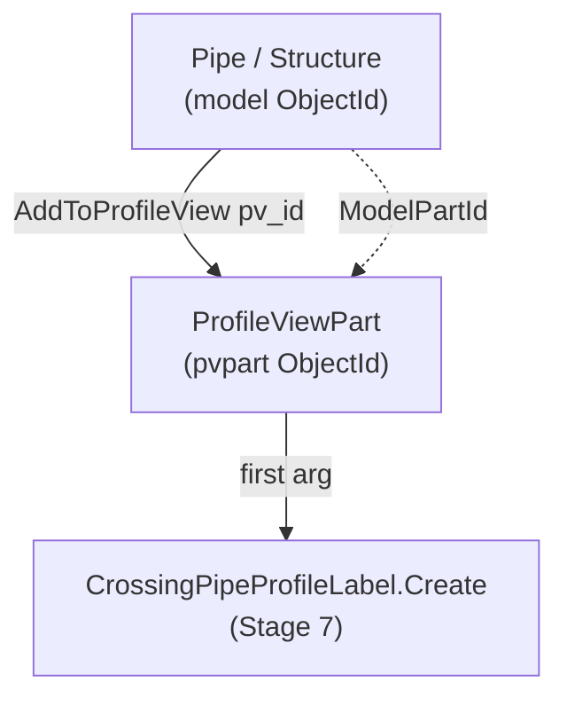

# Stage 6 — Adding parts & crossings to the Profile View

!!! abstract "Goal of this stage"
    Draw geometry *into* each profile view: first the **main pipe and its two
    structures**, then every **crossing pipe** the DuckDB `crossings` table
    reported for that main pipe — gravity and (if present) pressure. The single
    most important thing this stage does is capture the **`ProfileViewPart`
    ObjectId** that `AddToProfileView()` returns, because that id — not the pipe id
    — is the mandatory first argument to the crossing-label calls in Stage 7.

    We build `helpers_network`'s part-adding utilities and meet the two hazards the
    reference hit head-on: **void-returning `AddToProfileView`** and the
    **pressure-network availability guard**.

---

## What "adding a part" actually produces

When you call `part.AddToProfileView(pv_id)`, Civil 3D draws that pipe/structure
in the view and creates a new lightweight entity — a **`ProfileViewPart`** (or
**`ProfileViewPressurePart`** for pressure pipes) — that represents *this pipe as
seen in this particular profile view*. It has its own ObjectId.



!!! danger "The pvpart id is the whole reason this stage exists"
    `CrossingPipeProfileLabel.Create(pvpart_oid, pv_oid, style)` wants the
    **ProfileViewPart** id, not the pipe's model id. A pipe can appear in many
    profile views; each appearance is a distinct ProfileViewPart. Label the wrong
    one and the label lands in the wrong view — or the `Create` call rejects the id
    outright. So Stage 6 must **return a `{model_oid: pvpart_oid}` map** that Stage
    7 consumes. Everything below exists to build that map reliably.

---

## Hazard 1 — `AddToProfileView` may return void

In Civil 3D 2025 `AddToProfileView` is *documented* to return the ProfileViewPart
ObjectId. In practice, under CPython3/pythonnet it **sometimes returns `None`**
(void marshalling). If we trusted the return value alone, those parts would be
drawn but absent from our map — and unlabellable in Stage 7.

The reference's fix — kept verbatim because it's correct — is a **ModelSpace
fallback scan**: for any part whose `AddToProfileView` gave us nothing, walk
ModelSpace for `ProfileViewPart` entities whose `ModelPartId` matches the part we
just added, and recover the pvpart id that way.

```python
# helpers_network.py
from Autodesk.AutoCAD.DatabaseServices import SymbolUtilityServices, OpenMode


def scan_pvparts_from_modelspace(tr, db, missing_oids, pvpart_class, warnings):
    """Recover ProfileViewPart ids by scanning ModelSpace for entities of
    pvpart_class whose ModelPartId matches one of missing_oids.
    Returns {model_part_oid: pvpart_oid}. Used only when AddToProfileView
    returned void/None for those parts."""
    found = {}
    if not missing_oids or pvpart_class is None:
        return found
    target = {str(o): o for o in missing_oids}      # compare by string form
    try:
        ms = tr.GetObject(SymbolUtilityServices.GetBlockModelSpaceId(db), OpenMode.ForRead)
        for eid in ms:
            try:
                obj = tr.GetObject(eid, OpenMode.ForRead)
                if isinstance(obj, pvpart_class):
                    key = str(obj.ModelPartId)
                    if key in target:
                        found[target[key]] = eid
            except Exception:
                pass
    except Exception as e:
        warnings.append(f"ProfileViewPart fallback scan error: {e}")
    return found
```

The add helpers use the scan only as a fallback — the fast path is the return
value.

```python
# helpers_network.py
def add_parts_to_profile_view(tr, db, ids_to_add, pv_id,
                              pvpart_class, has_pvpart, warnings):
    """Add gravity parts (Pipe/Structure) to a PV. Returns {model_oid: pvpart_oid}.
    Fast path: trust AddToProfileView's return. Fallback: ModelSpace scan for
    any part that returned void."""
    pvpart_map = {}
    for oid in ids_to_add:
        try:
            part = tr.GetObject(oid, OpenMode.ForWrite)
            if hasattr(part, "AddToProfileView"):
                result = part.AddToProfileView(pv_id)
                try:
                    if result is not None and not result.IsNull:
                        pvpart_map[oid] = result
                except Exception:
                    pass                              # void return -> fallback later
        except Exception as e:
            warnings.append(f"AddToProfileView failed for {oid}: {e}")

    missing = [o for o in ids_to_add if o not in pvpart_map]
    if missing and has_pvpart:
        recovered = scan_pvparts_from_modelspace(tr, db, missing, pvpart_class, warnings)
        if recovered:
            pvpart_map.update(recovered)
            warnings.append(f"{len(recovered)} gravity ProfileViewPart id(s) "
                            f"recovered via ModelSpace scan.")
    return pvpart_map


def add_pressure_pipes_to_profile_view(tr, db, pressure_pipe_ids, pv_id,
                                       pvpressurepart_class, has_pvpressurepart, warnings):
    """Same contract for pressure pipes -> ProfileViewPressurePart. The returned
    pvpart id is required by CrossingPressurePipeProfileLabel.Create (Stage 7)."""
    pvpart_map = {}
    for oid in pressure_pipe_ids:
        try:
            ppart = tr.GetObject(oid, OpenMode.ForWrite)
            if hasattr(ppart, "AddToProfileView"):
                result = ppart.AddToProfileView(pv_id)
                try:
                    if result is not None and not result.IsNull:
                        pvpart_map[oid] = result
                except Exception:
                    pass
        except Exception as e:
            warnings.append(f"Pressure AddToProfileView failed for {oid}: {e}")

    missing = [o for o in pressure_pipe_ids if o not in pvpart_map]
    if missing and has_pvpressurepart:
        recovered = scan_pvparts_from_modelspace(tr, db, missing, pvpressurepart_class, warnings)
        if recovered:
            pvpart_map.update(recovered)
            warnings.append(f"{len(recovered)} pressure ProfileViewPart id(s) "
                            f"recovered via ModelSpace scan.")
    return pvpart_map


def probe_styles_root(civdoc, warnings):
    """One-time diagnostic (kept for NEW builds, not the resolution strategy).
    Dumps (a) StylesRoot collection names, and (b) the public members/type of the
    PipeStyles collection, so on an unfamiliar build you can see how it exposes
    styles. On THIS build (2025.2.5) the answers are already known — PipeStyles uses
    get_Item, and pressure styles are absent from civdoc.Styles entirely (see the
    'PV-part styles' section). Everything goes to `warnings` for Dynamo output."""
    names = [n for n in dir(civdoc.Styles) if not n.startswith("_")]
    style_cols = [n for n in names if "Style" in n]
    warnings.append(f"StylesRoot members with 'Style': {style_cols}")
    try:
        coll = civdoc.Styles.PipeStyles
        members = [n for n in dir(coll) if not n.startswith("_")]
        warnings.append(f"PipeStyles type: {type(coll).__name__}")
        warnings.append(f"PipeStyles members: {members}")
        # count is the one property the Developer Guide guarantees; probe it
        for cn in ("Count", "count"):
            if hasattr(coll, cn):
                warnings.append(f"PipeStyles.{cn} = {getattr(coll, cn)}")
    except Exception as e:
        warnings.append(f"probe_styles_root: PipeStyles introspection failed: {e}")
    return style_cols


def resolve_part_styles(civdoc, grav_name, warnings):
    """Resolve the GRAVITY part style that governs profile-view display.
    The pipe/structure network style IS the profile-view display style; there is
    no separate ProfileViewPart style collection. PRESSURE is intentionally NOT
    handled here — pressure styles are unreachable by name on this build (no
    collection, not in civdoc.Styles, write-only .Name); use
    pressure_style_from_sample instead. Returns a gravity style ObjectId or None
    (-> set_pvpart_styles no-ops).

    Access pattern is VERIFIED for Civil 3D 2025.2.5: PipeStyleCollection is not
    Python-indexable (coll[0]/coll[name] -> 'unindexable object'); use Contains +
    get_Item(name) for by-name and get_Item(0) for the default."""
    coll = getattr(civdoc.Styles, "PipeStyles", None)
    if coll is None:
        warnings.append("resolve_part_styles: PipeStyles collection absent; gravity style left unset.")
        return None
    try:
        if grav_name and coll.Contains(grav_name):
            return coll.get_Item(grav_name)     # by-name (NOT coll[grav_name])
        return coll.get_Item(0)                  # first/default (NOT coll[0])
    except Exception as e:
        warnings.append(f"resolve_part_styles: gravity style resolution failed: {e}")
        return None


def pressure_style_from_sample(tr, civdoc, get_pressure_ids, warnings, pipe_name=None):
    """Return a pressure-pipe StyleId to apply to crossing pressure PV parts.

    On Civil 3D 2025 (this build) pressure styles are NOT reachable by name:
      - civdoc.Styles has no PressurePipeStyles collection;
      - the target style isn't in any civdoc.Styles.* collection;
      - PressurePipeStyle.Name is WRITE-ONLY (cannot match by name).
    So we borrow a live StyleId via PressurePipe.get_StyleId() — which works even
    though `pipe.StyleId` is write-only for assignment. Optionally match a specific
    pipe by name to copy that pipe's style; otherwise use the first pressure pipe.
    Returns an ObjectId (never None if any pressure pipe exists) or None."""
    try:
        for nid in get_pressure_ids(civdoc):
            pnet = tr.GetObject(nid, OpenMode.ForRead)
            for pid in pnet.GetPipeIds():
                p = tr.GetObject(pid, OpenMode.ForRead)
                if pipe_name is not None:
                    try:
                        if getattr(p, "Name", None) != pipe_name:
                            continue
                    except Exception:
                        continue
                sid = p.get_StyleId()           # readable; direct '=' assignment is not
                if sid is not None and not sid.IsNull:
                    return sid
    except Exception as e:
        warnings.append(f"pressure_style_from_sample failed: {e}")
    return None


def pvpart_addition_stats(ids_to_add, pvpart_map):
    """Diagnostic — quantify the add hand-off for ONE add_* call.
    Returns {requested, returned, missing, missing_ids} where:
      requested   = ids we asked AddToProfileView to draw
      returned    = pvparts we ended up with (fast-path + ModelSpace fallback)
      missing     = requested that produced NO pvpart at all -> unlabelable
      missing_ids = the actual model oids that fell through (for drill-down)
    A non-empty `missing` is the Stage-7 label bug's fingerprint, surfaced here.
    Note: this counts final coverage; it does NOT distinguish fast-path from
    fallback (the add_* functions already warn on fallback recovery)."""
    req = list(ids_to_add)
    got = set(pvpart_map.keys())
    missing_ids = [o for o in req if o not in got]
    return {"requested": len(req), "returned": len(pvpart_map),
            "missing": len(missing_ids), "missing_ids": missing_ids}


def set_pvpart_styles(tr, pvpart_map, style_id, warnings):
    """Apply the display style for parts drawn in a profile view.
    pvpart_map: {model_oid: pvpart_oid} as returned by add_*_to_profile_view.
    style_id: ObjectId of the target network part style; None/Null -> no-op.
    The profile-view display of a pipe/structure follows its NETWORK part style,
    so we set StyleId on the MODEL part (model_oid), not the pvpart. Called once
    for gravity parts, once for pressure parts, after add."""
    if style_id is None:
        return
    try:
        if style_id.IsNull:
            return
    except Exception:
        return
    for model_oid, pvpart_oid in pvpart_map.items():
        try:
            part = tr.GetObject(model_oid, OpenMode.ForWrite)   # the pipe/structure
            part.StyleId = style_id
        except Exception as e:
            warnings.append(f"set_pvpart_styles: could not set style on {model_oid}: {e}")
```

!!! note "Why compare `ModelPartId` by string"
    `ObjectId` equality/hashing across a marshalling boundary is not reliable
    enough to use as a dict key here. Stringifying both sides (`str(obj.ModelPartId)`
    vs `str(target_oid)`) gives a stable, comparable key. It's slightly ugly but
    it's the pattern that actually works under CPython3 — kept from the reference.

---

## PV-part styles — set after add, and pressure is a special case

A profile-view part has **no style of its own**. How a pipe or structure *draws*
in a profile view is governed by that part's **network part style** — the same
style you set in Prospector. So restyling is: resolve the network style, then set
it on the **model part** (the pipe/structure), after it has been added. The pvpart
tracks the model part; restyle the model part and the view follows.

!!! danger "Reference trap 1 — there is no `AddToProfileView` style overload"
    `AddToProfileView` has exactly one signature: `part.AddToProfileView(pv_id)`.
    Passing a style `ObjectId` fails with a .NET overload-resolution error. Style is
    set **separately, after add** — never during.

!!! danger "Reference trap 2 — `civdoc.Styles.ProfileViewPartStyles` does not exist"
    `StylesRoot` has no such collection; reaching for it throws
    `'StylesRoot' object has no attribute 'ProfileViewPartStyles'`. There is no
    distinct "profile-view part style" object at all. The part's own network style
    *is* the profile-view display style.

### What we set, and what we don't

On this project only the **crossing** parts need a deliberate style; the **main**
pipe and its structures keep whatever style they already carry (that was verified
acceptable, so we leave them alone). Concretely:

| Part | Restyle? | Source of the style |
|---|---|---|
| Main pipe + its 2 structures | No | Keep existing network style |
| Gravity crossing pipes (+ end structures) | Yes | `PipeStyles` / `StructureStyles`, resolved by name |
| Pressure crossing pipes | **Yes — special path** | Copied from a live pressure pipe (see below) |

### Gravity styles — `get_Item`, not indexing

The gravity resolver reads `civdoc.Styles.PipeStyles`. The one thing worth stating
plainly, because it was **discovered, not assumed** (see the collapsed panel), is
the access pattern this Civil 3D 2025 build actually exposes:

!!! success "Verified accessor for this build"
    `PipeStyleCollection` / `StructureStyleCollection` are **not** Python-indexable.
    `coll[0]` and `coll[name]` both throw `TypeError: unindexable object`. The
    working members are `get_Item(name)`, `get_Item(int)`, `Contains(name)`,
    `Count`, `ToObjectIds()`, and iteration. Resolve **by name** with
    `Contains` + `get_Item`; take a default with `get_Item(0)`.

```python
# helpers_network.py
def resolve_part_styles(civdoc, grav_name, warnings):
    """Resolve the GRAVITY part style that governs profile-view display.
    Pressure is NOT handled here — see pressure_style_from_sample (pressure styles
    are unreachable by name on this build). Returns a gravity style ObjectId or
    None (-> set_pvpart_styles no-ops)."""
    coll = getattr(civdoc.Styles, "PipeStyles", None)
    if coll is None:
        warnings.append("resolve_part_styles: PipeStyles collection absent; gravity style left unset.")
        return None
    try:
        if grav_name and coll.Contains(grav_name):     # by-name (Contains + get_Item)
            return coll.get_Item(grav_name)
        return coll.get_Item(0)                          # first/default; NOT coll[0]
    except Exception as e:
        warnings.append(f"resolve_part_styles: gravity style resolution failed: {e}")
        return None
```

### Pressure styles — the build won't let us resolve by name

This is the finding that cost the most to establish and is the most important to
record, because it inverts the obvious approach.

!!! danger "Reference trap 3 — you cannot resolve a pressure style by name on this build"
    Three facts, each proven by a read-only probe against Civil 3D 2025.2.5, kill
    name-based resolution for pressure:

    1. **No collection.** `civdoc.Styles.PressurePipeStyles` and `PressurePartStyles`
       are **both ABSENT** (`StylesRoot` does not expose them).
    2. **Not in the tree.** The style a live pressure pipe actually uses
       (`PressurePipeStyle`) is **not found in *any* `civdoc.Styles.*` collection**,
       top-level or one level deep. It is reachable from the pipe, not from Styles.
    3. **Write-only name.** `PressurePipeStyle.Name` raises
       `TypeError: property cannot be read`. Even if you found the collection, you
       could not match by name — the names are unreadable.

    Any resolver that walks `civdoc.Styles` looking for a pressure style by name
    **cannot work here.** The earlier draft of this page did exactly that and
    silently returned `None` every run — which is *why* pressure crossings never got
    restyled.

!!! success "Why it fails → the fix: copy the StyleId from a live pressure pipe"
    A pressure pipe exposes its style via the **readable bound getter**
    `pipe.get_StyleId()` (even though `pipe.StyleId` is *write-only* for assignment).
    So we don't resolve a style — we **borrow** one: read the `StyleId` off an
    existing pressure pipe and apply that ObjectId to the crossing pressure parts.
    Optionally pass a pipe name to copy a specific pipe's style; otherwise take the
    first pressure pipe's.

```python
# helpers_network.py
def pressure_style_from_sample(tr, civdoc, get_pressure_ids, warnings, pipe_name=None):
    """Return a pressure-pipe StyleId to apply to crossing pressure PV parts.
    On this build pressure styles are unreachable by name (no collection; not in
    civdoc.Styles; PressurePipeStyle.Name is write-only), so we borrow a live
    StyleId via PressurePipe.get_StyleId(). `pipe_name` (optional) copies that
    specific pipe's style; else the first pressure pipe's. Returns ObjectId or None."""
    try:
        for nid in get_pressure_ids(civdoc):
            pnet = tr.GetObject(nid, OpenMode.ForRead)
            for pid in pnet.GetPipeIds():
                p = tr.GetObject(pid, OpenMode.ForRead)
                if pipe_name is not None and getattr(p, "Name", None) != pipe_name:
                    continue
                sid = p.get_StyleId()                    # readable; '=' assignment is not
                if sid is not None and not sid.IsNull:
                    return sid
    except Exception as e:
        warnings.append(f"pressure_style_from_sample failed: {e}")
    return None
```

### Applying the style — one writer for both

`set_pvpart_styles` writes `part.StyleId = style_id` directly on each model part.
It needs **no read-back guard** — and must not have one — because on this build
both `PressurePipe.StyleId` and `PressurePipeStyle.Name` are write-only. A guard
that reads either would throw and silently skip the write. Direct assignment is
exactly why gravity already worked and why pressure works the moment it receives a
non-`None` id.

```python
# helpers_network.py
def set_pvpart_styles(tr, pvpart_map, style_id, warnings):
    """Apply a network part style to the MODEL parts drawn in a profile view.
    pvpart_map: {model_oid: pvpart_oid}. None/Null style_id -> no-op. Writes
    part.StyleId directly — NO read-back (StyleId is write-only for pressure)."""
    if style_id is None:
        return
    try:
        if style_id.IsNull:
            return
    except Exception:
        return
    for model_oid, _pvpart_oid in pvpart_map.items():
        try:
            part = tr.GetObject(model_oid, OpenMode.ForWrite)   # the pipe/structure
            part.StyleId = style_id                              # write-only on pressure: OK to set
        except Exception as e:
            warnings.append(f"set_pvpart_styles: could not set style on {model_oid}: {e}")
```

!!! warning "No read-back verification for pressure styling"
    Because `StyleId` is write-only on a pressure pipe, you **cannot** assert in code
    that the style took. Verify **visually** in the profile view. Do not add a
    "skip if already styled" or logging read of `StyleId`/`Name` — it will throw and
    reintroduce the original silent failure.

!!! note "IN[2] semantics changed for pressure"
    `IN[2]` was "pressure style **name** to look up". On this build that is
    impossible, so `IN[2]` is now "pressure pipe **name** to copy the style *from*"
    (empty → first pressure pipe). If you need a specific look, style that source
    pipe once in Prospector and point `IN[2]` at it. Recorded as caveat **C6** in
    Stage 9.

??? note "How we discovered all of this (the probe trail) — collapsed"
    We did not guess. A read-only probe node introspected the live document:

    - `dir(civdoc.Styles)` → confirmed `PipeStyles`/`StructureStyles` exist,
      `PressurePipeStyles`/`PressurePartStyles` **absent**.
    - On the collections: `coll[0]` → `unindexable object`; `get_Item(0)`,
      `next(iter(coll))`, `ToObjectIds()[0]` → all OK. → `get_Item` is the accessor.
    - On a live pressure pipe: `Style`-named members include `StyleId` with a
      **write-only** getter (`pp.StyleId` read → `property cannot be read`) but a
      working `pp.get_StyleId()`.
    - Reading that StyleId opened a `PressurePipeStyle`, whose `.Name` also raised
      `property cannot be read`, and which was **not present in any `civdoc.Styles.*`
      collection** — proving name resolution is impossible and copy-from-sample is
      the only path.

    A reusable version of that probe lives in Stage 9's first-run probe. Keep the
    diagnostic; don't ship the guessing.


---

## Hazard 2 — pressure networks may not exist / may not be loaded

The pressure-pipe API lives in a **separate assembly** (`AeccPressurePipesMgd`)
that isn't guaranteed to be present. Reference/probe it once, guarded, and pass
the resulting flag + class down as parameters (never module globals — your
convention). This block lives **inside the .py module**:

```python
# stage6_add_parts.py  (top of module)
import clr

HAS_PRESSURE = False
try:
    clr.AddReference("AeccPressurePipesMgd")
    from Autodesk.Civil.ApplicationServices import CivilDocumentPressurePipesExtension
    HAS_PRESSURE = True
except Exception:
    CivilDocumentPressurePipesExtension = None

# ProfileViewPressurePart availability is a SEPARATE guard from HAS_PRESSURE
HAS_PVPRESSUREPART = False
try:
    from Autodesk.Civil.DatabaseServices import ProfileViewPressurePart
    HAS_PVPRESSUREPART = True
except Exception:
    ProfileViewPressurePart = None

from Autodesk.Civil.DatabaseServices import ProfileViewPart   # gravity: essentially always present
HAS_PVPART = True
```

!!! danger "Reference trap → why it fails → our fix"
    **Trap.** Treating "pressure API available" and "ProfileViewPressurePart
    importable" as one flag. **Why it fails.** They're in different namespaces and
    can differ by version — you can have the pressure app extension yet still fail
    to import the pressure *profile-view-part* class, so a single flag either
    over-promises (crash) or over-restricts (skips pressure needlessly). **Fix.**
    **Two independent guards**: `HAS_PRESSURE` (can we enumerate pressure networks?)
    and `HAS_PVPRESSUREPART` (can we build the pvpart map for them?). Pass both down.

---

## The DuckDB contrast — where the crossing parts come from

This is the stage where our framework diverges hardest from the reference.

!!! danger "Reference trap → why it fails → our fix"
    **Trap.** The reference discovers crossing parts *here*, inside the per-PV loop:
    for every profile view it re-walks **every pipe of every other network** and
    runs `is_pipe_crossing(aln, sp, ep, gsp, gep, tol)` to decide what to add
    (v2 ~line 1444). **Why it fails.** It's $O(\text{ICs} \times \text{networks}
    \times \text{pipes})$ — the same geometry recomputed hundreds of times — and
    the crossing test is entangled with the drawing loop, so detection bugs and
    drawing bugs can't be debugged apart. **Fix.** Detection already happened
    **once** in Stage 3 and lives in the DuckDB `crossings` table. Stage 6 just
    **queries** which pipes cross this main pipe and maps their handles to
    ObjectIds. No geometry math in the drawing loop.

```python
# per main pipe, inside run():  which pipes cross me, by handle?
rows = con.execute("""
    SELECT cross_handle, cross_kind          -- 'gravity_cross' | 'pressure_cross'
    FROM crossings
    WHERE main_handle = ? AND runs_alongside = FALSE
""", [main_handle]).fetchall()

gravity_handles  = [h for h, k in rows if k == 'gravity_cross']
pressure_handles = [h for h, k in rows if k == 'pressure_cross']
```

Handles are then resolved to live ObjectIds via a **handle→ObjectId index** built
once from the drawing (see note). We add the gravity crossings (+ their end
structures) and, if `HAS_PRESSURE and HAS_PVPRESSUREPART`, the pressure crossings.

!!! note "Handle -> ObjectId, built once"
    DuckDB stores AutoCAD **handles** (stable, portable strings), not ObjectIds
    (session-bound). Build one dict `{handle: ObjectId}` by walking each network's
    pipes/structures at the start of the stage (`db.GetObjectId(False, Handle(h), 0)`
    also works but the walk is simpler and validates existence). Look up handles
    against it; a handle absent from the index means the pipe was deleted since
    extraction — log to `Skipped`, don't crash.

---

## The three helpers this stage relies on

The checkpoint below calls three functions that must be defined, not assumed.
Two are ours (`build_handle_index`, `iter_main_pvs`); one is lifted verbatim from
the verified v2 reference (`get_pipe_end_structure_ids`).

```python
# helpers_network.py
from Autodesk.AutoCAD.DatabaseServices import OpenMode, Handle


def build_handle_index(db, tr, civdoc, has_pressure, pressure_ext, warnings):
    """Map every gravity (and, if available, pressure) pipe/structure HANDLE to
    its live ObjectId for this session. DuckDB stores handles (portable, stable);
    the drawing needs ObjectIds (session-bound). Returns {handle_str: ObjectId}.

    Uses Database.GetObjectId(add=False, Handle, reserved=0) — the direct, correct
    inverse of `oid.Handle.ToString()` used by extraction. A handle that no longer
    resolves (part deleted since extraction) is simply skipped, not fatal."""
    index = {}

    def add_net(net_id):
        net = tr.GetObject(net_id, OpenMode.ForRead)
        for oid in list(net.GetPipeIds()) + list(net.GetStructureIds()):
            try:
                index[tr.GetObject(oid, OpenMode.ForRead).Handle.ToString()] = oid
            except Exception:
                pass

    for gid in civdoc.GetPipeNetworkIds():
        try:
            add_net(gid)
        except Exception as e:
            warnings.append(f"handle-index gravity net skipped: {e}")

    if has_pressure and pressure_ext is not None:
        try:
            for pid in pressure_ext.GetPressurePipeNetworkIds(civdoc):
                pnet = tr.GetObject(pid, OpenMode.ForRead)
                for oid in pnet.GetPipeIds():
                    try:
                        index[tr.GetObject(oid, OpenMode.ForRead).Handle.ToString()] = oid
                    except Exception:
                        pass
        except Exception as e:
            warnings.append(f"handle-index pressure nets skipped: {e}")

    return index


def get_pipe_end_structure_ids(pipe_obj):
    """(start_structure_id, end_structure_id) for a Pipe OBJECT (not an id).
    Verbatim from v2: tries the direct *Id properties, then the older object-
    reference properties that expose an .ObjectId. Returns (None, None) on failure.
    NOTE: takes the opened pipe object, so callers pass tr.GetObject(pid, ...)."""
    for a, b in (("StartStructureId", "EndStructureId"),
                 ("StartStructure",   "EndStructure")):
        if hasattr(pipe_obj, a) and hasattr(pipe_obj, b):
            try:
                sv, ev = getattr(pipe_obj, a), getattr(pipe_obj, b)
                if hasattr(sv, "ObjectId"): sv = sv.ObjectId
                if hasattr(ev, "ObjectId"): ev = ev.ObjectId
                return sv, ev
            except Exception:
                pass
    return None, None
```

!!! tip "Prefer the stored handles over re-deriving structures"
    Extraction (Stage 2) already wrote each pipe's `start_handle` / `end_handle`
    into the `pipes` table. So the cheapest way to attach a crossing pipe's
    structures is to read those two handle columns and look them up in the index —
    no live pipe object needed. `get_pipe_end_structure_ids` is the fallback for
    when you only hold an ObjectId (e.g. the main pipe) and want its structures
    without a DuckDB round-trip. The checkpoint below shows both paths.

`iter_main_pvs` is the bridge from Stages 4-5: it re-creates (or looks up) the
alignment + profile view for each main pipe and yields the ids Stage 6 needs. In
the full orchestrator (Stage 8) this is one fused loop; here it is shown as a
generator so Stage 6 reads independently.

```python
# stage6_add_parts.py
def iter_main_pvs(context, con, h2id):
    """Yield (main_handle, pv_id, alignment_id, main_pipe_id, start_struct_id,
    end_struct_id) for each main pipe. Resolves the main pipe + its two structures straight from
    the DuckDB `pipes` row's handle columns via the handle index. pv_id comes from
    the profile view created for this pipe in Stage 5 (looked up by PV name, or
    carried in-run by the orchestrator). Rows whose main handle is absent from the
    drawing are skipped by the caller."""
    civdoc, db, tr = context["civdoc"], context["db"], context["tr"]
    rows = con.execute("""
        SELECT handle, name, start_handle, end_handle
        FROM pipes WHERE role = 'main' ORDER BY name
    """).fetchall()
    for main_handle, pname, sh, eh in rows:
        main_pipe_id = h2id.get(main_handle)
        if main_pipe_id is None:
            continue                                   # deleted since extraction
        s1 = h2id.get(sh)
        s2 = h2id.get(eh)
        aln_name = f"ALN - {pname or main_handle}"
        aln_id = net.find_alignment_id_by_name(tr, civdoc, aln_name)
        pv_id = pvh.find_profile_view_id_by_name(tr, db, f"PV - {aln_name}")
        if pv_id is None or aln_id is None:
            continue                                   # PV/alignment not built (Stage 5 skip)
        yield main_handle, pv_id, aln_id, main_pipe_id, s1, s2
```

`iter_main_pvs` uses one more resolver, which belongs in `helpers_network`
alongside the other by-name lookups:

```python
# helpers_network.py
def find_alignment_id_by_name(tr, civdoc, name):
    """ObjectId of the alignment called `name`, or None. Walks GetAlignmentIds()."""
    for aid in civdoc.GetAlignmentIds():
        if getattr(tr.GetObject(aid, OpenMode.ForRead), "Name", "") == name:
            return aid
    return None
```

!!! warning "`iter_main_pvs` is a seam, not a finished contract"
    How `pv_id` is obtained depends on how Stages 4-6 are fused. Two honest options:
    **(a)** the orchestrator (Stage 8) carries an in-run `{main_handle: pv_id}` map
    built as it creates each PV — no name lookup, no ambiguity; **(b)** standalone,
    look the PV up by its deterministic name (shown above), which relies on the
    Stage-5 naming convention holding exactly. Option (a) is what the final
    orchestrator uses; the name lookup here is the fallback that lets Stage 6 run on
    its own.

The name lookup reuses the Stage-5 `SymbolUtilityServices` + `RXClass` ProfileView
enumeration:

```python
# helpers_profileview.py
from Autodesk.AutoCAD.DatabaseServices import SymbolUtilityServices, OpenMode
from Autodesk.AutoCAD.Runtime import RXClass
from Autodesk.Civil.DatabaseServices import ProfileView


def find_profile_view_id_by_name(tr, db, name):
    """ObjectId of the ProfileView called `name`, or None. Enumerates ModelSpace
    ProfileView entities by RXClass (the reliable CPython3 way — see Stage 5).
    Takes the AutoCAD **Database** (needed by SymbolUtilityServices), not civdoc."""
    ms = tr.GetObject(SymbolUtilityServices.GetBlockModelSpaceId(db), OpenMode.ForRead)
    pv_class = RXClass.GetClass(ProfileView)
    for oid in ms:
        if oid.ObjectClass.IsDerivedFrom(pv_class):
            if getattr(tr.GetObject(oid, OpenMode.ForRead), "Name", "") == name:
                return oid
    return None
```

---

## Stage-6 checkpoint — parts drawn, pvpart map captured

Per main pipe: add main pipe + 2 structures, then the DuckDB-reported crossings.
Collect the pvpart maps for Stage 7. (Alignment/PV creation from Stages 4-5 is
assumed done and the pv_id carried; shown condensed.)

```python
# stage6_add_parts.py  (imports + guards at top of module — see Hazard 2 block)
import traceback
from Autodesk.AutoCAD.DatabaseServices import OpenMode
from automations import helpers_network as net
from automations import helpers_profileview as pvh
from automations import duckdb_engine as duck
# HAS_PRESSURE / CivilDocumentPressurePipesExtension / ProfileViewPart /
# HAS_PVPART / ProfileViewPressurePart / HAS_PVPRESSUREPART are defined at the
# top of THIS module by the Hazard-2 guard block above.


def run(context):
    civdoc, tr, IN = context["civdoc"], context["tr"], context["IN"]
    db = context["db"]                       # AutoCAD Database (Recipe 7/8 contract)
    data = {"Warnings": [], "Skipped": [], "Items": []}
    try:
        duckdb_path = IN[0] if (len(IN) > 0 and IN[0]) else ':memory:'
        grav_style_name = IN[1] if (len(IN) > 1 and IN[1]) else None
        pres_style_name = IN[2] if (len(IN) > 2 and IN[2]) else None
        con = duck.connect(duckdb_path)      # path -> persistent file; None -> in-memory ETL

        # Resolve PV-part styles ONCE before the loop.
        # NB: StylesRoot has NO `ProfileViewPartStyles`. The style that governs how a
        # pipe/structure DRAWS in a profile view is the network part style itself.
        # GRAVITY lives in civdoc.Styles.PipeStyles (get_Item accessor). PRESSURE is
        # NOT under civdoc.Styles on this build and its .Name is write-only, so it is
        # resolved separately by copying a live pipe's StyleId (see below).
        grav_pvpart_style = net.resolve_part_styles(
            civdoc, grav_style_name, data["Warnings"])

        # pressure: cannot resolve by name on this build -> borrow a live StyleId.
        # IN[2] (pres_style_name) is reinterpreted as an optional pressure-pipe NAME to
        # copy the style FROM; empty -> first pressure pipe's style.
        pres_pvpart_style = None
        if HAS_PRESSURE:
            pres_pvpart_style = net.pressure_style_from_sample(
                tr, civdoc,
                CivilDocumentPressurePipesExtension.GetPressurePipeNetworkIds,
                data["Warnings"],
                pipe_name=pres_style_name)

        h2id = net.build_handle_index(db, tr, civdoc, HAS_PRESSURE,
                                      CivilDocumentPressurePipesExtension, data["Warnings"])

        for main_handle, pv_id, aln_id, main_pipe_id, s1, s2 in iter_main_pvs(context, con, h2id):
            # 1) main pipe + its two structures
            main_ids = [x for x in (main_pipe_id, s1, s2) if x and not x.IsNull]
            pvpart_main = net.add_parts_to_profile_view(
                tr, db, main_ids, pv_id, ProfileViewPart, HAS_PVPART, data["Warnings"])
            # net.set_pvpart_styles(tr, pvpart_main, grav_pvpart_style, data["Warnings"])

            # 2) crossings from DuckDB (detected once, in Stage 3)
            rows = con.execute("""SELECT cross_handle, cross_kind FROM crossings
                                  WHERE main_handle = ? AND runs_alongside = FALSE""",
                               [main_handle]).fetchall()
            grav_handles = [h for h, k in rows if k == 'gravity_cross' and h in h2id]
            pres_handles = [h for h, k in rows if k == 'pressure_cross' and h in h2id]
            grav_ids = [h2id[h] for h in grav_handles]
            pres_ids = [h2id[h] for h in pres_handles]

            # attach each gravity crossing pipe's end structures too. get_pipe_end_
            # structure_ids takes the OPENED pipe object, so we open it first.
            grav_all = list(grav_ids)
            # for gid in grav_ids:
            #     pipe_obj = tr.GetObject(gid, OpenMode.ForRead)
            #     s_start, s_end = net.get_pipe_end_structure_ids(pipe_obj)
            #     grav_all += [x for x in (s_start, s_end) if x and not x.IsNull]

            pvpart_grav = net.add_parts_to_profile_view(
                tr, db, grav_all, pv_id, ProfileViewPart, HAS_PVPART, data["Warnings"])
            net.set_pvpart_styles(tr, pvpart_grav, grav_pvpart_style, data["Warnings"])

            pvpart_pres = {}
            pres_stats = {"requested": 0, "returned": 0, "missing": 0, "missing_ids": []}
            if HAS_PRESSURE and HAS_PVPRESSUREPART and pres_ids:
                pvpart_pres = net.add_pressure_pipes_to_profile_view(
                    tr, db, pres_ids, pv_id, ProfileViewPressurePart,
                    HAS_PVPRESSUREPART, data["Warnings"])
                net.set_pvpart_styles(tr, pvpart_pres, pres_pvpart_style, data["Warnings"])
                pres_stats = net.pvpart_addition_stats(pres_ids, pvpart_pres)

            # --- add hand-off diagnostic (measured at the RAW add level) ---------
            # Measures coverage of AddToProfileView BEFORE re-keying, so it isolates
            # the "AddToProfileView returned nothing" failure from the separate
            # "re-key dropped a handle" concern below.
            grav_stats = net.pvpart_addition_stats(grav_all, pvpart_grav)

            # Re-key the pvpart maps by cross_handle for Stage 7. Stage 6 builds
            # them {model_oid: pvpart_oid}; Stage 7 looks up by handle. We invert
            # via the handle index (id -> handle) so the hand-off speaks handles.
            # NOTE: end-structure pvparts drop out here on purpose — they have no
            # crossing handle and are not labeled; only crossing PIPE handles survive.
            id2h = {v: k for k, v in h2id.items()}
            grav_by_handle = {id2h.get(mid): pv for mid, pv in pvpart_grav.items() if mid in id2h}
            pres_by_handle = {id2h.get(mid): pv for mid, pv in pvpart_pres.items() if mid in id2h}

            # Re-key LOSS diagnostic: of the crossing PIPES we intended to label,
            # how many survived both the add AND the id->handle re-key? Count against
            # the re-keyed map's KEYS using the crossing HANDLE strings from the query
            # (grav_handles), NOT the ObjectIds in grav_ids. Handle strings are stable
            # dict keys; an ObjectId round-trip (id2h.get(h2id.get(h))) does NOT
            # hash-match across the pythonnet boundary and always missed — that was
            # the bug that reported labelable=0 while the maps were fully populated.
            grav_labelable = sum(1 for h in grav_handles if h in grav_by_handle)
            pres_labelable = sum(1 for h in pres_handles if h in pres_by_handle)
            diagnostics = {
                "grav_add": grav_stats,            # requested/returned/missing at add
                "pres_add": pres_stats,
                "grav_crossings_intended": len(grav_ids),
                "grav_crossings_labelable": grav_labelable,
                "pres_crossings_intended": len(pres_ids),
                "pres_crossings_labelable": pres_labelable,
            }
            if grav_stats["missing"] or pres_stats["missing"] \
                    or grav_labelable < len(grav_ids) or pres_labelable < len(pres_ids):
                data["Warnings"].append(
                    f"PV {main_handle}: add/hand-off gap -> {diagnostics}")

            # In-run hand-off record for the orchestrator (Stage 8) / Stage 7.
            # pv_id + pvpart maps are SESSION objects: kept in Data for the current
            # execution only, never serialized to DuckDB (ObjectIds don't persist).
            data["Items"].append({
                "main_handle": main_handle,
                "pv_id": pv_id,
                "alignment_id": aln_id,              # main alignment (for station calc in Stage 7)
                "pvpart_gravity": grav_by_handle,   # {cross_handle: pvpart_oid}
                "pvpart_pressure": pres_by_handle,   # {cross_handle: pvpressurepart_oid}
                "gravity_crossings": len(grav_by_handle),
                "pressure_crossings": len(pres_by_handle),
                "diagnostics": diagnostics,          # add/hand-off coverage (this stage)
            })
    except Exception as e:
        data["Warnings"].append(str(e))
        data["Warnings"].append(traceback.format_exc())
    return data
```

!!! success "Stage-6 checkpoint"
    Open a profile view whose main pipe the `crossings` table said is crossed. You
    should see the **main pipe + its structures** drawn, plus a **marker for each
    crossing pipe** at the right station — one per non-`runs_alongside` row for that
    main pipe. Counts in `Items` should match `SELECT count(*) ... GROUP BY
    cross_kind` from the table. Any handle missing from the drawing shows in
    `Skipped`; no labels yet (that's Stage 7).

!!! danger "Read the `diagnostics` before trusting Stage 7"
    Each `Items` record now carries a `diagnostics` block that predicts, in
    Stage 6, whether Stage 7 will be able to label every crossing. Read it like a
    reconciliation:

    - **`grav_add.requested` vs `grav_add.returned`** — did `AddToProfileView`
      produce a pvpart for every id we asked? `missing > 0` means some parts drew
      but returned no id even after the ModelSpace fallback → **unlabelable**. This
      is the most likely root of "not all crossings get labeled."
    - **`grav_crossings_intended` vs `grav_crossings_labelable`** — of the crossing
      *pipes* (not structures), how many survived the add **and** the `id → handle`
      re-key? `labelable` is counted by testing each crossing **handle string** from
      the query against the re-keyed map's keys — never by re-deriving an ObjectId
      key, which does not hash-match across the pythonnet boundary.

    If both numbers reconcile for every PV, the Stage-7 label gap is **not** in the
    hand-off and we look elsewhere (label style, `runs_alongside`, multiplicity). If
    they don't, we've found it here — before writing a single label. Any gap is also
    pushed to `Warnings` per PV so it's visible without expanding `Items`.

!!! warning "The first `labelable` counter was itself buggy — a lesson in trusting diagnostics"
    The initial version counted with `id2h.get(h2id.get(h)) in map` — an ObjectId
    round-trip used as a dict key. It reported `labelable = 0` on **every** PV even
    though the re-keyed maps in `Items` were **fully and correctly populated**. The
    add worked, the re-key worked, and only the *counter* was wrong. Lesson: a
    diagnostic that disagrees with the actual data (`grav_by_handle` had 4 real
    handle keys, yet `labelable` said 0) is suspect **before** the pipeline is. Key
    dict lookups by the **handle string**, which is stable, not by an ObjectId.

!!! note "Two failure modes, deliberately measured separately"
    `grav_stats` is measured on the **raw** `pvpart_grav` map (right after add),
    while `grav_labelable` is measured **after** the `id → handle` re-key. Keeping
    them apart is the whole point: an add failure and a re-key failure look
    identical in Stage 7 (a missing label) but have completely different fixes.
    Measuring at both points tells us which one we're chasing.

!!! tip "This stage is where the Stage-5 empty bands finally fill"
    After Stage 5 the profile view's **Pipe Data / Invert / Rim** bands are labelled
    but their value cells are **blank** — correct, because those bands annotate the
    pipe *parts drawn in the view*, and Stage 5 drew none. The genuine acceptance
    test for `set_band_inputs` is therefore **here**: once `add_parts_to_profile_view`
    adds the main pipe, re-open the view and confirm the Invert/Rim/Pipe Data cells
    now show numbers. If they are *still* blank after parts are added, the fault is
    upstream in Stage 5's band wiring — either `datasource_id` didn't resolve to the
    right pipe network, or the `Get…BandItems → mutate → Set…BandItems` write-back
    was skipped. Blank bands with parts present is a real defect; blank bands with
    no parts is not.

!!! warning "Pvpart maps are in-run state, carried in the return payload"
    The pvpart maps are session objects (ObjectIds don't persist across sessions),
    so they are returned **inside `Data["Items"]`** for the *current execution only*
    and consumed by Stage 7 within the same run — never written to the DuckDB file.
    Note the hand-off is **re-keyed by `cross_handle`** (`{cross_handle: pvpart_oid}`),
    not by model ObjectId, because Stage 7 iterates crossings by handle. DuckDB
    carries the *detection facts* (handles, classes, geometry); the drawing carries
    the *session ids*; the return payload is the in-run bridge between them.

!!! note "When Stage 6 and Stage 7 are fused (Stage 8), there is no hand-off"
    The independent-stage view above is the **standalone** contract, useful for
    debugging one stage. In the real pipeline the Stage-8 orchestrator runs the
    per-pipe loop once — add parts, then label, with the pvpart map as a local
    variable that never crosses a `run()` boundary. So Stage 6→7 has *two* modes:
    **fused** (map is a local, the common case) and **standalone** (map travels in
    `Data`, or Stage 7 re-derives it via the ModelSpace scan). Both are documented;
    the fused path is what production uses.

Next: **[Crossing labels](07-labels.md)** — `CrossingPipeProfileLabel` (gravity)
and `CrossingPressurePipeProfileLabel` (pressure, station-ratio), consuming the
pvpart maps built here, replacing the v3 style-archaeology with a lean resolver.
