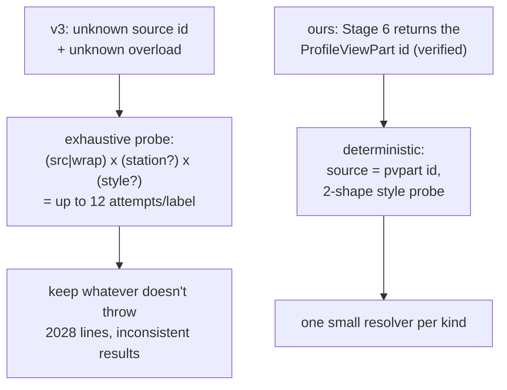
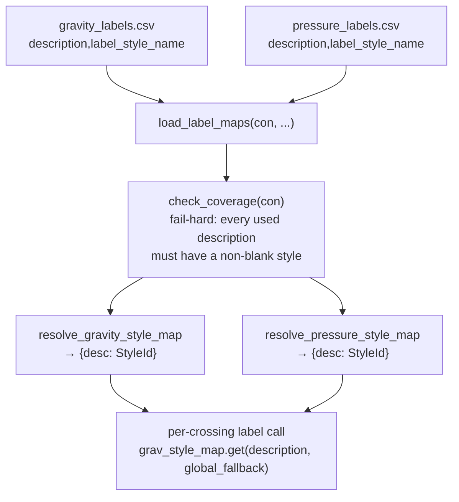

# Stage 7 — Crossing labels

!!! abstract "Goal of this stage"
    Annotate every crossing drawn in Stage 6 with a **crossing profile label** —
    `CrossingPipeProfileLabel` for gravity, `CrossingPressurePipeProfileLabel` for
    pressure. This is the API-hardest stage and the one the reference (v3, 2028
    lines) never got consistently right. We replace its "try every overload until
    one works" approach with a **lean, deterministic resolver** built on the one
    thing Stage 6 gave us that v3 lacked: a **reliable ProfileViewPart id** for
    each part.

    Input to this stage is the `{cross_handle → pvpart_oid}` maps from Stage 6 —
    session objects, not DuckDB rows. Output is one label per labelable crossing,
    styled **per pipe description** via the `label_mapping` module.

---

## Why v3 is 2028 lines — and why ours won't be

v3 is honest about its own confusion: it calls the label `Create` methods with
**every permutation** of `(source id | wrapper id) × (with station/ratio | without)
× (with style | without)`, catching exceptions and keeping whatever doesn't
throw. That is *style-archaeology* — reverse-engineering the API at runtime
because two things were unknown:

1. **Which id to pass as the label source** — the raw pipe id, or the
   ProfileViewPart "wrapper" id?
2. **Which `Create` overload the running build actually exposes.**



!!! success "The Stage-6 dividend"
    Stage 6 already resolved the hard unknown: `AddToProfileView()` (with the
    ModelSpace fallback scan) returns the **ProfileViewPart id**, which *is* the
    correct label source. So Stage 7 doesn't guess the source — it's handed one.
    That single fact collapses v3's 12-way cartesian probe down to a **2-shape
    probe** (with-style, then without-style) that exists only to tolerate a missing
    style, not to discover the API.

---

## The verified label API

Taken directly from v3 (the API *source of truth*, even though its control flow
isn't). Both classes are guarded imports — pressure may be absent.

```python
# stage7_labels.py  (top of module)
import clr
HAS_PRESSURE_LABEL = False
try:
    clr.AddReference("AeccPressurePipesMgd")
    from Autodesk.Civil.DatabaseServices import CrossingPressurePipeProfileLabel
    HAS_PRESSURE_LABEL = True
except Exception:
    CrossingPressurePipeProfileLabel = None

from Autodesk.Civil.DatabaseServices import (
    CrossingPipeProfileLabel, ProfileView, ProfileViewPart)
from Autodesk.AutoCAD.DatabaseServices import OpenMode, ObjectId

# Pressure PV-part class — resolved locally so this module runs standalone.
# ProfileViewPressurePart is the confirmed class name on 2025.2.5 (probe-verified;
# ProfileViewPressurePipe does NOT exist). Gravity/pressure crossings draw as
# different classes, and consume_handoff scans each with its own class.
try:
    from Autodesk.Civil.DatabaseServices import ProfileViewPressurePart
    HAS_PVPRESSUREPART = True
except Exception:
    ProfileViewPressurePart = None
    HAS_PVPRESSUREPART = False
```

| Kind | Call | Notes |
|---|---|---|
| Gravity | `CrossingPipeProfileLabel.Create(pvpart_oid, pv_oid, style_id)` | style optional on gravity |
| Pressure | `CrossingPressurePipeProfileLabel.Create(pvpart_oid, pv_oid, ratio, style_id)` | `ratio ∈ [0,1]`; the pressure API places by **normalized ratio**, not raw station |

!!! danger "Gravity takes NO station; pressure REQUIRES a ratio"
    This asymmetry is the second thing v3 fumbled. The gravity `Create` derives the
    label station from the ProfileViewPart itself — you pass **no** station. The
    pressure `Create` needs a **ratio in [0,1]** locating the label along the PV.
    Pass a raw station to pressure and it's off the view or throws; pass a station
    to gravity and there's no overload for it. Two different shapes — don't unify
    them.

---

## Station → ratio (pressure only)

The pressure label places at a normalized position along the profile view. We
need the crossing station, then normalize it. Both helpers are distilled from v3.

```python
# helpers_labels.py
def station_to_ratio(station, pv_start, pv_end):
    """Fraction [0,1] of `station` within the PV window [pv_s, pv_e].
    Subtractive form so it stays correct when a PV starts at a nonzero station."""
    span = pv_end - pv_start
    if span <= 0:
        return None                      # caller must skip; degenerate PV
    r = (station - pv_start) / span
    return min(1.0, max(0.0, r))         # clamp: a crossing just outside the window
                                         # anchors at the edge instead of floating


def station_of_point(aln, x, y, warnings):
    """Station of world point (x, y) on alignment `aln`, or None if it can't be
    projected. Uses the out-param convention: dummy 0.0 doubles drive overload
    resolution; real (station, offset) come back in the return tuple after a
    leading None for the void return."""
    try:
        _, st, off = aln.StationOffset(float(x), float(y), 0.0, 0.0)
        return st
    except Exception as e:
        warnings.append(f"station_of_point failed ({x:.3f},{y:.3f}): {e}")
        return None


def get_profile_view_station_range(pv_obj):
    """PV station bounds (start, end). Confirmed on 2025: ProfileView.StationStart /
    StationEnd. Do NOT wrap in a bare except that returns (None, None) — a wrong
    read must fail loudly, not silently produce null ratios."""
    return pv_obj.StationStart, pv_obj.StationEnd
```

!!! note "Where the crossing station comes from — derived from the crossing POINT"
    v3 tried to read a station off the crossing *object* at runtime
    (`get_station_of_oid`), with several fallbacks. The `crossings` table has **no
    `main_station` column** (confirmed against the live schema) — it carries the
    crossing **point** `(cross_x, cross_y)`. So Stage 7 derives the station itself:
    project that point onto the **main alignment** via `Alignment.StationOffset`.
    This is exact, needs no schema change, and keeps a PV-placement concern out of
    the detection table. If the projection fails (point off the alignment), we fall
    back to ratio `0.5` (mid-view) — a visible, honest degradation, not a silent
    guess.

    `StationOffset` is the verified **out-param** case: pythonnet (CPython3) has no
    `clr.Reference`, so we pass dummy `0.0` doubles (their type drives overload
    resolution) and unpack the real values from the return tuple, with a leading
    `None` for the void return: `_, st, off = aln.StationOffset(x, y, 0.0, 0.0)`.

---

## The lean resolvers

Two small functions replace v3's ~600 lines of label-creation permutations. Each
tries **with style, then without** — that's the only real variability once the
source id is known.

```python
# helpers_labels.py
def create_gravity_label(pvpart_oid, pv_oid, style_id, warnings):
    """Create a gravity crossing label. Returns the label ObjectId on success, else None.
    Source is the ProfileViewPart id from Stage 6 (NOT the raw pipe id)."""
    if pvpart_oid is None or pvpart_oid.IsNull:
        warnings.append("gravity label skipped: no ProfileViewPart id")
        return None
    if style_id is not None and not style_id.IsNull:
        try:
            res = CrossingPipeProfileLabel.Create(pvpart_oid, pv_oid, style_id)
            return res[0] if (res is not None and res.Count > 0) else None
        except Exception as e:
            warnings.append(f"gravity label (styled) failed, retrying default: {e}")
    try:
        res = CrossingPipeProfileLabel.Create(pvpart_oid, pv_oid)      # 2-arg default style
        return res[0] if (res is not None and res.Count > 0) else None
    except Exception as e:
        warnings.append(f"gravity label failed: {e}")
        return None


def create_pressure_label(pvpart_oid, pv_oid, ratio, style_id,
                          has_pressure_label, warnings):
    """Create a pressure crossing label at normalized ratio in [0,1].
    Returns the label ObjectId on success, else None. No-op (warns) if the
    pressure class is unavailable."""
    if not has_pressure_label or CrossingPressurePipeProfileLabel is None:
        warnings.append("pressure label skipped: pressure label class unavailable")
        return None
    if pvpart_oid is None or pvpart_oid.IsNull:
        warnings.append("pressure label skipped: no ProfileViewPressurePart id")
        return None
    r = 0.5 if ratio is None else max(0.0, min(1.0, float(ratio)))
    # Create REQUIRES a style id — the ONLY overload is
    # Create(ObjectId, ObjectId, Double, ObjectId). There is NO 3-arg/styleless
    # overload (probe-confirmed on 2025.2.5). And the style must be a valid PRESSURE
    # crossing label style: a gravity CrossProfileLabelStyles id is rejected by
    # CheckArgLabelStyle ("Value does not fall within the expected range"). So if
    # style_id is Null we SKIP — there is nothing valid to fall back to.
    if style_id is None or style_id.IsNull:
        warnings.append("pressure label skipped: no valid pressure crossing label "
                        "style to borrow (none exists in the drawing to copy from).")
        return None
    if style_id is not None and not style_id.IsNull:
        try:
            res = CrossingPressurePipeProfileLabel.Create(pvpart_oid, pv_oid, r, style_id)
            return res[0] if (res is not None and res.Count > 0) else None
        except Exception as e:
            warnings.append(f"pressure label (styled) failed, retrying default: {e}")
    try:
        res = CrossingPressurePipeProfileLabel.Create(pvpart_oid, pv_oid, r)
        return res[0] if (res is not None and res.Count > 0) else None
    except Exception as e:
        warnings.append(f"pressure label failed: {e}")
        return None
```

!!! danger "Reference trap → why it fails → our fix"
    **Trap.** v3 builds a list of *source candidates* (`[pvpart_id, pipe_id,
    wrapper_id, …]`) and loops them against every overload, because it was never
    sure which id the API wanted. **Why it fails.** When more than one candidate
    "works", the label can attach to the *wrong* entity or the wrong view, so
    results are inconsistent run-to-run — exactly the symptom that motivated this
    study. **Fix.** One source, no candidate list: the **ProfileViewPart id from
    Stage 6**. If it's null, we *skip and warn* — we do **not** fall back to the raw
    pipe id, because a "successful" label on the wrong id is worse than a logged
    miss.

---

## Style resolution — gravity from a collection, pressure by borrowing

Gravity and pressure crossing label styles resolve by **completely different
mechanisms** on this build — verified empirically, not assumed:

- **Gravity** lives in `civdoc.Styles.LabelStyles.PipeLabelStyles.CrossProfileLabelStyles`
  and resolves by name (or default). This works.
- **Pressure has NO reachable collection.** There is no `Pressure*LabelStyles`
  anywhere under `civdoc.Styles.LabelStyles`, and the gravity `CrossProfileLabelStyles`
  id is the **wrong type** — passing it to `CrossingPressurePipeProfileLabel.Create`
  throws `Value does not fall within the expected range` inside `CheckArgLabelStyle`.
  The only valid pressure crossing label style comes from an **existing pressure
  crossing label in the drawing**, whose `StyleId` we borrow.

### `available_pressure_label_styles` — single scan, exact map

The key fix over the original `resolve_pressure_label_style`: scan ModelSpace
**once** and return a `{StyleName → StyleId}` dict. Callers do an exact lookup —
no silent fallback to the first placed style.

```python
# helpers_labels.py
def available_pressure_label_styles(db, warnings):
    """Return ({StyleName -> StyleId}, first StyleId) for placed pressure crossing
    labels in ModelSpace. Scans once; callers do exact dict lookup.

    Prerequisite: at least one pressure crossing label must be placed in the drawing
    for each style name the CSV intends to use. On a fresh drawing with none,
    returns ({}, ObjectId.Null) and pressure labels are skipped with a warning."""
    from Autodesk.AutoCAD.DatabaseServices import (
        OpenMode, ObjectId, SymbolUtilityServices)
    from Autodesk.AutoCAD.Runtime import RXClass
    import Autodesk.Civil.DatabaseServices as cds

    target = None
    for cand in ("CrossingPressurePipeProfileLabel", "PressurePartProfileLabel"):
        try:
            target = RXClass.GetClass(getattr(cds, cand))
            break
        except Exception:
            continue
    if target is None:
        warnings.append("available_pressure_label_styles: pressure label RXClass unavailable.")
        return {}, ObjectId.Null

    tr = db.TransactionManager.TopTransaction
    try:
        ms = tr.GetObject(SymbolUtilityServices.GetBlockModelSpaceId(db), OpenMode.ForRead)
    except Exception as e:
        warnings.append(f"available_pressure_label_styles: ModelSpace open failed: {e}")
        return {}, ObjectId.Null

    styles = {}
    first = ObjectId.Null
    for oid in ms:
        try:
            if not oid.ObjectClass.IsDerivedFrom(target):
                continue
            lab = tr.GetObject(oid, OpenMode.ForRead)
            sid = lab.StyleId
            if sid is None or sid.IsNull:
                continue
            try:
                name = getattr(lab, "StyleName", None)
            except Exception:
                name = None
            name = str(name).strip() if name else None
            if name and name not in styles:
                styles[name] = sid
            if first.IsNull:
                first = sid
        except Exception:
            continue

    return styles, first


def resolve_gravity_label_style(civdoc, desired_name, warnings):
    """ObjectId of the gravity crossing label style (documented path first)."""
    coll = civdoc.Styles.LabelStyles.PipeLabelStyles.CrossProfileLabelStyles
    sid, _ = core.get_style_id(coll, desired_name, warnings, "Crossing Pipe Label Style")
    return sid


def resolve_pressure_label_style(db, style_name, warnings):
    """Borrow a pressure crossing label StyleId from a placed label in the drawing.
    `style_name` (optional) matches a specific label's StyleName exactly; else
    returns the first found. Returns ObjectId.Null if none exists — caller must
    SKIP (there is no styleless Create overload for pressure)."""
    from Autodesk.AutoCAD.DatabaseServices import ObjectId

    styles, first = available_pressure_label_styles(db, warnings)

    if style_name:
        key = str(style_name).strip()
        sid = styles.get(key)
        if sid is not None and not sid.IsNull:
            return sid
        warnings.append(
            "resolve_pressure_label_style: requested pressure crossing label style "
            f"{key!r} is not borrowable because no placed pressure crossing label "
            f"uses it. Available placed styles: {sorted(styles.keys())}"
        )
        return ObjectId.Null

    if first.IsNull:
        warnings.append("resolve_pressure_label_style: no existing pressure crossing "
                        "label to borrow a style from; pressure labels will be skipped. "
                        "Place one pressure crossing label manually (any style) once.")
    return first
```

!!! danger "The silent-fallback trap — and how we fixed it"
    The original `resolve_pressure_label_style` scanned ModelSpace and, when the
    requested style name wasn't found among placed labels, **silently returned the
    first placed style** instead. Result: every pressure crossing got the same style
    (`'WATER CROSSING'`) regardless of the CSV mapping — the per-description feature
    was wired end-to-end but dead on arrival. The fix: `available_pressure_label_styles`
    builds a `{StyleName → StyleId}` dict; callers do an **exact lookup** with no
    fallback. A missing style now fails hard with a message listing both the missing
    requested styles and the available placed styles — actionable, not silent.

---

## Per-description label styles — `label_mapping.py`

A single global label style per crossing kind is often insufficient — a `WATER`
crossing and an `LV` crossing need different label styles. The `label_mapping`
module provides **opt-in, per-description style resolution** via two CSV files.



```python
# automations/label_mapping.py
def load_label_maps(con, gravity_csv, pressure_csv):
    """Load both description->style CSVs into DuckDB map tables.
    utf-8-sig BOM tolerant (Excel), style trimmed, blank style -> NULL,
    description NULL/'' unified to '' so the empty-description bucket is one key."""
    for tbl, path in (("label_map_gravity", gravity_csv),
                      ("label_map_pressure", pressure_csv)):
        con.execute(f"""CREATE OR REPLACE TABLE "{tbl}" AS
            SELECT COALESCE(NULLIF(TRIM(CAST(description AS VARCHAR)), ''), '') AS description,
                   NULLIF(TRIM(CAST(label_style_name AS VARCHAR)), '')          AS label_style_name
            FROM read_csv_auto('{path}', header=true, all_varchar=true)""")


def check_coverage(con):
    """Fail-hard: every DISTINCT crossing-pipe description in `crossings` must have
    a map row with a non-blank style. Returns list[str] of problems (empty = OK)."""
    problems = []
    for role, tbl in (("gravity_cross", "label_map_gravity"),
                      ("pressure_cross", "label_map_pressure")):
        rows = con.execute(f"""
            WITH used AS (
                SELECT DISTINCT COALESCE(NULLIF(TRIM(p.description),''),'') AS d,
                       count(*) AS n
                FROM crossings c
                JOIN pipes p ON p.handle = c.cross_handle
                WHERE c.cross_kind = '{role}'
                GROUP BY 1)
            SELECT u.d, u.n,
                   (m.description IS NULL) AS uncovered,
                   (m.label_style_name IS NULL) AS blank
            FROM used u
            LEFT JOIN "{tbl}" m ON u.d = m.description
            WHERE m.description IS NULL OR m.label_style_name IS NULL
            ORDER BY u.n DESC""").fetchall()
        tag = role.replace("_cross", "")
        for d, n, uncovered, blank in rows:
            if uncovered:
                problems.append(f"[{tag}] NO mapping row for description {d!r} ({n} crossings)")
            elif blank:
                problems.append(f"[{tag}] style BLANK for description {d!r} ({n} crossings)")
    return problems


def resolve_gravity_style_map(con, civdoc, warnings):
    """{description -> gravity crossing-label StyleId}. Validates each CSV style name
    against CrossProfileLabelStyles.Contains; unknown name -> hard error."""
    coll = civdoc.Styles.LabelStyles.PipeLabelStyles.CrossProfileLabelStyles
    rows = con.execute("""SELECT description, label_style_name FROM label_map_gravity
                          WHERE label_style_name IS NOT NULL""").fetchall()
    out, bad = {}, []
    for desc, name in rows:
        if coll.Contains(name):
            out[desc] = core.unwrap_oid(coll.get_Item(name))
        else:
            bad.append(name)
    if bad:
        raise ValueError("Gravity label styles not found in drawing "
                         f"(check spelling / import to template): {sorted(set(bad))}")
    return out


def resolve_pressure_style_map(con, db, warnings):
    """{description -> pressure crossing-label StyleId}. Each CSV style name must
    match a placed label's StyleName; unmatched -> hard error listing both missing
    and available styles."""
    rows = con.execute("""SELECT description, label_style_name FROM label_map_pressure
                          WHERE label_style_name IS NOT NULL""").fetchall()
    borrowable, _first = labels.available_pressure_label_styles(db, warnings)
    out, bad = {}, []
    for desc, name in rows:
        sid = borrowable.get(str(name).strip())
        if sid is None or sid.IsNull:
            bad.append(name)
        else:
            out[desc] = sid
    if bad:
        raise ValueError("Pressure label styles not borrowable (no PLACED label uses "
                         f"them — place one crossing label with each style once). "
                         f"Missing requested styles: {sorted(set(bad))}. "
                         f"Available placed styles: {sorted(borrowable.keys())}")
    return out
```

!!! note "Opt-in, backward-compatible"
    `label_mapping` is **opt-in**: if `grav_map_csv` and `pres_map_csv` are both
    `None` (the default), the maps stay empty and every `.get(description, global_style)`
    falls back to the single global style — identical to pre-CSV behavior. Providing
    CSVs activates per-description resolution; `check_coverage` then fail-hards if
    any description used in `crossings` is missing from the CSV.

!!! warning "Pressure prerequisite: place one label per style"
    `resolve_pressure_style_map` can only resolve styles that are **already placed**
    in the drawing. If your CSV lists `'LV CROSSING'` but no placed pressure crossing
    label uses that style, the resolver fails hard and tells you exactly which styles
    are missing and which are available. Fix: place one pressure crossing label with
    each required style, then rerun.

---

## The label loop — per-crossing, per-description

The crossing query joins `pipes` to fetch `description` alongside the geometry
columns. The loop unpacks it and looks up the per-description style, falling back
to the global style if the map is empty (opt-in path).

```python
# project_ic_profiles.py — inside _process_main_pipe
rows = con.execute("""
    SELECT c.cross_handle, c.cross_kind, c.cross_x, c.cross_y,
           c.verdict, c.angle_class, c.cross_z,
           COALESCE(NULLIF(TRIM(p.description),''),'') AS description
    FROM crossings c
    JOIN pipes p ON p.handle = c.cross_handle
    WHERE c.main_handle = ?
""", [mh]).fetchall()

for ch, kind, cx, cy, verdict, angle_class, cross_z, description in rows:
    station = lbl.station_of_point(aln, cx, cy, data["Warnings"])
    if kind == 'gravity_cross':
        loid = lbl.create_gravity_label(
            grav_map.get(ch), pv_id,
            R["grav_style_map"].get(description, R["grav_lblstyle"]),  # per-desc, fallback global
            data["Warnings"])
        if loid:
            made += 1
            label_recs.append((loid, station, cross_z))
    elif kind == 'pressure_cross':
        ratio = lbl.station_to_ratio(station, pv_s, pv_e)
        if ratio is None:
            data["Warnings"].append("pressure label skipped: null ratio (degenerate PV range)")
            continue
        loid = lbl.create_pressure_label(
            pres_map.get(ch), pv_id, ratio,
            R["pres_style_map"].get(description, R["pres_lblstyle"]),  # per-desc, fallback global
            HAS_PRESSURE_LABEL, data["Warnings"])
        if loid:
            made += 1
            label_recs.append((loid, station, cross_z))
```

!!! danger "The per-description key bug — and the fix"
    The original loop unpacked only 7 fields and keyed the style lookup on the
    **literal string `"description"`** — `R["grav_style_map"].get("description", …)`.
    That key never matches a real description, so every crossing silently fell back
    to the global style and the entire `label_mapping` machinery had zero effect.
    The fix is two characters: unpack `description` as the 8th field and key on
    **its value**, not its name.

---

## Label spreading

After all labels for a PV are created, `spread_crossing_labels` repositions them
outside the grid frame so they don't overlap the profile geometry. Labels left of
the midstation go to the left margin; labels right of midstation go to the right
margin. Vertical positions are spread evenly within the grid height.

```python
# helpers_labels.py
def spread_crossing_labels(tr, pv, recs, warnings):
    """Reposition crossing labels outside the PV grid frame.
    recs: [(label_oid, station, cross_z), ...]"""
    live = [(oid, s, z) for (oid, s, z) in recs
            if oid is not None and not oid.IsNull and s is not None and z is not None]
    if not live:
        return 0
    e = pv.GeometricExtents
    gx0, gx1 = e.MinPoint.X, e.MaxPoint.X
    gy0, gy1 = e.MinPoint.Y, e.MaxPoint.Y
    grid_h = gy1 - gy0
    s0, s1 = pv.StationStart, pv.StationEnd
    mid_s = (s0 + s1) / 2.0
    avg_z = sum(z for _, _, z in live) / len(live)
    # ... (vertical centering + spread logic) ...
```

---

## Known issues — current status

!!! success "RESOLVED — per-description label styles (gravity and pressure)"
    The per-description style mapping (`label_mapping.py`) is now correctly wired
    end-to-end. Gravity labels follow the CSV per description. Pressure labels follow
    the CSV per description, provided the required styles are placed in the drawing
    (see prerequisite above). The original silent-fallback bug (all pressure crossings
    getting `'WATER CROSSING'` regardless of description) is fixed by the
    `available_pressure_label_styles` exact-lookup approach.

!!! success "RESOLVED — the pvpart hand-off is sound (was the prime suspect)"
    "Not every crossing gets a label" was first blamed on the Stage-6 → Stage-7
    hand-off (the `id → cross_handle` re-key dropping entries). A per-PV diagnostic
    proved otherwise: `grav_crossings_labelable == grav_crossings_intended` on
    **every** profile view, gravity and pressure. The maps in `Data["Items"]` were
    fully populated with the correct handle keys.

    The alarm was a **buggy counter**, not a buggy pipeline: it counted with
    `id2h.get(h2id.get(h))` — an ObjectId round-trip used as a dict key, which does
    not hash-match across the pythonnet boundary, so it under-reported to zero. Fixed
    by counting against the crossing **handle strings** (stable) directly. Lesson:
    when a diagnostic disagrees with the visible data, suspect the diagnostic first.
    **Conclusion: if a label is missing, the cause is downstream of the hand-off** —
    look at label style, `runs_alongside`, or multiplicity, not the map.

!!! success "RESOLVED — `find_profile_view_id_by_name` signature"
    The helper takes `(tr, db, name)` — it needs the AutoCAD **Database** for
    `SymbolUtilityServices.GetBlockModelSpaceId(db)`. All call sites (Stage 6
    `iter_main_pvs`, Stage 7 `rederive_pv_records`) now pass `context["db"]`. Earlier
    drafts passed `civdoc`, which broke the ModelSpace lookup. Fixed.

!!! danger "OPEN — residual unlabelled crossings, remaining hypotheses"
    With the hand-off cleared and per-description styles working, any crossing still
    drawn-but-unlabelled must be one of these — debug **one at a time**, do not
    blind-patch:

    1. **`runs_alongside = FALSE` filter.** Confirm no crossing you expected is
       classified `runs_alongside = TRUE` and thus filtered from labelling.
    2. **Multiplicity.** A pipe crossing the main **twice** yields two `crossings`
       rows but one pvpart id; the second `Create` on the same pvpart may no-op or
       throw. Check for duplicate `cross_handle` per `main_handle`.
    3. **Null pressure label style.** A pressure crossing whose description maps to a
       style not yet placed in the drawing will be skipped (see prerequisite above).
       The warning message lists exactly which styles are missing.
    4. **Structures aren't in `crossings`.** Stage 6 adds each crossing pipe's end
       structures to the PV, but only *pipes* have `cross_handle` rows. Their pvparts
       are created and never labelled — which is *correct* (we label pipes, not
       structures). Confirm the "missing" labels aren't just structures.

    Debug order: per PV, log `len(rows)` vs labels made and diff the handle sets;
    the drop-out set names the cause.

## Stage-7 checkpoint — labels on every labelable crossing

```python
# stage7_labels.py
def run(context, stage6=None):
    civdoc, db, tr, IN = context["civdoc"], context["db"], context["tr"], context["IN"]
    data = {"Warnings": [], "Skipped": [], "Items": []}
    try:
        duckdb_path   = IN[0] if (len(IN) > 0 and IN[0]) else ':memory:'
        grav_style_nm = IN[1] if (len(IN) > 1 and IN[1]) else None
        pres_style_nm = IN[2] if (len(IN) > 2 and IN[2]) else None
        handoff       = IN[3] if (len(IN) > 3 and IN[3]) else None
        con = duck.connect(duckdb_path)

        grav_style = lbl.resolve_gravity_label_style(civdoc, grav_style_nm, data["Warnings"])
        pres_style = lbl.resolve_pressure_label_style(db, pres_style_nm, data["Warnings"])

        # Three reconstruction modes (A fused / B serialised / C re-derive)
        pvpart_cls = ProfileViewPart
        pvpressurepart_cls = ProfileViewPressurePart if HAS_PVPRESSUREPART else None
        has_pres   = (CrossingPressurePipeProfileLabel is not None)
        if stage6 is not None:
            records = stage6                                                    # A
        else:
            records = lbl.consume_handoff(                                      # B
                context, handoff, con, net, pvpart_cls, pvpressurepart_cls, data["Warnings"])
            if records is None:
                records = lbl.rederive_pv_records(                             # C
                    context, con, net, pvpart_cls, has_pres, data["Warnings"])

        for pv_rec in records:
            pv_id  = pv_rec["pv_id"]
            pv_obj = tr.GetObject(pv_id, OpenMode.ForRead)
            pv_s, pv_e = lbl.get_profile_view_station_range(pv_obj)
            grav_map = pv_rec["pvpart_gravity"]
            pres_map = pv_rec["pvpart_pressure"]
            aln = tr.GetObject(pv_rec["alignment_id"], OpenMode.ForRead)

            rows = con.execute("""
                SELECT cross_handle, cross_kind, cross_x, cross_y
                FROM crossings
                WHERE main_handle = ? AND runs_alongside = FALSE
            """, [pv_rec["main_handle"]]).fetchall()

            made = 0
            for cross_handle, cross_kind, cross_x, cross_y in rows:
                if cross_kind == 'gravity_cross':
                    if lbl.create_gravity_label(grav_map.get(cross_handle), pv_id,
                                                grav_style, data["Warnings"]):
                        made += 1
                elif cross_kind == 'pressure_cross':
                    station = lbl.station_of_point(aln, cross_x, cross_y, data["Warnings"])
                    ratio = lbl.station_to_ratio(station, pv_s, pv_e)
                    if lbl.create_pressure_label(pres_map.get(cross_handle), pv_id,
                                                 ratio, pres_style,
                                                 HAS_PRESSURE_LABEL, data["Warnings"]):
                        made += 1
            data["Items"].append({"main": pv_rec["main_handle"], "labels": made})
    except Exception as e:
        data["Warnings"].append(str(e))
        data["Warnings"].append(traceback.format_exc())
    return data
```

!!! note "Input map (standalone Stage 7)"
    `IN[0]` = DuckDB path · `IN[1]` = gravity label style name · `IN[2]` = pressure
    label style name · `IN[3]` = Stage-6 hand-off (`OUT["Handoff"]`, optional).
    `IN[3]` empty → falls back to re-derive (mode C).

`pvh.find_profile_view_id_by_name(tr, db, name)` is the Stage-6 helper
(`SymbolUtilityServices` + `RXClass` ProfileView enumeration) in
`helpers_profileview`. **It takes the AutoCAD `db`, not `civdoc`** — pass
`context["db"]` (this was a real bug: earlier call sites passed `civdoc` and the
`SymbolUtilityServices.GetBlockModelSpaceId(db)` call inside then failed).

Next: **[Stage 8 — Orchestrator](08-orchestrator.md)**
