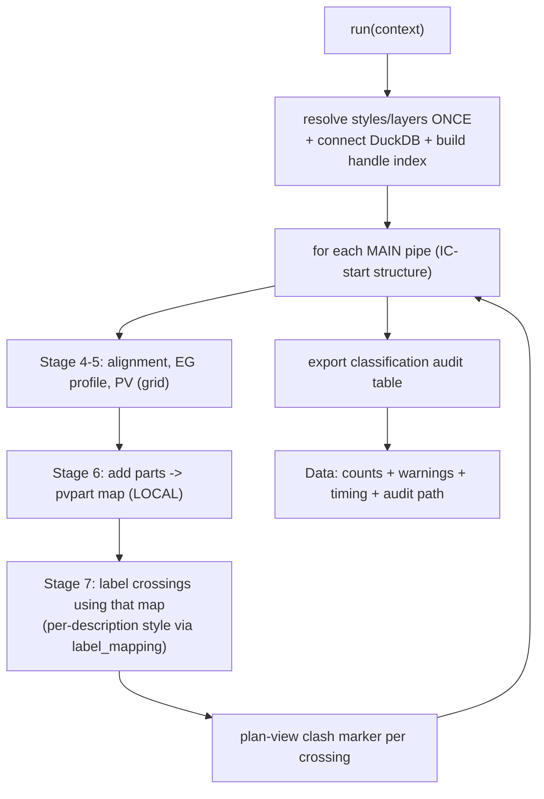

# Stage 8 — Orchestrator, plan-view clash markers, audit table

!!! abstract "Goal of this stage"
    Fuse Stages 4-7 into a single pass — `project_ic_profiles.run(context)` — so
    the per-pipe work (alignment → profile → PV → parts → labels) happens in one
    loop with the pvpart map as a **local variable**, never crossing a `run()`
    boundary. Then add the two things that make a run *checkable* rather than
    merely *complete*: **plan-view clash markers** at every crossing, coloured by
    verdict, and a **classification audit table** exported from DuckDB.

    This is the node the Dynamo graph actually loads. Stages 2-7 were the pieces;
    this assembles and instruments them.

---

## Why fuse (and what stops being independent)

Stages 6 and 7 share **session ObjectIds** (the pvpart map). ObjectIds don't
persist, so the only place that map is trustworthy is *within one execution*.
Fusing makes that structural: add parts and label in the same loop iteration, map
never stored, never re-derived.



!!! note "The standalone stages still exist — for debugging"
    Fusing is the production path. The per-stage `run()` entry points remain valid
    for isolating a single stage when something breaks. Same helpers, two assemblies.

!!! note "No hand-off object needed here — the map is a local variable"
    Because the orchestrator labels **inline** (the pvpart map produced by
    `add_parts_to_profile_view` is consumed by the label calls a few lines later, in
    the same loop iteration), there is **no** cross-process hand-off in the fused
    path — nothing to serialise, nothing to mis-hash. The serialised hand-off
    (`data["Handoff"]` → `OUT[0]`) only matters when Stage 6 and Stage 7 run as
    **separate Dynamo graphs**; then Stage 7 reads it as `IN[3]` (`consume_handoff`,
    mode B) and skips the ModelSpace re-derive. If you ever split this orchestrator
    back into two graphs, have Stage 6 emit `data["Handoff"]` exactly as its
    standalone form does and wire it to Stage 7's `IN[3]`.

---

## The orchestrator

One transaction (loader-owned, Recipe 7/8), one DuckDB connection, resolve-once,
then the fused loop. Per-item `try/except` isolates one bad pipe.

### Input map

| `IN` index | Value | Notes |
|---|---|---|
| `IN[0]` | main network name | required; raises if absent |
| `IN[1]` | surface name | optional; EG profiles empty if absent |
| `IN[2]` | DuckDB file path | required for persistence; `':memory:'` for in-run only |
| `IN[3]` | alignment style name | optional; first available if absent |
| `IN[4]` | alignment label-set name | optional |
| `IN[5]` | profile style name | optional |
| `IN[6]` | profile label-set name | optional |
| `IN[7]` | profile view style name | optional |
| `IN[8]` | band-set name | optional |
| `IN[9]` | gravity crossing part style name | optional; first `PipeStyles` entry if absent |
| `IN[10]` | pressure source pipe name (style copy) | optional; first pressure pipe if absent |
| `IN[11]` | gravity crossing **label** style name | optional; first `CrossProfileLabelStyles` if absent |
| `IN[12]` | pressure crossing **label** style name | optional; borrowed from first placed pressure label if absent |
| `IN[13]` | gravity label-style CSV path | optional; activates per-description gravity labels |
| `IN[14]` | pressure label-style CSV path | optional; activates per-description pressure labels |

```python
# project_ic_profiles.py
import traceback
import clr
import time, os
from Autodesk.AutoCAD.DatabaseServices import SymbolUtilityServices, OpenMode, ObjectId
from Autodesk.Civil.DatabaseServices import ProfileViewPart, ProfileViewPressurePart
from automations import helpers_core as core
from automations import helpers_alignment as al
from automations import helpers_profileview as pvh
from automations import helpers_network as net
from automations import helpers_labels as lbl
from automations import duckdb_engine as duck

HAS_PRESSURE = False
try:
    clr.AddReference("AeccPressurePipesMgd")
    from Autodesk.Civil.ApplicationServices import CivilDocumentPressurePipesExtension
    HAS_PRESSURE = True
except Exception:
    CivilDocumentPressurePipesExtension = None

HAS_PRESSURE_LABEL = False
try:
    clr.AddReference("AeccPressurePipesMgd")
    from Autodesk.Civil.DatabaseServices import CrossingPressurePipeProfileLabel
    HAS_PRESSURE_LABEL = True
except Exception:
    CrossingPressurePipeProfileLabel = None

HAS_PVPRESSUREPART = False
try:
    from Autodesk.Civil.DatabaseServices import ProfileViewPressurePart
    HAS_PVPRESSUREPART = True
except Exception:
    ProfileViewPressurePart = None

from Autodesk.Civil.DatabaseServices import ProfileViewPart
HAS_PVPART = True

TEMP_LAYER   = "_TEMP_ALIGN_SEED"
CLASH_LAYER  = "_XING_CLASH_MARKERS"
MAX_PV_W, MAX_PV_H = 1200.0, 400.0
MARGIN_X, MARGIN_Y = 1000.0, 50.0


def run(context):
    start_time = time.time()
    civdoc, tr, IN = context["civdoc"], context["tr"], context["IN"]
    db = context["db"]
    data = {"Warnings": [], "Skipped": [], "Items": [], "Counts": {}, "pv_handles": []}
    try:
        main_network     = IN[0]  if (len(IN) > 0  and IN[0])  else None
        surface_name     = IN[1]  if (len(IN) > 1  and IN[1])  else None
        duckdb_path      = IN[2]  if (len(IN) > 2  and IN[2])  else ':memory:'
        aln_style_nm     = IN[3]  if (len(IN) > 3  and IN[3])  else None
        aln_labelset_nm  = IN[4]  if (len(IN) > 4  and IN[4])  else None
        prof_style_nm    = IN[5]  if (len(IN) > 5  and IN[5])  else None
        prof_labelset_nm = IN[6]  if (len(IN) > 6  and IN[6])  else None
        pv_style_nm      = IN[7]  if (len(IN) > 7  and IN[7])  else None
        bandset_nm       = IN[8]  if (len(IN) > 8  and IN[8])  else None
        grav_style_nm    = IN[9]  if (len(IN) > 9  and IN[9])  else None
        pres_style_nm    = IN[10] if (len(IN) > 10 and IN[10]) else None
        grav_lblstyle_nm = IN[11] if (len(IN) > 11 and IN[11]) else None
        pres_lblstyle_nm = IN[12] if (len(IN) > 12 and IN[12]) else None
        grav_map_csv     = IN[13] if (len(IN) > 13 and IN[13]) else None
        pres_map_csv     = IN[14] if (len(IN) > 14 and IN[14]) else None

        con = duck.connect(duckdb_path)

        # --- per-description label-style mapping (opt-in) ---
        from automations import label_mapping as lmap
        grav_style_map, pres_style_map = {}, {}
        if grav_map_csv or pres_map_csv:
            lmap.load_label_maps(con, grav_map_csv, pres_map_csv)
            problems = lmap.check_coverage(con)
            if problems:
                raise ValueError("Label-style mapping incomplete: " + " ".join(problems))
            grav_style_map = lmap.resolve_gravity_style_map(con, civdoc, data["Warnings"])
            pres_style_map = lmap.resolve_pressure_style_map(con, db, data["Warnings"])

        # detection must already be built into `crossings` (Stage 3). Guard it.
        n_x = con.execute("SELECT count(*) FROM crossings").fetchone()[0]
        if main_network is None:
            raise ValueError("main network name (IN[0]) is required.")

        # --- resolve ONCE ---
        ms_id = SymbolUtilityServices.GetBlockModelSpaceId(db)
        ms = tr.GetObject(ms_id, OpenMode.ForWrite)
        seed_layer  = core.ensure_layer(tr, db, TEMP_LAYER)
        clash_layer = core.ensure_layer(tr, db, CLASH_LAYER)
        aln_style, _   = core.get_style_id(civdoc.Styles.AlignmentStyles, aln_style_nm, data["Warnings"], "Alignment Style")
        aln_lblset, _  = core.get_style_id(civdoc.Styles.LabelSetStyles.AlignmentLabelSetStyles, aln_labelset_nm, data["Warnings"], "Alignment Label Set")
        prof_style, _  = core.get_style_id(civdoc.Styles.ProfileStyles, prof_style_nm, data["Warnings"], "Profile Style")
        prof_lblset, _ = core.get_style_id(civdoc.Styles.LabelSetStyles.ProfileLabelSetStyles, prof_labelset_nm, data["Warnings"], "Profile Label Set")
        pv_style, _    = core.get_style_id(civdoc.Styles.ProfileViewStyles, pv_style_nm, data["Warnings"], "Profile View Style")
        bandset, _     = core.get_style_id(civdoc.Styles.ProfileViewBandSetStyles, bandset_nm, data["Warnings"], "Band Set")
        grav_lblstyle  = lbl.resolve_gravity_label_style(civdoc, grav_lblstyle_nm, data["Warnings"])
        pres_lblstyle  = lbl.resolve_pressure_label_style(db, pres_lblstyle_nm, data["Warnings"])
        surface_id     = core.find_surface_id(tr, civdoc, surface_name)

        grav_part_style = net.resolve_part_styles(civdoc, grav_style_nm, data["Warnings"])
        pres_part_style = None
        if HAS_PRESSURE:
            pres_part_style = net.pressure_style_from_sample(
                tr, civdoc, CivilDocumentPressurePipesExtension.GetPressurePipeNetworkIds,
                data["Warnings"], pipe_name=pres_style_nm)

        h2id = net.build_handle_index(db, tr, civdoc, HAS_PRESSURE,
                                      CivilDocumentPressurePipesExtension, data["Warnings"])
        id2h = {v: k for k, v in h2id.items()}

        _, _, maxx, maxy = con.execute(
            "SELECT st_xmin(e), st_ymin(e), st_xmax(e), st_ymax(e) "
            "FROM (SELECT st_extent_agg(geom) e FROM structures)").fetchone()
        placer = pvh.GridPlacer(maxx + MARGIN_X, maxy + MARGIN_Y, columns=5)
        aln_names = set(getattr(tr.GetObject(a, OpenMode.ForRead), "Name", "")
                        for a in civdoc.GetAlignmentIds())

        # --- IC- filter: only main pipes whose start structure name begins 'IC-' ---
        mains = con.execute("""
            SELECT p.handle, p.name, p.start_x, p.start_y, p.end_x, p.end_y,
                   p.start_handle, p.end_handle
            FROM pipes p
            JOIN structures s ON p.start_handle = s.handle
            WHERE p.role = 'main'
              AND s.name LIKE 'IC-%'
            ORDER BY p.name
        """).fetchall()

        labels_total = 0
        total_mains = len(mains)
        for idx, (mh, pname, sx, sy, ex, ey, sh, eh) in enumerate(mains, 1):
            _plog(f"PV {idx}/{total_mains}  pipe={pname!r}  START")
            t_pv = time.time()
            try:
                labels_made = _process_main_pipe(
                    context, con, ms, mh, pname, (sx, sy), (ex, ey), sh, eh, h2id, id2h,
                    dict(seed_layer=seed_layer, clash_layer=clash_layer, aln_names=aln_names,
                         aln_style=aln_style, aln_lblset=aln_lblset, prof_style=prof_style,
                         prof_lblset=prof_lblset, pv_style=pv_style, bandset=bandset,
                         grav_lblstyle=grav_lblstyle, pres_lblstyle=pres_lblstyle,
                         grav_part_style=grav_part_style, pres_part_style=pres_part_style,
                         surface_id=surface_id, placer=placer, datasource_id=datasource_id,
                         grav_style_map=grav_style_map, pres_style_map=pres_style_map),
                    data)
                labels_total += labels_made
                _plog(f"PV {idx}/{total_mains}  pipe={pname!r}  DONE  labels={labels_made}  "
                      f"({time.time()-t_pv:.1f}s)")
            except Exception as e:
                data["Skipped"].append({"pipe": mh, "reason": str(e)})
                _plog(f"PV {idx}/{total_mains}  pipe={pname!r}  SKIPPED  {e}")

        audit_path = _export_audit(con, duckdb_path)
        data["Counts"] = {"main_pipes": len(mains), "crossings": n_x,
                          "labels": labels_total, "audit": audit_path}
    except Exception as e:
        data["Warnings"].append(str(e)); data["Warnings"].append(traceback.format_exc())
    finally:
        data["Timing"] = {"total": f"{time.time() - start_time:.2f} seconds"}
    return data
```

!!! danger "Resolve everything before the loop — and pass it as one bag"
    Style/layer/label-set/surface resolution and the handle index are computed
    **once** and handed to `_process_main_pipe` as a single dict. Resolving inside
    the loop would repeat hundreds of collection walks; worse, a mid-loop style
    failure would be reported per pipe instead of once. The DuckDB `crossings`
    count and the `main_network` presence are **hard-guarded up front** — if
    detection wasn't built (Stage 3), fail immediately, not 200 pipes deep.

!!! note "IC- filter — only pipes whose start structure begins 'IC-'"
    The mains query joins `structures` on `start_handle` and filters
    `s.name LIKE 'IC-%'`. This is an **inner join**: any main pipe with a `NULL`
    `start_handle` (extraction couldn't resolve the start structure) is silently
    excluded. If a pipe you expect is missing, check whether its start structure
    resolved during extraction. Use `ILIKE 'IC-%'` if structure names may be
    mixed-case.

---

## `_process_main_pipe` — the fused per-pipe function

```python
# project_ic_profiles.py
def _process_main_pipe(context, con, ms, mh, pname, sp, ep, sh, eh, h2id, id2h, R, data):
    """One main pipe: alignment -> EG profile -> PV -> add parts -> label crossings
    -> plan markers. Returns labels created."""
    civdoc, tr = context["civdoc"], context["tr"]
    db = context["db"]

    aln_name = core.build_unique_name(R["aln_names"], f"ALN - {pname or mh}")
    aln_id = al.create_alignment_from_points(civdoc, tr, ms, sp, ep, aln_name,
                                             R["seed_layer"], R["aln_style"], R["aln_lblset"])
    aln = tr.GetObject(aln_id, OpenMode.ForRead)
    prof_id = al.create_eg_profile(aln_id, R["surface_id"], aln.LayerId,
                                   R["prof_style"], R["prof_lblset"], f"EG - {aln_name}")
    pv_id, _ = pvh.create_profile_view_unique(aln_id, R["placer"].current(),
                                              R["bandset"], R["pv_style"], f"PV - {aln_name}")
    R["placer"].advance(MAX_PV_W, MAX_PV_H)
    pv = tr.GetObject(pv_id, OpenMode.ForWrite)
    pvh.set_band_inputs(pv, R["datasource_id"], prof_id, data["Warnings"])

    # main pipe + structures (keep existing style — no set_pvpart_styles call here)
    main_ids = [x for x in (h2id.get(mh), h2id.get(sh), h2id.get(eh)) if x and not x.IsNull]
    net.add_parts_to_profile_view(tr, db, main_ids, pv_id, ProfileViewPart, HAS_PVPART, data["Warnings"])

    # crossings for THIS main pipe — join pipes for description
    rows = con.execute("""
        SELECT c.cross_handle, c.cross_kind, c.cross_x, c.cross_y,
               c.verdict, c.angle_class, c.cross_z,
               COALESCE(NULLIF(TRIM(p.description),''),'') AS description
        FROM crossings c
        JOIN pipes p ON p.handle = c.cross_handle
        WHERE c.main_handle = ?
    """, [mh]).fetchall()

    grav_ids = [h2id[h] for h, k, *_ in rows if k == 'gravity_cross' and h in h2id]
    pres_ids = [h2id[h] for h, k, *_ in rows if k == 'pressure_cross' and h in h2id]

    g_map_id = net.add_parts_to_profile_view(tr, db, grav_ids, pv_id, ProfileViewPart, HAS_PVPART, data["Warnings"])
    net.set_pvpart_styles(tr, g_map_id, R["grav_part_style"], data["Warnings"])
    grav_map = {id2h[i]: pv_ for i, pv_ in g_map_id.items() if i in id2h}

    pres_map = {}
    if HAS_PRESSURE and HAS_PVPRESSUREPART and pres_ids:
        p_map_id = net.add_pressure_pipes_to_profile_view(tr, db, pres_ids, pv_id,
                        ProfileViewPressurePart, HAS_PVPRESSUREPART, data["Warnings"])
        net.set_pvpart_styles(tr, p_map_id, R["pres_part_style"], data["Warnings"])
        pres_map = {id2h[i]: pv_ for i, pv_ in p_map_id.items() if i in id2h}

    pv_s, pv_e = lbl.get_profile_view_station_range(pv)
    made = 0
    label_recs = []
    for ch, kind, cx, cy, verdict, angle_class, cross_z, description in rows:
        station = lbl.station_of_point(aln, cx, cy, data["Warnings"])
        if kind == 'gravity_cross':
            loid = lbl.create_gravity_label(
                grav_map.get(ch), pv_id,
                R["grav_style_map"].get(description, R["grav_lblstyle"]),
                data["Warnings"])
            if loid:
                made += 1
                label_recs.append((loid, station, cross_z))
        elif kind == 'pressure_cross':
            ratio = lbl.station_to_ratio(station, pv_s, pv_e)
            if ratio is None:
                data["Warnings"].append("pressure label skipped: null ratio (degenerate PV range)")
                continue
            loid = lbl.create_pressure_label(
                pres_map.get(ch), pv_id, ratio,
                R["pres_style_map"].get(description, R["pres_lblstyle"]),
                HAS_PRESSURE_LABEL, data["Warnings"])
            if loid:
                made += 1
                label_recs.append((loid, station, cross_z))
        _plan_marker(tr, ms, R["clash_layer"], cx, cy, verdict,
                     f"{kind[0].upper()} {angle_class}", data["Warnings"])

    lbl.spread_crossing_labels(tr, pv, label_recs, data["Warnings"])
    return made
```

---

## Progress logging

Long-running batches (hundreds of IC pipes, thousands of crossings) can appear
unresponsive for hours. The orchestrator writes a **real-time progress log** to a
file next to the `.duckdb` file, flushed and `fsync`'d after every line so it's
visible via `tail -f` while the node is still running.

```python
# project_ic_profiles.py
_T0 = time.time()
_LOG_PATH = None   # set in run()

def _plog(msg):
    """Append a timestamped progress line and flush immediately."""
    line = f"[{time.time()-_T0:8.1f}s] {msg}"
    try:
        if _LOG_PATH:
            with open(_LOG_PATH, "a", encoding="utf-8") as f:
                f.write(line + "\n")
                f.flush()
                os.fsync(f.fileno())
    except Exception:
        pass
```

`_LOG_PATH` is set at the start of `run()` to `<duckdb_dir>/progress.log` and
the file is truncated at the start of each run. Watch it live from WSL:

```bash
tail -f /path/to/data/progress.log
```

**Reading the log:**

- **No file, or only `START`** → stuck before the per-PV loop (DuckDB connection,
  `crossings` count, or style resolution). The loop never began.
- **`main pipes to process: N` then stops at `PV k/N START`** → stuck processing
  PV *k*. The per-second timing on the previous `DONE` lines gives the ETA for
  remaining pipes.
- **Lines advancing steadily** → working normally; `({t}s)` per PV is the cost.

`data["Timing"]` in the return dict reports total elapsed seconds regardless of
whether the run succeeded or raised.

---

## Plan-view clash markers

```python
# project_ic_profiles.py
from Autodesk.AutoCAD.DatabaseServices import Circle, MText
from Autodesk.AutoCAD.Geometry import Point3d

_VERDICT_COLOR = {"CLASH": 1, "TIGHT": 2, "CLEAR": 3}   # ACI: red / yellow / green
_MARKER_R = 1.5


def _plan_marker(tr, ms, layer_id, x, y, verdict, tag, warnings):
    """Circle + MText at (x, y), colour by verdict. Purely diagnostic; never fatal."""
    try:
        if not ms.IsWriteEnabled:
            ms.UpgradeOpen()
        c = Circle(); c.Center = Point3d(x, y, 0.0); c.Radius = _MARKER_R
        c.LayerId = layer_id
        c.ColorIndex = _VERDICT_COLOR.get(verdict, 7)
        ms.AppendEntity(c); tr.AddNewlyCreatedDBObject(c, True)

        t = MText(); t.Location = Point3d(x + _MARKER_R, y + _MARKER_R, 0.0)
        t.Contents = f"{verdict} | {tag}"; t.TextHeight = _MARKER_R
        t.LayerId = layer_id; t.ColorIndex = _VERDICT_COLOR.get(verdict, 7)
        ms.AppendEntity(t); tr.AddNewlyCreatedDBObject(t, True)
        return True
    except Exception as e:
        warnings.append(f"Plan marker failure: {str(e)}")
        return False
```

!!! note "Marker verdict matches the approved three-way classification"
    Colours map to the **Stage-3 verdict** — `CLASH` (gap ≤ 0), `TIGHT` (0 < gap <
    clearance), `CLEAR` (gap ≥ clearance) — red / yellow / green. This is the
    three-way scheme from the approved crossing-detection page, **not** the
    two-way `CLASH` / `CLEARANCE_OK` of the immature foundation engine. If your
    live `crossings.verdict` still emits the two-way values, that's a Stage-3 fix,
    not a marker fix.

!!! tip "The marker is drawn even when the label fails"
    `_plan_marker` runs regardless of whether `create_*_label` succeeded. So a
    crossing that the label API rejected is **still visible in plan** with its
    verdict — the marker is the independent audit trail that doesn't depend on the
    label pipeline working. When debugging unlabelled crossings, compare marker
    count (should equal `len(rows)`) against label count.

---

## The classification audit table

```python
# project_ic_profiles.py
def _export_audit(con, duckdb_path):
    """Write the full crossings classification to CSV next to the .duckdb file."""
    import os
    out = os.path.join(os.path.dirname(duckdb_path) if duckdb_path else ".",
                       "crossings_audit.csv")
    con.execute(f"""COPY (
        SELECT main_name, cross_name, cross_net, cross_kind,
               angle_deg, angle_class, main_z, cross_z, dz, verdict,
               runs_alongside, cross_x, cross_y
        FROM crossings
        ORDER BY verdict, angle_class, main_name
    ) TO '{out}' (HEADER, DELIMITER ',')""")
    return out
```

!!! danger "The audit is the point — a label you can't verify isn't done"
    A plan set can *look* finished and be wrong: a missed crossing, a mislabelled
    clash, an oblique dismissed as parallel. The audit table is how the run defends
    itself — sort by `verdict='CLASH'` to review every hard conflict, filter
    `angle_class='NEAR_PARALLEL'` to sanity-check the alongside calls, diff
    `runs_alongside` against what got labelled. This is why detection lives in
    DuckDB and not buried in the drawing loop: **the evidence is queryable.**

!!! success "Stage-8 checkpoint"
    One run produces: alignments + EG profiles + profile views for every IC- main
    pipe; the main pipe, its structures, and every non-alongside crossing drawn into
    each PV; a gravity/pressure label per crossing (per-description styled if CSVs
    provided); a coloured plan marker per crossing; and `crossings_audit.csv`.
    `Counts` reports `main_pipes`, `crossings`, `labels`, and the audit path.
    `Timing` reports total elapsed seconds.

    Acceptance: **marker count == crossings count** for each PV (markers never
    fail), and **labels == crossings** once all label styles are placed and mapped.
    Until then, the marker-vs-label gap is the bug's fingerprint.

Next: **[Limits & verification](09-limits.md)** — the known caveats, the
first-run probe procedure, and how to read the audit table to trust a run.
