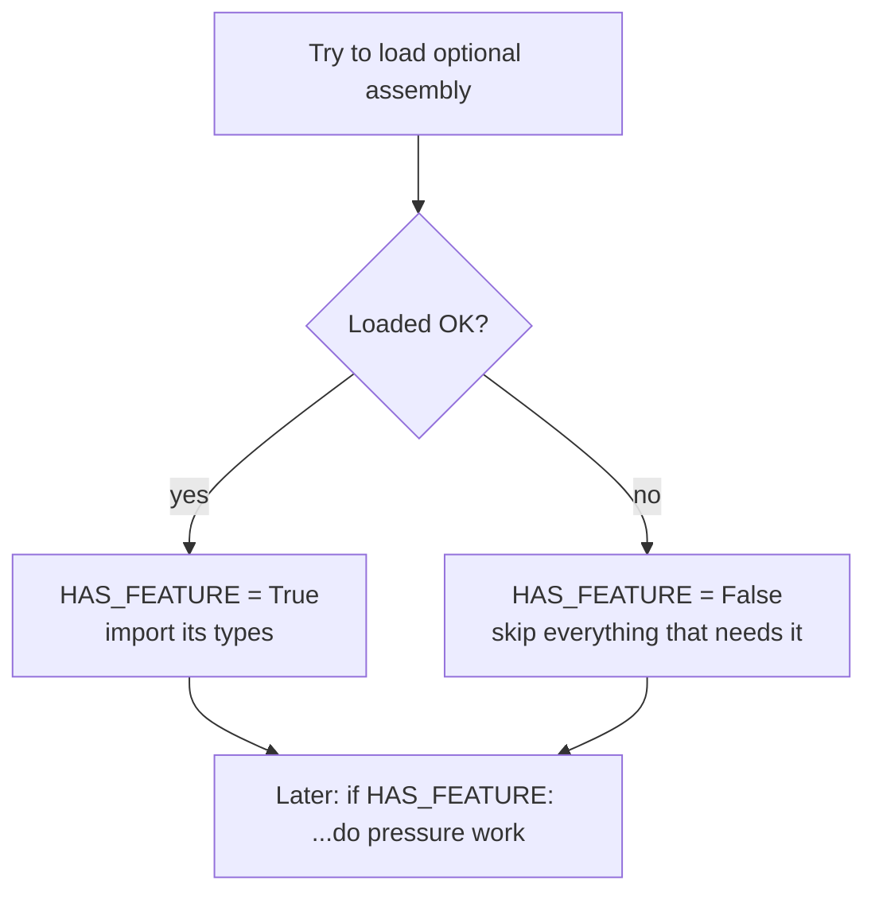

# Chunk A — Imports & Feature Flags

!!! abstract "What this chapter teaches"
    How to load the Civil 3D .NET libraries from Python, and — more importantly —
    how to load *optional* ones **without crashing** when they're missing. This is
    the "capability detection" pattern, and it's what lets one script run across
    different Civil 3D installs and versions.

---

## The two-line ritual: `clr` and `AddReference`

Python doesn't know about .NET libraries until you tell it. The **Common Language
Runtime** bridge (`clr`) lets Python treat .NET assemblies (DLLs) like packages.

```python
import clr
clr.AddReference("AcMgd")        # AutoCAD managed API (Application, Document)
clr.AddReference("AcDbMgd")      # AutoCAD database objects (Polyline, Layer, ObjectId)
clr.AddReference("AeccDbMgd")    # Civil 3D core objects (Alignment, Profile, ProfileView)
```

!!! note "Think of it like `pip install`, but for .NET"
    `clr.AddReference("AcDbMgd")` is roughly *"make the AutoCAD database library
    importable."* After it runs, you can do `from Autodesk.AutoCAD.DatabaseServices
    import Polyline`. Skip the `AddReference` and that import fails.

The three you'll almost always need:

| Assembly | Holds | You use it for |
|---|---|---|
| `AcMgd` | `Application`, `Document`, `Editor` | Getting the active drawing |
| `AcDbMgd` | `Polyline`, `Line`, `ObjectId`, `LayerTableRecord` | Plain CAD geometry & database |
| `AeccDbMgd` | `Alignment`, `Profile`, `ProfileView`, `Pipe` | Civil 3D objects |

---

## The important idea: optional assemblies & feature flags

Not every drawing/install has every module. The **Pressure Pipes** module is the
classic example — it may not be installed. If you blindly `AddReference` it and it's
missing, your whole script dies before it starts.

The fix is **capability detection**: try to load it, and remember whether you
succeeded in a boolean flag.

```python
try:
    clr.AddReference("AeccPressurePipesMgd")
    HAS_PRESSURE = True
except:
    HAS_PRESSURE = False
```

Now every pressure-related code path is *guarded* by that flag:

```python
if HAS_PRESSURE:
    from Autodesk.Civil.ApplicationServices import CivilDocumentPressurePipesExtension
    # ... pressure-only imports ...
```



!!! tip "One flag per optional capability"
    The example script sets several: `HAS_PRESSURE`, `HAS_CROSSING_LABEL`,
    `HAS_PVPART_CLASS`, `HAS_PRESSURE_LABEL`. Each guards a feature that only exists
    in certain versions. This is exactly how you make **one script that works across
    Civil 3D 2023–2025** instead of four brittle copies.

---

## Version-safe *type* imports (not just assemblies)

A subtler trap: even inside an assembly you *did* load, a specific **class** might
only exist in newer versions. `ProfileViewPart`, for instance, appeared in Civil 3D
2025. Importing it on 2023 throws. So wrap *those* too:

```python
try:
    from Autodesk.Civil.DatabaseServices import ProfileViewPart
    HAS_PVPART_CLASS = True
except:
    HAS_PVPART_CLASS = False
    ProfileViewPart = None        # define the name so later code can reference it safely
```

!!! warning "Always define the fallback name"
    Notice `ProfileViewPart = None` in the `except`. If you don't, later code that
    mentions `ProfileViewPart` raises `NameError` on old versions — even inside an
    `if HAS_PVPART_CLASS:` block, Python still has to resolve the name. Setting it to
    `None` keeps the module importable everywhere.

---

## The improved pattern

The example script uses **bare `except:`** everywhere, which also swallows things
like `KeyboardInterrupt` and hides real errors. A cleaner version narrows the catch
and records *why* a capability is off:

```python
CAPABILITIES = {}

def _try_reference(name):
    """Load an optional assembly; return True/False and never raise."""
    try:
        clr.AddReference(name)
        CAPABILITIES[name] = "loaded"
        return True
    except Exception as e:                      # narrow: Exception, not bare except
        CAPABILITIES[name] = f"unavailable ({e.__class__.__name__})"
        return False

HAS_PRESSURE = _try_reference("AeccPressurePipesMgd")
```

!!! success "Why this is better"
    - **`except Exception`** (not bare `except:`) still catches load failures but
      lets truly fatal signals through.
    - **`CAPABILITIES`** becomes a diagnostic you can drop into your `results` dict —
      so when a teammate asks "why didn't pressure crossings work on my machine?",
      the answer is right there in the Watch node.

---

## Which Python engine? (this changes your imports)

!!! danger "IronPython 2 vs CPython 3 — know which you're on"
    Dynamo can run nodes on **IronPython 2** or **CPython 3**. They differ in syntax
    (`print` statement vs function), in some `clr` behaviours, and in how a few APIs
    marshal data. The example script targets **CPython 3** (Dynamo 3.x). If you copy
    code between nodes, confirm both use the same engine — mismatches cause baffling
    errors.
    ([Dynamo primer: Python and Civil 3D](https://primer2.dynamobim.org/dynamo-for-civil-3d/advanced-topics/python-and-civil-3d))

---

## Takeaways

| Idea | Keep it forever |
|---|---|
| `clr.AddReference` before importing .NET types | It's "make this DLL importable" |
| Wrap **optional** assemblies in try/except → flag | One script, many installs |
| Wrap **version-specific classes** too | And set the name to `None` on failure |
| Prefer `except Exception` over bare `except:` | Don't swallow fatal signals |
| Record *why* a capability is off | Future-you debugging on someone's machine |

Next: [Chunk B — Reading Dynamo inputs safely](b-inputs.md).
