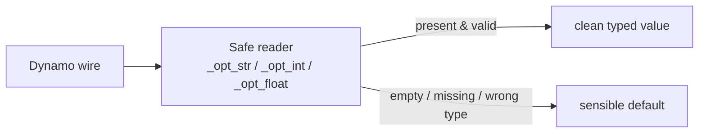

# Chunk B — Reading Dynamo Inputs Safely

!!! abstract "What this chapter teaches"
    How to turn "whatever the user wired into the node" into clean, typed values —
    without your script exploding when a wire is empty, disconnected, or the wrong
    type. This is dull, unglamorous code that saves you *hours* of debugging.

---

## The problem: `IN` is a bag of surprises

Everything wired into a Dynamo Python node arrives in the list `IN`. `IN[0]` is the
first port, `IN[1]` the second, and so on.

```python
network_name = IN[0]     # first wire
ic_prefix    = IN[1]     # second wire
```

But wires lie. A port might be:

- **empty** (`None`) — nothing connected,
- **missing** — the user wired fewer ports than your code expects (`IN[9]` when only
  6 wires exist → `IndexError`),
- **the wrong type** — a number where you wanted text, or a single string where you
  wanted a list.

Any of these will crash a naïve `IN[9]` access. So we never read `IN` directly for
optional values.



---

## The three tiny guardians

These helpers each do the same three-step dance: *does the port exist? is it not
None? can I convert it?* — and fall back to a default otherwise.

```python
def _opt_str(i, default=""):
    """Read IN[i] as a stripped string; default if absent/empty/bad."""
    try:
        if len(IN) > i and IN[i] is not None:
            s = str(IN[i]).strip()
            return s if s else default
    except Exception:
        pass
    return default

def _opt_int(i, default):
    """Read IN[i] as an int; default if absent or non-numeric."""
    try:
        if len(IN) > i and IN[i] is not None:
            return int(IN[i])
    except Exception:
        pass
    return default

def _opt_float(i, default):
    """Read IN[i] as a float; default if absent or non-numeric."""
    try:
        if len(IN) > i and IN[i] is not None:
            return float(IN[i])
    except Exception:
        pass
    return default
```

!!! note "Read one out loud"
    `_opt_int(9, 3)` means: *"Give me port 9 as a whole number. If it's not there or
    isn't a number, give me 3 instead."* No crash, ever.

Using them reads beautifully — every option has a visible default:

```python
COLUMNS      = max(1, _opt_int(9, 3))         # at least 1 column
ON_ALIGN_TOL = abs(_opt_float(12, 0.15))      # tolerance, always positive
TEST_LIMIT   = max(0, _opt_int(15, 0))        # 0 = process everything
```

!!! tip "Wrap the value, not just read it"
    Notice `max(1, ...)`, `abs(...)`, `max(0, ...)`. Reading safely is half the job;
    the other half is **clamping to a sane range** so a user typing `-2 columns`
    can't break your grid layout.

---

## Lists need their own coercion

A port meant to be *a list of network names* might arrive as a single string (user
wired one name), or with blanks and duplicates. Normalise it once, up front:

```python
def normalize_name_list(x):
    """Accept a string OR a list; return de-duplicated, stripped, non-empty names.
    Case-insensitive de-dup, but original casing preserved."""
    if x is None:
        return []
    if isinstance(x, str):
        x = [x]                                   # a lone string becomes a 1-item list
    seen, out = set(), []
    try:
        for item in x:
            if item is None:
                continue
            s = str(item).strip()
            if s and s.lower() not in seen:
                seen.add(s.lower())
                out.append(s)
    except TypeError:
        s = str(x).strip()                        # not iterable → treat as single value
        if s:
            out.append(s)
    return out
```

!!! success "Why de-dup case-insensitively but keep original casing"
    Civil 3D network names are matched case-insensitively, so `"Sewer"` and
    `"sewer"` are the same network — de-dup on `.lower()`. But you keep the user's
    original spelling for **display in warnings**, so messages read naturally.

---

## What the example script did, and the one improvement

The original uses **bare `except:`** in these readers. That works, but it silently
catches *everything* — including bugs in your own conversion logic. The version
above uses **`except Exception`** (and `except TypeError` for the list case), which
is just as safe against bad input but won't mask a genuine coding error.

!!! warning "Bare `except:` is the #1 debugging time-sink"
    `except:` with no type catches `KeyboardInterrupt`, `SystemExit`, and your own
    typos. When "nothing happens and there's no error," a bare `except:` is usually
    the reason. Narrow it. See [Gotchas](../gotchas.md#bare-except).

---

## A habit worth forming: echo the resolved inputs

Put the *resolved* values (after defaults/clamping) into your `results` dict. Then
the Watch node shows exactly what the script actually used — not what the user
*thinks* they wired.

```python
results["ResolvedInputs"] = {
    "Network": network_name, "Columns": COLUMNS,
    "OnAlignTol_m": ON_ALIGN_TOL, "TestLimit": TEST_LIMIT,
}
```

---

## Takeaways

| Idea | Keep it forever |
|---|---|
| Never read optional `IN[i]` directly | Use `_opt_str/_int/_float` |
| Every option has a **visible default** | Reader's second argument |
| **Clamp** after reading | `max(1, ...)`, `abs(...)` |
| Normalise list inputs once | `normalize_name_list` handles string-or-list |
| Prefer `except Exception` | Bare `except:` hides real bugs |
| Echo resolved inputs to `results` | Debug what actually ran |

Next: [Chunk C — Geometry & object helpers](c-helpers.md).
