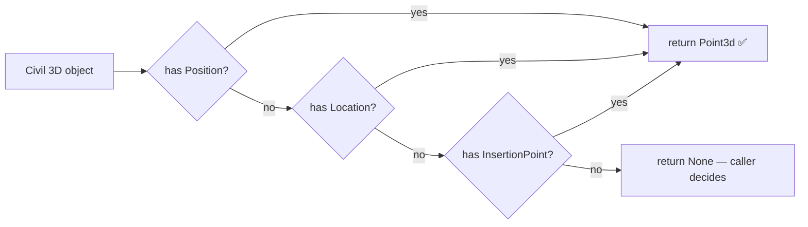
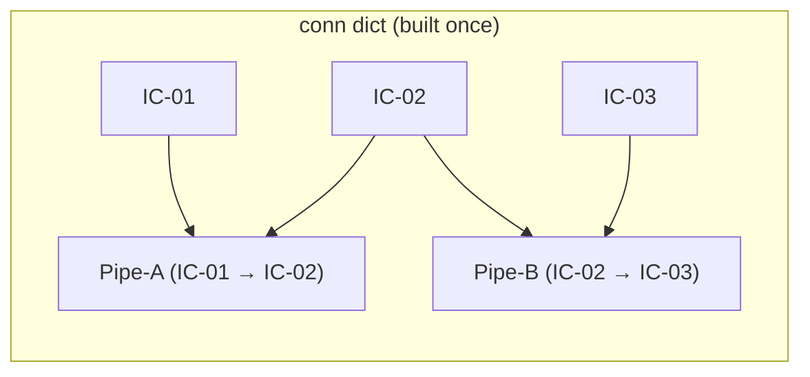

# Chunk C — Geometry & Object Helpers

!!! abstract "What this chapter teaches"
    A collection of small, focused functions that extract points, pipe endpoints,
    and structure IDs from Civil 3D objects — **robustly**, across different object
    types and API versions. These are the functions you'll copy into almost every
    pipe-network script you ever write.

---

## Why "robust extraction" matters

Civil 3D exposes the same *concept* (e.g. "where is this object?") through
**different property names** depending on the object type and the API version:

| Object type | Property that holds its location |
|---|---|
| Structure / Manhole | `Position` |
| Block reference | `InsertionPoint` |
| Generic entity | `Location` or `Point` |

If you hard-code `obj.Position` and the object is a block reference, you get an
`AttributeError`. The helpers below **probe** several names in order and return
`None` if none work — so the caller can decide what to do, rather than crashing.



---

## Helper 1 — `try_get_point3d` (where is this object?)

```python
def try_get_point3d(obj):
    """
    Extract a Point3d from any Civil 3D object by probing common
    position attribute names. Returns None if no valid 3-D point found.
    Safe to call on any object — never raises.
    """
    for attr in ("Position", "Location", "InsertionPoint", "Point"):
        if hasattr(obj, attr):
            try:
                pt = getattr(obj, attr)
                if hasattr(pt, "X") and hasattr(pt, "Y") and hasattr(pt, "Z"):
                    return pt
            except Exception:
                pass
    return None
```

!!! tip "The `hasattr` + `getattr` pattern"
    `hasattr(obj, "Position")` asks *"does this object have a Position property?"*
    without raising if it doesn't. `getattr(obj, "Position")` then fetches it.
    Together they let you probe an unknown object type safely. This pattern appears
    constantly in Civil 3D automation.

!!! warning "Always validate the returned point"
    Some objects have a `Position` property that returns `None` or an invalid object.
    The inner `hasattr(pt, "X")` check guards against that — a real `Point3d` always
    has `X`, `Y`, `Z`.

---

## Helper 2 — `get_pipe_points` (start and end of a pipe)

```python
def get_pipe_points(pipe_obj):
    """
    Return (start_point, end_point) as Point3d for any pipe type
    (gravity or pressure). Returns (None, None) on failure.
    Using a helper avoids silent failures when attribute access throws.
    """
    sp = ep = None
    if hasattr(pipe_obj, "StartPoint"):
        try:
            sp = pipe_obj.StartPoint
        except Exception:
            sp = None
    if hasattr(pipe_obj, "EndPoint"):
        try:
            ep = pipe_obj.EndPoint
        except Exception:
            ep = None
    return sp, ep
```

!!! note "Why not just `pipe_obj.StartPoint` directly?"
    On some Civil 3D versions, accessing `StartPoint` on a pressure pipe raises
    instead of returning `None`. Wrapping in `try/except` means the rest of your
    loop keeps running — you just skip that pipe and log it.

---

## Helper 3 — `get_pipe_end_structure_ids` (which manholes does this pipe connect?)

Gravity pipes connect two structures (manholes). The API exposes this through
`StartStructureId` / `EndStructureId` — but older versions used `StartStructure` /
`EndStructure` (objects, not IDs). This helper tries both:

```python
def get_pipe_end_structure_ids(pipe_obj):
    """
    Return (start_structure_id, end_structure_id) as ObjectIds.
    Tries direct ObjectId properties first, then older object-reference
    properties. Returns (None, None) on failure.
    """
    for a, b in (("StartStructureId", "EndStructureId"),
                 ("StartStructure",   "EndStructure")):
        if hasattr(pipe_obj, a) and hasattr(pipe_obj, b):
            try:
                sv = getattr(pipe_obj, a)
                ev = getattr(pipe_obj, b)
                # Unwrap to plain ObjectId if the API returned an object
                if hasattr(sv, "ObjectId"):
                    sv = sv.ObjectId
                if hasattr(ev, "ObjectId"):
                    ev = ev.ObjectId
                return sv, ev
            except Exception:
                pass
    return None, None
```

!!! note "The 'unwrap' pattern"
    Some API versions return the *structure object* instead of its *ObjectId*. The
    `if hasattr(sv, "ObjectId"): sv = sv.ObjectId` lines unwrap it. This is a
    common Civil 3D API version-compatibility trick.

---

## Helper 4 — `build_unique_name` (avoid duplicate-name crashes)

Civil 3D raises an exception if you try to create two alignments (or profile views)
with the same name. This helper appends an incrementing suffix until it finds a
free name:

```python
def build_unique_name(existing_set, base):
    """
    Return a name not already in existing_set.
    Appends ' 1', ' 2', ... until a free name is found.
    Also adds the chosen name to existing_set to prevent re-use.
    """
    if base not in existing_set:
        existing_set.add(base)
        return base
    i = 1
    while f"{base} {i}" in existing_set:
        i += 1
    name = f"{base} {i}"
    existing_set.add(name)
    return name
```

Usage:

```python
existing_align_names = set()
# pre-populate from the drawing:
for aid in civdoc.GetAlignmentIds():
    a = tr.GetObject(aid, OpenMode.ForRead)
    existing_align_names.add(a.Name)

# now generate a safe name:
aln_name = build_unique_name(existing_align_names, f"Alignment - {start_name}")
```

!!! tip "Pre-populate from the drawing"
    Always seed `existing_set` with names already in the drawing before the loop
    starts. Otherwise the first run is fine, but re-running the script creates
    `Alignment - IC-01 1`, `Alignment - IC-01 2`, etc. instead of reusing the
    original.

!!! warning "Belt-and-braces: also catch the API exception"
    Even with this helper, a race condition (another user editing the drawing) could
    cause a duplicate. Wrap `Alignment.Create(...)` in a retry loop that catches the
    `ArgumentException` for "duplicate name" — see the
    [Cookbook recipe 6](../cookbook.md#recipe-6--generate-a-unique-name-avoid-duplicate-name-crashes).

---

## Helper 5 — `ensure_layer` (create a layer if it doesn't exist)

Placing temporary geometry (the seed polyline for alignment creation) requires a
layer. This helper creates it if missing and unlocks it if locked:

```python
def ensure_layer(tr, layer_name):
    """
    Return the ObjectId of layer_name, creating it if absent.
    Also unlocks the layer so temporary geometry can be placed on it.
    """
    lt = tr.GetObject(db.LayerTableId, OpenMode.ForRead)
    for lid in lt:
        ltr = tr.GetObject(lid, OpenMode.ForRead)
        if ltr.Name.lower() == layer_name.lower():
            if ltr.IsLocked:
                ltrw = tr.GetObject(lid, OpenMode.ForWrite)
                ltrw.IsLocked = False
            return lid
    # Not found — create it
    lt.UpgradeOpen()                          # switch the table to write mode
    ltr_new = LayerTableRecord()
    ltr_new.Name = layer_name
    ltr_new.IsLocked = False
    new_id = lt.Add(ltr_new)
    tr.AddNewlyCreatedDBObject(ltr_new, True) # register with the transaction
    return new_id
```

!!! note "`UpgradeOpen()` — switching from read to write"
    You open the layer table `ForRead` first (cheap, safe). When you need to *add*
    to it, call `UpgradeOpen()` to promote it to write mode. This is the standard
    AutoCAD .NET pattern — open read-only until you know you need to write.

!!! danger "Always `AddNewlyCreatedDBObject`"
    Any object you `new` up in Python and add to the database **must** be registered
    with the transaction via `tr.AddNewlyCreatedDBObject(obj, True)`. Skip this and
    the object is orphaned — it may appear to work but will cause corruption or
    crashes on commit.

---

## The connectivity map — a pattern worth knowing

The main loop needs to know "which pipes connect to this manhole?" for every
manhole. Iterating the full network for every manhole is O(n²). The better approach
(used in the example script) is to build a **connectivity map** once, up front:

```python
conn = {}   # {structure_id: [(pipe_id, start_id, end_id), ...]}

for pid in target_net.GetPipeIds():
    p = tr.GetObject(pid, OpenMode.ForRead)
    st_id, en_id = get_pipe_end_structure_ids(p)
    if st_id is None or en_id is None:
        continue
    conn.setdefault(st_id, []).append((pid, st_id, en_id))
    conn.setdefault(en_id, []).append((pid, st_id, en_id))
```

Now `conn[manhole_id]` gives all connected pipes in O(1). This is a standard
**adjacency list** — the same data structure used in graph algorithms.



!!! success "O(n) build, O(1) lookup"
    Build the map once in one pass over all pipes. Then every manhole lookup is
    instant. For networks with hundreds of pipes this is the difference between a
    2-second run and a 2-minute run.

---

## Takeaways

| Helper | What it solves |
|---|---|
| `try_get_point3d` | Different object types, different property names |
| `get_pipe_points` | Pressure vs gravity, version differences |
| `get_pipe_end_structure_ids` | ObjectId vs object-reference API versions |
| `build_unique_name` | Civil 3D duplicate-name exceptions |
| `ensure_layer` | Layer may not exist; may be locked |
| Connectivity map | O(1) pipe lookup per manhole |

Next: [Chunk D — Resolving styles & label styles](d-styles.md).
