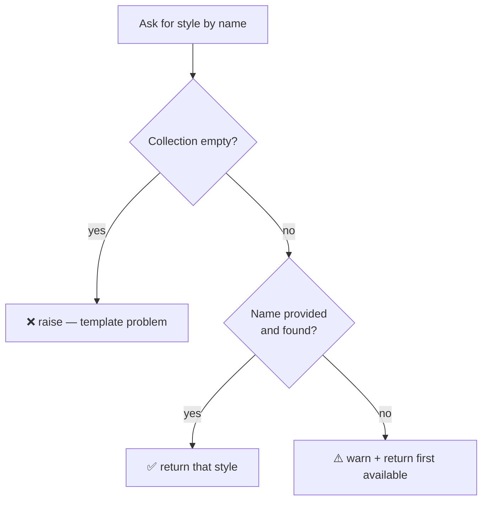
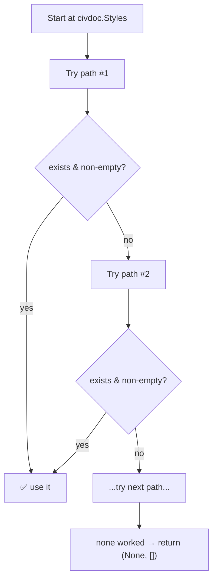

# Chunk D — Resolving Styles & Label Styles

!!! abstract "What this chapter teaches"
    How to look up a Civil 3D **style** by name, fall back gracefully when it's
    missing, and — the hard part — how to navigate the deeply-nested, version-varying
    tree of **label style** collections. This is where a lot of "why is my label the
    wrong style?" bugs live.

---

## Recap: styles are outfits in a wardrobe

From the [primer](../getting-started/civil3d-api-primer.md): a **style** is the
"how it looks" recipe. Your code doesn't create styles — it **picks** from what the
drawing template already contains, looking them up **by name** in a **collection**.

```python
civdoc.Styles.AlignmentStyles          # wardrobe of alignment outfits
civdoc.Styles.ProfileViewStyles        # wardrobe of profile-view outfits
civdoc.Styles.ProfileViewBandSetStyles # wardrobe of band-set outfits
```

---

## The core pattern: find-by-name-or-fall-back

The single most useful style helper. It tries to find the requested style; if the
name is missing it **warns and uses the first available** (so the script continues);
if the collection is *empty* it raises (a drawing-setup problem you can't paper
over).

```python
def get_style_id_or_first(style_coll, desired_name, warnings, kind):
    """
    Resolve a style ObjectId from a collection.
    - name found      → return it
    - name missing    → warn, return first available
    - collection empty→ raise (template not set up)
    Returns: (ObjectId, resolved_name)
    """
    try:
        ids = list(style_coll.ToObjectIds())
    except Exception:
        ids = []
    if not ids:
        raise Exception(f"No {kind} found in drawing. Import styles from template.")
    if desired_name:
        try:
            if style_coll.Contains(desired_name):
                return style_coll.get_Item(desired_name), desired_name
        except Exception:
            pass
        warnings.append(f'{kind} "{desired_name}" not found; using first available.')
    return ids[0], "<FirstAvailable>"
```



!!! success "Two different failures, two different responses"
    - **Empty collection** = the drawing template is broken. Nothing to fall back
      to → **fail loudly**. The engineer must fix their template.
    - **Named style missing** = a typo or a template variant. There *is* something
      to fall back to → **degrade gracefully + warn**. The script still produces a
      drawing; the engineer fixes the name later.

Usage is clean:

```python
align_style_id, _ = get_style_id_or_first(
    civdoc.Styles.AlignmentStyles,
    DESIRED_ALIGNMENT_STYLE, results["Warnings"], "Alignment Style")

pv_style_id, _ = get_style_id_or_first(
    civdoc.Styles.ProfileViewStyles,
    PROFILEVIEW_STYLE_NAME, results["Warnings"], "Profile View Style")
```

---

## The hard part: label style collections are a maze

Regular styles live one level under `civdoc.Styles`. **Label styles** live in a
deep, inconsistent tree that *changes between Civil 3D versions and between gravity
and pressure*. For example, a crossing-pipe label style might live at any of:

```text
Styles → LabelStyles → PipeLabelStyles → CrossProfileLabelStyles   (2025)
Styles → LabelStyles → PipeLabelStyles → CrossingPipeLabelStyles   (older)
Styles → LabelStyles → CrossingPipeLabelStyles                     (older still)
```

And **pressure** pipe label styles don't live under `civdoc.Styles` at all — they
live on the **pressure extension object**.

!!! warning "This is the #1 source of 'wrong label style' bugs"
    There is no single reliable path. Hard-coding one path works on your machine and
    fails on your colleague's. The robust approach is to **try a list of known paths
    in priority order** and use the first that exists.

---

## The improved pattern: path-list resolution

Rather than one hard-coded path, define a **priority-ordered list of candidate
paths** and walk them until one yields a non-empty collection.

```python
_GRAVITY_CROSSING_LABEL_PATHS = [
    ("LabelStyles", "PipeLabelStyles", "CrossProfileLabelStyles"),   # 2025 (preferred)
    ("LabelStyles", "PipeLabelStyles", "CrossingPipeLabelStyles"),   # older
    ("LabelStyles", "CrossingPipeLabelStyles"),                      # older still
    ("LabelStyles", "PipeLabelStyles"),                             # last-resort
]

def _resolve_label_coll(paths):
    """Walk candidate paths; return the first (collection, ids) that has content."""
    for attr_path in paths:
        try:
            obj = civdoc.Styles
            for attr in attr_path:
                obj = getattr(obj, attr)         # descend one level
            ids = _enum_style_coll(obj)
            if ids:
                return obj, ids
        except Exception:
            continue
    return None, []
```



!!! tip "Enumerate collections defensively too"
    Different Civil 3D versions expose style collections through different
    enumeration methods (`ToObjectIds()`, direct iteration, or `Count` + indexer).
    A robust `_enum_style_coll` tries all three:
    ```python
    def _enum_style_coll(coll):
        try:
            ids = list(coll.ToObjectIds())
            if ids: return ids
        except Exception: pass
        try:
            return [item for item in coll]        # IEnumerable
        except Exception: pass
        try:
            return [coll[i] for i in range(int(coll.Count))]
        except Exception: pass
        return []
    ```

---

## Pressure label styles live somewhere else entirely

Pressure crossing label styles are **not** under `civdoc.Styles`. They hang off the
pressure extension:

```python
from Autodesk.Civil.ApplicationServices import CivilDocumentPressurePipesExtension

ext = CivilDocumentPressurePipesExtension.GetCivilDocumentPressurePipesExtension(civdoc)
# now walk ext.Styles.LabelStyles.CrossingProfileLabelStyles etc.
```

!!! note "When in doubt, search by name recursively"
    As a last resort, the example script walks *every* collection-like attribute
    under a root object looking for a style whose `.Name` matches — a brute-force
    fallback. It's slow and ugly, but it *finds the style* when the path list
    misses. Keep it as a safety net, not a primary strategy.

---

## Anti-pattern spotted: dead code after `return`

!!! bug "Unreachable code in the example script"
    In `get_pressure_crossing_label_style_id`, there's a block of code (another whole
    resolution attempt) placed **after** a `return` statement. Python never runs it —
    it's dead code left over from a refactor.

    ```python
    def get_pressure_crossing_label_style_id(desired_name, warnings):
        ...
        return ObjectId.Null          # <-- function ends here
        # everything below is UNREACHABLE — never executes
        """Resolve a pressure CROSSING pipe label style ObjectId."""
        coll, ids = _resolve_label_coll(_PRESSURE_CROSSING_LABEL_PATHS)
        ...
    ```

    **Lesson:** after any refactor, search for code following an unconditional
    `return`/`raise`. Linters (`pylint`, `ruff`) flag this automatically —
    [set one up](../gotchas.md#unreachable-code).

---

## Takeaways

| Idea | Keep it forever |
|---|---|
| Find-by-name-or-first | Graceful degradation with a warning |
| Empty collection → raise; missing name → warn | Two failures, two responses |
| Label styles need **path lists**, not one path | Versions differ wildly |
| Enumerate collections three ways | `ToObjectIds` / iterate / `Count` |
| Pressure styles live on the **extension** | Not under `civdoc.Styles` |
| Watch for dead code after `return` | Run a linter |

Next: [Chunk E — Crossing detection (the math)](e-crossing-detection.md).
