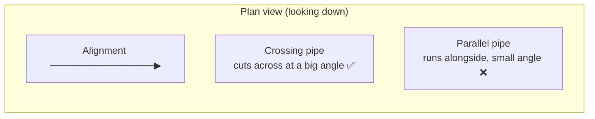
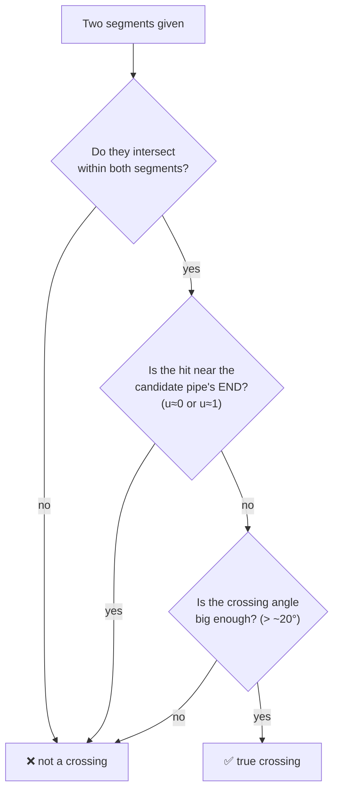

# Chunk E — Crossing Detection (the geometry that decides what shows on a section)

!!! abstract "What this chapter teaches"
    How to decide, **in code**, whether one pipe *truly crosses* an alignment —
    and, just as important, how to **reject pipes that merely run alongside it**.
    This is the single trickiest piece of the example script, and the place its
    original author got a subtly wrong answer. We'll learn the *good* pattern and
    turn the *bug* into a lesson.

!!! warning "Remember: the example script is a teaching sample, not a template"
    We keep its **good ideas** (pure-Python 2-D math, `StationOffset` by reference)
    and **replace its weak logic** (a too-loose "alongside" filter) with a better
    approach. Copy the boxed *recommended* code, not the original.

---

## The task in plain words

Imagine you are standing on a footpath (the **alignment**) and other pipes are
laid across the ground. Some pipes **cut across** your path — those are
**crossings**, and they must appear as a little circle on the cross-section. Some
pipes run **next to** your path in the same direction — those are **parallel
runs**, and they must **not** appear as crossings.



So the whole job is a **yes/no question about two line segments in plan (XY)**:

> *Does this candidate pipe cross the alignment — and is it actually a crossing,
> not just a pipe running beside it?*

---

## Step 1 — Do two segments cross? (pure Python, no CAD API)

The original script makes a smart choice here: instead of asking AutoCAD to
compute intersections (which needs both objects registered in the database and
"fails silently otherwise"), it does the math **itself** with plain numbers. This
is fast, dependency-free, and testable.

Each pipe and the alignment are reduced to a **straight segment** between two
points. Two segments `A→B` and `C→D` are tested with the classic parametric
method:

```python
def _cross2d(ax, ay, bx, by):
    """2-D cross product of vectors (ax,ay) and (bx,by)."""
    return ax * by - ay * bx

def segments_intersect_2d(x1, y1, x2, y2, x3, y3, x4, y4):
    """True if segment (x1,y1)->(x2,y2) crosses segment (x3,y3)->(x4,y4).
    Z is ignored: this is a plan-view (top-down) test."""
    dx12, dy12 = x2 - x1, y2 - y1        # direction of segment A->B
    dx34, dy34 = x4 - x3, y4 - y3        # direction of segment C->D
    denom = _cross2d(dx12, dy12, dx34, dy34)
    if abs(denom) < 1e-10:
        return False                     # parallel or on top of each other
    dx13, dy13 = x3 - x1, y3 - y1
    t = _cross2d(dx13, dy13, dx34, dy34) / denom   # how far along A->B
    u = _cross2d(dx13, dy13, dx12, dy12) / denom   # how far along C->D
    return 0.0 <= t <= 1.0 and 0.0 <= u <= 1.0     # both hits land on the segments
```

!!! note "What `t` and `u` mean (say it out loud)"
    - `t` = *"how far along the **alignment** is the meeting point?"* (0 = start, 1 = end)
    - `u` = *"how far along the **candidate pipe** is the meeting point?"*

    If **both** are between 0 and 1, the two *finite* segments genuinely touch.
    Remember `u` — it becomes the hero of our bug fix.

!!! tip "Why `abs(denom) < 1e-10` matters"
    `denom` is zero when the two segments are **parallel**. Comparing floating-point
    numbers to *exactly* zero is dangerous, so we treat "very close to zero" as
    parallel. A perfectly parallel pipe correctly returns `False` here. The trouble
    (below) is the *nearly* parallel pipe.

---

## Step 2 — Where is a point relative to the alignment? (`StationOffset`)

To ask "is this pipe running *alongside* the alignment?", we need the alignment's
own ruler: **station** (distance *along*) and **offset** (distance *sideways*).
Civil 3D gives us `Alignment.StationOffset(...)`, but there's a catch that trips
up every newcomer.

### The by-reference gotcha

`StationOffset` doesn't *return* the two numbers. It expects you to hand it two
**empty boxes** and it fills them in — this is a C#/.NET pattern called
**`out` parameters** ("output parameters, passed by reference"). In Python we make
those boxes with `clr.Reference`:

```python
import clr, System

def station_offset(aln, x, y):
    """Return (station, offset) of world point (x, y) on the alignment.
    StationOffset writes its answers into by-reference doubles, so we
    hand it two clr.Reference boxes and read them back afterwards."""
    st  = clr.Reference[System.Double](0.0)   # empty box #1
    off = clr.Reference[System.Double](0.0)   # empty box #2
    aln.StationOffset(x, y, st, off)          # Civil 3D fills the boxes
    return float(st.Value), float(off.Value)  # read the boxes back
```

!!! danger "The classic 'it returned nothing and no error' trap"
    If you call `StationOffset` (or `PointLocation`) the normal Python way,
    expecting a return value, you get **nothing and no error** — because the real
    answers went into the `out` boxes you didn't provide. This exact confusion is
    all over the forums.
    ([Dynamo forum: PointLocation with Python](https://forum.dynamobim.com/t/how-to-use-civil-3d-api-command-alignment-pointlocation-station-offset-easting-northing-with-python/82232))

    **Rule:** any Civil 3D method whose C# signature has `out double x` needs a
    `clr.Reference[System.Double](0.0)` box in Python.

Now `offset` is exactly what we need: a pipe endpoint whose **offset ≈ 0** sits
*on* the alignment; a large offset sits *far to the side*.

```python
def endpoint_on_alignment(aln, pt, tol):
    """True if pt is within `tol` metres sideways of the alignment centreline."""
    try:
        _, off = station_offset(aln, pt.X, pt.Y)
        return abs(off) <= tol
    except:
        return False
```

---

## Step 3 — The decision function, and the bug 🐞

Here is the example script's original decision function. Read it, then read the
warning box.

```python
def is_pipe_crossing(aln, aln_sp, aln_ep, sp, ep, tol_on_align):
    if sp is None or ep is None or aln_sp is None or aln_ep is None:
        return False
    if not segments_intersect_2d(
        aln_sp.X, aln_sp.Y, aln_ep.X, aln_ep.Y,
        sp.X, sp.Y, ep.X, ep.Y):
        return False
    # Exclude pipes that run parallel/alongside the alignment
    if endpoint_on_alignment(aln, sp, tol_on_align) and endpoint_on_alignment(aln, ep, tol_on_align):
        return False
    return True
```

!!! bug "Why parallel pipes leak onto the section"
    The "alongside" filter only rejects a pipe when **BOTH** of its endpoints are
    within `tol_on_align` of the centreline — and the default tolerance is
    **`0.01 m` (1 cm!)**. A real parallel pipe, offset even slightly or ending at a
    manhole a few centimetres off-line, fails this test, so it is **not** excluded.
    If its segment then clips the alignment near one end, `segments_intersect_2d`
    says "yes" and the parallel pipe is wrongly reported as a **crossing**.

    Two root causes:

    1. **`0.01 m` is effectively never triggered** — real utilities are never that
       perfectly aligned.
    2. **There is no angle check.** A crossing meets the path at a big angle; a
       parallel pipe grazes it at ≈0°. The code can't tell them apart.

### The better approach ✅

A robust crossing test asks **three** questions, not one:



```python
import math

MIN_CROSSING_ANGLE_DEG = 20.0     # below this = 'running alongside'  (tune 15–30)
ENDPOINT_PARAM_GUARD   = 0.02     # ignore hits in the first/last 2% of the pipe

def _segment_cross_params(x1, y1, x2, y2, x3, y3, x4, y4):
    """Like segments_intersect_2d, but returns (t, u, ix, iy) or None.
    t = param along the alignment, u = param along the candidate pipe."""
    dx12, dy12 = x2 - x1, y2 - y1
    dx34, dy34 = x4 - x3, y4 - y3
    denom = dx12 * dy34 - dy12 * dx34
    if abs(denom) < 1e-10:
        return None
    dx13, dy13 = x3 - x1, y3 - y1
    t = (dx13 * dy34 - dy13 * dx34) / denom
    u = (dx13 * dy12 - dy13 * dx12) / denom
    if 0.0 <= t <= 1.0 and 0.0 <= u <= 1.0:
        return t, u, x1 + t * dx12, y1 + t * dy12
    return None

def _crossing_angle_deg(ax, ay, bx, by, cx, cy, dx, dy):
    """Acute angle (0–90°) between alignment vector AB and pipe vector CD."""
    v1 = (bx - ax, by - ay)
    v2 = (dx - cx, dy - cy)
    n1 = math.hypot(*v1); n2 = math.hypot(*v2)
    if n1 < 1e-9 or n2 < 1e-9:
        return 0.0
    cosang = (v1[0]*v2[0] + v1[1]*v2[1]) / (n1 * n2)
    cosang = max(-1.0, min(1.0, cosang))          # clamp for float safety
    return math.degrees(math.acos(abs(cosang)))   # abs -> fold to 0..90

def is_pipe_crossing(aln, aln_sp, aln_ep, sp, ep, tol_on_align):
    """True only for a GENUINE crossing: real intersection, at a meaningful
    angle, not at the candidate pipe's endpoints, and not running alongside."""
    if sp is None or ep is None or aln_sp is None or aln_ep is None:
        return False

    hit = _segment_cross_params(
        aln_sp.X, aln_sp.Y, aln_ep.X, aln_ep.Y, sp.X, sp.Y, ep.X, ep.Y)
    if hit is None:
        return False                                   # parallel / no hit
    t, u, ix, iy = hit

    if u < ENDPOINT_PARAM_GUARD or u > 1.0 - ENDPOINT_PARAM_GUARD:
        return False                                   # touches only at its own end

    if _crossing_angle_deg(aln_sp.X, aln_sp.Y, aln_ep.X, aln_ep.Y,
                           sp.X, sp.Y, ep.X, ep.Y) < MIN_CROSSING_ANGLE_DEG:
        return False                                   # shallow graze = alongside

    if (endpoint_on_alignment(aln, sp, tol_on_align)
            and endpoint_on_alignment(aln, ep, tol_on_align)):
        return False                                   # backstop: fully on-line

    return True
```

!!! success "Why this fixes the leak"
    - **Angle test** is the decisive discriminator: parallel ≈ 0°, crossing ≫ 20°.
    - **Endpoint guard (`u`)** drops "pipe only touches at its own manhole" cases.
    - Use a **realistic** `tol_on_align` (e.g. `0.15 m`), because `0.01 m` never fires.

---

## Step 4 — Two assumptions you must never forget

!!! warning "This is a PLAN-view (2-D) test — Z is ignored"
    Every function here throws away the Z coordinate. A pipe that crosses in plan
    but sits 3 m above or below the alignment is **still flagged**. For "what to
    draw on the section" that's usually fine, but if **vertical clearance** matters,
    add a Z-band check before you trust the result.

!!! warning "Skewed crossings are real"
    Don't set `MIN_CROSSING_ANGLE_DEG` too high. Utilities legitimately cross at
    30–45°. Start at **20°** and tune against your own drawings. Which leads to the
    golden rule below.

---

## Step 5 — Tune with data, not vibes (the diagnostics habit)

Before trusting *any* geometric threshold, **log the raw numbers** for every
candidate so you can see *why* each pipe was kept or dropped. This turns threshold
tuning from guesswork into evidence.

```python
diag = []   # collect one row per candidate pipe
hit = _segment_cross_params(...)
if hit:
    t, u, ix, iy = hit
    ang = _crossing_angle_deg(...)
    diag.append({"pipe": str(gpid), "u": round(u, 3),
                 "angle_deg": round(ang, 1), "kept": is_pipe_crossing(...)})
# ... later ...
results["Crossings"]["Diagnostics"] = diag   # read it in a Dynamo Watch node
```

!!! tip "The workflow"
    Run once in **diagnostics mode**, open the `Diagnostics` list in a Watch node,
    eyeball the `angle_deg`/`u` of pipes you *know* are parallel vs. crossing, then
    pick thresholds that cleanly separate them. Only then switch labelling on.

---

## What to take away from Chunk E

| Idea | Keep it forever |
|---|---|
| **Do geometry in pure Python** | No CAD-API dependency, fast, unit-testable |
| **`t` and `u` are gold** | `t` = along alignment, `u` = along candidate — use `u` to reject endpoint touches |
| **`out double` → `clr.Reference`** | Any `StationOffset`/`PointLocation`-style call needs by-ref boxes |
| **One condition is never enough** | Real classification = intersection **and** angle **and** endpoint guard |
| **Tune with logged data** | Emit diagnostics before trusting a threshold |
| **State your assumptions** | This is 2-D; Z is ignored — say so, loudly |

Next: [Chunk F — Building profile views](f-profile-views.md).
