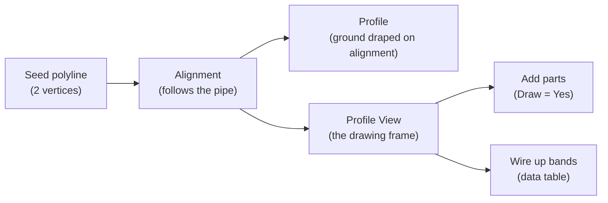
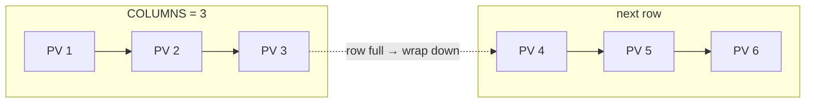

# Chunk F — Building Profile Views

!!! abstract "What this chapter teaches"
    How to create the core Civil 3D objects — **alignment → profile → profile view** —
    from a pipe, place profile views on a tidy grid, add pipes/structures so they
    actually draw, and wire up the data bands. This is tasks 1–4 of the workflow.

---

## The dependency chain

These objects must be created **in order** — each depends on the previous one:



---

## Step 1 — The alignment needs a seed polyline

`Alignment.Create()` (the polyline overload) needs an existing AutoCAD polyline to
trace. So we create a throwaway 2-vertex polyline from the pipe's endpoints, then
let Civil 3D consume it.

```python
pl = Polyline()
pl.AddVertexAt(0, Point2d(sp.X, sp.Y), 0.0, 0.0, 0.0)   # start
pl.AddVertexAt(1, Point2d(ep.X, ep.Y), 0.0, 0.0, 0.0)   # end
pl.Layer = TEMP_LAYER

pl_id = ms.AppendEntity(pl)                   # add to model space
tr.AddNewlyCreatedDBObject(pl, True)          # register with the transaction
```

Then create the alignment, telling Civil 3D to **erase the seed polyline** when
done:

```python
plops = PolylineOptions()
plops.PlineId                  = pl_id
plops.AddCurvesBetweenTangents = False
plops.EraseExistingEntities    = True         # Civil 3D cleans up the seed polyline

aln_id = Alignment.Create(
    civdoc, plops, aln_name, SITE_ID,
    layer_id, align_style_id, align_labelset_id)
```

!!! note "`SITE_ID = ObjectId.Null` — the 'no site' trick"
    Pipe-based alignments should not belong to a Civil 3D *site* (sites impose
    geometry-interaction rules that don't apply here). Passing `ObjectId.Null` as the
    site means "no site" — the recommended choice for this kind of alignment.

!!! danger "Register the seed polyline before creating the alignment"
    `tr.AddNewlyCreatedDBObject(pl, True)` is mandatory. If you forget it, the
    polyline isn't part of the transaction and `Alignment.Create` may fail or corrupt
    the drawing.

---

## Step 2 — The surface profile (optional)

If a ground surface is available, drape it over the alignment to get the "existing
ground" line:

```python
surface_profile_id = ObjectId.Null
if surface_id != ObjectId.Null:
    prof_name = f"EG - {SURFACE_NAME}"
    surface_profile_id = Profile.CreateFromSurface(
        prof_name, aln_id, surface_id,
        aln.LayerId, profile_style_id, profile_labelset_id)
```

!!! tip "Guard optional steps with `ObjectId.Null` checks"
    `if surface_id != ObjectId.Null:` reads as *"only if we actually found a
    surface."* This lets the same script run with or without a ground surface — no
    surface, no profile, no crash.

---

## Step 3 — The profile view, with duplicate-name retry

`ProfileView.Create` throws if the name already exists. Rather than pre-checking
(which can race), the robust pattern **retries with an integer suffix** until it
succeeds:

```python
def create_profile_view_unique(aln_id, insert_pt, bandset_id, pv_style_id, base_name):
    """Create a Profile View, retrying with ' (1)', ' (2)', ... on duplicate names."""
    for i in range(0, 5000):
        name = base_name if i == 0 else f"{base_name} ({i})"
        try:
            pv_id = ProfileView.Create(aln_id, insert_pt, name, bandset_id, pv_style_id)
            return pv_id, name
        except Exception as e:
            if "duplicat" in str(e).lower():   # only retry on duplicate-name errors
                continue
            raise                              # any other error is real — re-raise
    raise Exception("Could not generate a unique Profile View name.")
```

!!! success "Retry ONLY on the expected error"
    Notice `if "duplicat" in str(e).lower(): continue` — it retries **only** on a
    duplicate-name error, and **re-raises everything else**. A retry loop that
    swallows *all* exceptions would hide real failures (bad style, bad alignment) and
    spin 5000 times pointlessly.

---

## Step 4 — Place views on a grid (don't stack them)

If you drop every profile view at the same point, they overlap into an unreadable
mess. The example script tracks a **grid cursor** that advances left-to-right, then
wraps to a new row:

```python
place = {"x": base_x, "y": base_y, "row_h": 0.0, "col": 0}

def next_grid_position(pv_w, pv_h):
    place["row_h"] = max(place["row_h"], pv_h)
    place["col"] += 1
    if place["col"] >= COLUMNS:                 # row full → wrap
        place["col"]   = 0
        place["x"]     = base_x
        place["y"]    -= (place["row_h"] + SPACING_Y)
        place["row_h"] = 0.0
    else:                                        # advance right
        place["x"] += (pv_w + SPACING_X)
```



!!! note "Place views away from the network"
    The grid origin is computed as `maxx + MARGIN`, `maxy + MARGIN` — i.e. to the
    upper-right of the pipe network's extents, so the profile views never overlap the
    plan drawing.

---

## Step 5 — Add parts so they actually draw

Creating a profile view shows an *empty frame*. To draw the pipe and its manholes,
you must **add them** to the view (this is "Draw = Yes" in the Profile View
Properties dialog):

```python
def add_parts_to_profile_view(tr, ids_to_add, pv_id, warnings):
    """Add pipes/structures to a Profile View. Returns {part_id: pvpart_id}."""
    pvpart_map = {}
    for oid in ids_to_add:
        try:
            part = tr.GetObject(oid, OpenMode.ForWrite)
            if hasattr(part, "AddToProfileView"):
                result = part.AddToProfileView(pv_id)
                if result is not None and not result.IsNull:
                    pvpart_map[oid] = result       # 2025 returns the ProfileViewPart id
        except Exception as e:
            warnings.append(f"AddToProfileView failed for {oid}: {e}")
    return pvpart_map
```

!!! warning "`AddToProfileView` return value varies by version"
    In Civil 3D 2025 it returns the new **`ProfileViewPart` ObjectId** (needed later
    to label crossings). On some versions it returns void/None. The example script
    handles this with a **ModelSpace fallback scan** — searching for the created
    `ProfileViewPart` whose `ModelPartId` matches the pipe. Robust, but a sign of how
    much version-drift you must absorb.

---

## Step 6 — Wire up the data bands

Bands (the data table under the profile) are created empty. You connect them to
data sources — the pipe network for pipe-data bands, the surface profile for
elevation bands:

```python
def set_band_inputs(pv, datasource_id, surface_profile_id, warnings):
    def _apply(items):
        changed = False
        for item in items:
            try:
                bt = item.BandType
                if bt in (BandType.PipeNetwork, BandType.SectionalData) and datasource_id != ObjectId.Null:
                    item.DataSourceId = datasource_id
                    item.ShowLabels   = True
                    changed = True
                if bt == BandType.ProfileData and surface_profile_id != ObjectId.Null:
                    item.Profile1Id = surface_profile_id
                    item.Profile2Id = surface_profile_id
                    item.ShowLabels = True
                    changed = True
            except Exception:
                pass
        return changed
    # apply to bottom, then top bands
    try:
        bottom = pv.Bands.GetBottomBandItems()
        if _apply(bottom):
            pv.Bands.SetBottomBandItems(bottom)
    except Exception:
        pass
```

!!! tip "Get–modify–Set is the band idiom"
    `GetBottomBandItems()` returns a *copy* of the list. You modify the copy, then
    call `SetBottomBandItems(...)` to push it back. Forgetting the `Set...` call is a
    classic "why didn't my band change?" bug — the modification never got saved.

---

## Takeaways

| Step | Key point |
|---|---|
| Seed polyline | Register with `AddNewlyCreatedDBObject`; erase after |
| Alignment | `SITE_ID = ObjectId.Null` for pipe alignments |
| Profile | Guard with `if surface_id != ObjectId.Null` |
| Profile view | Retry on **duplicate-name only**, re-raise the rest |
| Grid placement | Track a cursor; wrap at `COLUMNS` |
| Add parts | Return value varies — have a fallback |
| Bands | **Get → modify → Set**, or nothing saves |

Next: [Chunk G — The main transaction](g-main-loop.md).
