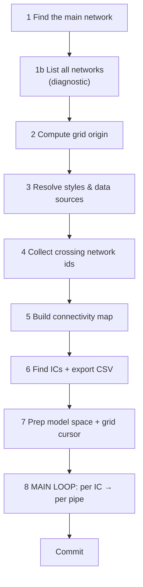
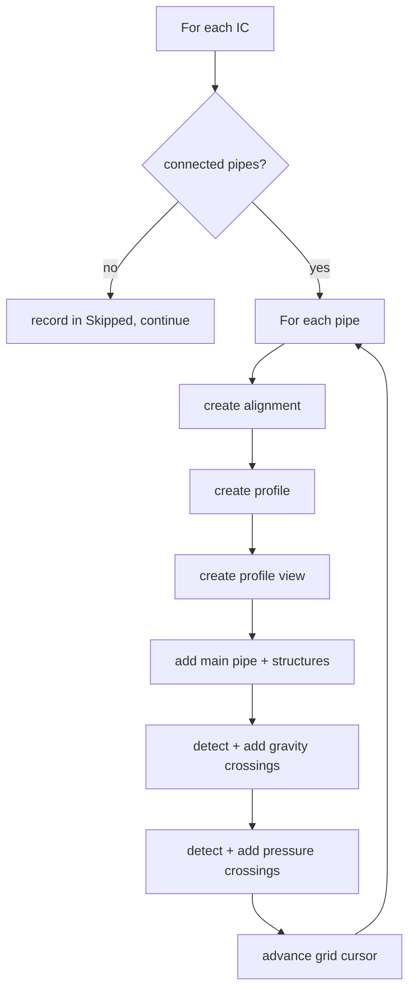

# Chunk G — The Main Transaction (Orchestration)

!!! abstract "What this chapter teaches"
    How all the helpers come together inside the **lock → transaction** skeleton:
    finding the network, computing placement, resolving styles, building the
    connectivity map, and the nested **per-manhole → per-pipe** loop that produces
    everything. This is the conductor of the orchestra.

---

## The skeleton, one more time (now in `with` form)

Everything below lives inside the `with`-form sandwich you learned in the
[primer](../getting-started/civil3d-api-primer.md) and
[Cookbook recipe 1](../cookbook.md#recipe-1--the-lock--transaction-skeleton-start-here-every-time).
The `with` blocks dispose the lock and the transaction automatically — and roll back
an un-committed transaction — even if an exception is thrown:

```python
import traceback
results = {"Success": False, "Warnings": [], "Errors": [], "Skipped": [], "Data": None}
RAISE_ON_ERROR = False                                    # True while developing

try:
    with doc.LockDocument():                              # 🔒 auto-released
        with db.TransactionManager.StartTransaction() as tr:   # 🧹 auto-disposed / rolled back
            # ... STEPS 1–8 below, appending to results ...
            tr.Commit()                                    # 🖊️ keep changes
    results["Success"] = True
except Exception as ex:                                    # fatal boundary
    results["Errors"].append(str(ex))
    results["Traceback"] = traceback.format_exc()
    if RAISE_ON_ERROR:
        raise

OUT = results
```

!!! success "One transaction, one commit"
    All objects — alignments, profiles, views, labels — are created inside **one**
    transaction and committed **once** at the end. Either the whole run succeeds and
    everything appears together, or it fails and the `with` block **rolls back** so
    nothing is left half-made.
    ([Autodesk — Commit and Rollback Changes (.NET)](https://help.autodesk.com/view/OARX/2025/ENU/?guid=GUID-commit-rollback))

!!! note "Two error boundaries, two jobs"
    - The **outer `try`** (above) is the *fatal* boundary: a problem that stops the
      whole run lands in `results["Errors"]`/`["Traceback"]`.
    - Inside the loop (Step 8), each fallible call gets a **narrow** try/except that
      records the item in `results["Skipped"]` and continues. Don't confuse the two —
      see [Gotchas](../gotchas.md#broad-try-except).

!!! tip "`RAISE_ON_ERROR`: dev vs production"
    `True` while developing → the node fails loudly with the traceback. `False` for
    Dynamo Player → the engineer gets a readable `results` instead of a red crash.

The results this chapter appends to (`Warnings`, `Skipped`, and payload fields under
`Data`) follow the standard [`results` schema](../cookbook.md#the-results-schema-read-this-once).

---

## The steps, in order



Steps 1–7 are **setup done once**. Step 8 is the **loop that does the work**.

---

## Step 1 — Find the main network (with validation)

Don't just grab a network by name — **validate** it's the right kind by checking it
has the methods you'll call:

```python
target_net = None
for oid in civdoc.GetPipeNetworkIds():
    net = tr.GetObject(oid, OpenMode.ForRead)
    if (getattr(net, "Name", "") == network_name
            and hasattr(net, "GetStructureIds")
            and hasattr(net, "GetPipeIds")):
        target_net = net
        break
if target_net is None:
    raise Exception(f'Pipe Network "{network_name}" not found.')   # fatal → outer try
```

!!! tip "Duck-typing check: does it quack?"
    `hasattr(net, "GetStructureIds")` confirms this is a gravity network (pressure
    networks have a different API). Checking capabilities rather than exact types is
    resilient across versions.

---

## Step 1b — List every network (a diagnostic gift)

A small kindness that saves enormous frustration: enumerate **all** network names
and put them in the result. When the user's crossing-network name doesn't match, they
can read the exact spelling from the Watch node.

```python
results["Data"] = results.get("Data") or {}
results["Data"]["AvailableNetworks"] = {
    "Gravity":  sorted(avail_gravity),
    "Pressure": sorted(avail_pressure),
}
```

!!! success "Make the invisible visible"
    Half of all "it's not working" tickets are name mismatches (`"Sewer Main"` vs
    `"SEWER_MAIN"`). Echoing available names turns a 30-minute back-and-forth into a
    5-second self-service fix.

---

## Steps 2–4 — Setup: placement, styles, crossing networks

- **Step 2** computes the grid origin from the network extents (upper-right of the
  plan) — see [Chunk F, grid placement](f-profile-views.md#step-4--place-views-on-a-grid-dont-stack-them).
- **Step 3** resolves all styles with the fallback helper from
  [Chunk D](d-styles.md), and finds the band data-source network and EG surface.
- **Step 4** matches the user's crossing-network name lists against the drawing's
  networks (case-insensitive) to get their ObjectIds.

```python
# Step 4 (gravity) — case-insensitive name match
gravity_cross_ids = []
if GRAVITY_CROSS_NET_NAMES:
    wanted = {n.lower() for n in GRAVITY_CROSS_NET_NAMES}
    for oid in civdoc.GetPipeNetworkIds():
        n = tr.GetObject(oid, OpenMode.ForRead)
        if getattr(n, "Name", "").strip().lower() in wanted:
            gravity_cross_ids.append(oid)
```

---

## Step 5 — Connectivity map (built once)

The adjacency-list pattern from [Chunk C](c-helpers.md#the-connectivity-map--a-pattern-worth-knowing).
Build it once so each manhole's pipe lookup is instant:

```python
conn = {}
for pid in target_net.GetPipeIds():
    p = tr.GetObject(pid, OpenMode.ForRead)
    st_id, en_id = get_pipe_end_structure_ids(p)
    if st_id is None or en_id is None:
        continue
    conn.setdefault(st_id, []).append((pid, st_id, en_id))
    conn.setdefault(en_id, []).append((pid, st_id, en_id))
```

---

## Step 6 — Find inspection chambers, export CSV

Filter structures by the prefix (`"IC-"`, `"MH-"`), collect their coordinates, and
write a CSV — a handy side-output for the engineer.

```python
ic_ids = []
for sid in target_net.GetStructureIds():
    s = tr.GetObject(sid, OpenMode.ForRead)
    if getattr(s, "Name", "").startswith(ic_prefix):
        ic_ids.append(sid)

results["Data"]["IC_Count"] = len(ic_ids)
if TEST_LIMIT > 0:                      # optional: process only first N for a quick test
    ic_ids = ic_ids[:TEST_LIMIT]
```

!!! tip "A `TEST_LIMIT` input is worth its weight in gold"
    Processing 3 manholes to check your styles/placement takes seconds; processing
    400 takes minutes. A "limit to first N" input (default 0 = all) makes iteration
    fast. Build this into every batch script.

---

## Step 8 — The main loop (the heart)

Two nested loops: **for each manhole → for each connected pipe**. Each pipe becomes
its own alignment + profile view.

```python
for sid in ic_ids:
    start_struct = tr.GetObject(sid, OpenMode.ForRead)
    connected    = conn.get(sid, [])
    if not connected:
        results["Skipped"].append(f"{getattr(start_struct,'Name','')} (no connected pipe)")
        continue

    for (pipe_id, st_id, en_id) in connected:
        # 8a. get endpoints (fall back to structure positions)
        # 8b. create alignment  (Chunk F, step 1)
        # 8c. create profile    (Chunk F, step 2)  [optional]
        # 8d. create view       (Chunk F, step 3)
        # 8e. add main parts    (Chunk F, step 5)
        # 8f. gravity crossings (Chunk E) + add + label
        # 8g. pressure crossings(Chunk E) + add + label
        # 8h. advance grid cursor(Chunk F, step 4)
```



!!! warning "Skip, don't crash, on bad data"
    Every step that can fail on messy data (no coordinates, no connected pipe)
    records the item in `results["Skipped"]` and **continues** the loop. One bad
    manhole must never abort the other 399. Fatal problems (no target network)
    `raise` and land in the outer `try` → `results["Errors"]`.

---

## The graceful-degradation philosophy (the whole point)

Trace how the script behaves when things go wrong:

| Problem | Response | Lands in |
|---|---|---|
| Main network missing | **raise** (nothing to do) | `Errors` (Step 1) |
| Style name missing | warn + first available | `Warnings` (Step 3) |
| Surface name given but missing | **raise** (user asked for it) | `Errors` (Step 3) |
| Crossing network name typo | silently skipped | — (Step 4) |
| Manhole has no pipe | record | `Skipped` (Step 8) |
| Pipe has no coordinates | record | `Skipped` (Step 8) |
| `AddToProfileView` returns void | ModelSpace fallback scan | `Warnings` (Step 8) |

!!! success "The rule: fail loudly only when you truly can't continue"
    Raise for *fatal* setup problems (no network, requested surface missing) → they
    surface in `results["Errors"]`/`["Traceback"]` and stop the run with
    `Success = False`. For everything else, **degrade and report** via `Warnings` /
    `Skipped`. The engineer reads the result, fixes their data, re-runs. This is what
    makes a batch tool trustworthy.

---

## Anti-pattern spotted: broad `try` around the whole loop body

!!! bug "One giant `try/except` hides which manhole failed"
    Wrapping the *entire* inner loop body in a single broad `try/except` (as some
    versions do) means a failure just vanishes into a generic warning — you can't
    tell **which** manhole or **which** step broke. Prefer **narrow** try/except
    around each fallible call, each recording a specific message to `Skipped`. See
    [Gotchas](../gotchas.md#broad-try-except).

    Note this is *different* from the single **outer** `try` at the top of the node,
    which exists to capture *fatal* errors into `results["Errors"]`. Outer try =
    fatal boundary; inner try = per-item, narrow.

---

## Where does this live? (modular reminder)

In the [modular workflow](../dev-env/dynamo-node-workflow.md), the **loader node**
owns the outer `try`, the `with` lock, the `with` transaction, `Commit`, and
`RAISE_ON_ERROR`; this Step 1–8 logic lives in your **`run(context)` module** and
uses the transaction handed in via `context["tr"]`. See
[Cookbook recipes 7 & 8](../cookbook.md#recipe-7--the-dynamo-loader-node-for-modular-development-in-cursor).
For a small one-off, the self-contained `with` skeleton at the top of this chapter is
enough.

---

## Takeaways

| Idea | Keep it forever |
|---|---|
| `with` lock + `with` transaction | Auto-dispose + auto-rollback, even on error |
| Setup once (steps 1–7), work in the loop (step 8) | Don't recompute per item |
| Validate the network by capability | `hasattr` duck-typing |
| Echo available names to `results["Data"]` | Self-service debugging |
| Build connectivity map once | O(1) lookups |
| `TEST_LIMIT` input | Fast iteration |
| Outer try = fatal → `Errors`; inner try = per-item → `Skipped` | Two boundaries |
| One transaction, one commit | Atomic all-or-nothing |
| `RAISE_ON_ERROR` by context | Loud in dev, reported in production |

Next: the distilled [Cookbook](../cookbook.md), the [Gotchas](../gotchas.md), and
the [Glossary](../glossary.md).
