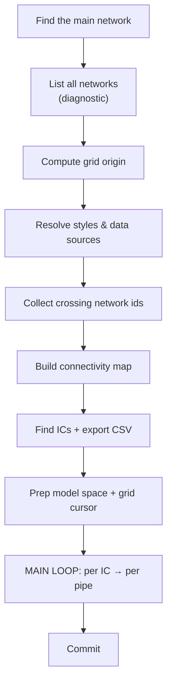
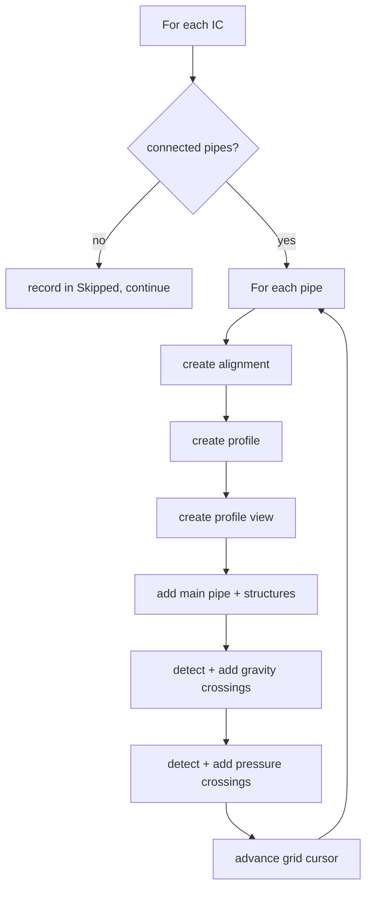

# Chunk G — The Main Transaction (Orchestration)

!!! abstract "What this chapter teaches"
    How all the helpers come together inside the **lock → transaction** skeleton:
    finding the network, computing placement, resolving styles, building the
    connectivity map, and the nested **per-manhole → per-pipe** loop that produces
    everything. This is the conductor of the orchestra.

---

## The skeleton, one more time

Everything below lives inside the sandwich you learned in the
[primer](../getting-started/civil3d-api-primer.md) and
[Cookbook recipe 1](../cookbook.md#recipe-1--the-lock--transaction-skeleton-start-here-every-time):

```python
doc_lock = doc.LockDocument()               # 🔒
try:
    tr = db.TransactionManager.StartTransaction()
    try:
        # ... STEPS 1–8 below ...
        tr.Commit()                          # 🖊️
    finally:
        tr.Dispose()
finally:
    doc_lock.Dispose()                       # 🔓

OUT = results
```

!!! success "One transaction, one commit"
    All objects — alignments, profiles, views, labels — are created inside **one**
    transaction and committed **once** at the end. Either the whole run succeeds and
    everything appears together, or it fails and **nothing** is left half-made.
    ([Autodesk .NET forum: transaction best practices](https://forums.autodesk.com/t5/net-forum/transaction-best-practices/td-p/12537017))

---

## The steps, in order



Steps 1–7 are **setup done once**. Step 8 is the **loop that does the work**.

---

## Step 1 — Find the main network (with validation)

Don't just grab a network by name — **validate** it's the right kind by checking it
has the methods you'll call:

```python
target_net = None
for oid in civdoc.GetPipeNetworkIds():
    net = tr.GetObject(oid, OpenMode.ForRead)
    if (getattr(net, "Name", "") == network_name
            and hasattr(net, "GetStructureIds")
            and hasattr(net, "GetPipeIds")):
        target_net = net
        break
if target_net is None:
    raise Exception(f'Pipe Network "{network_name}" not found.')
```

!!! tip "Duck-typing check: does it quack?"
    `hasattr(net, "GetStructureIds")` confirms this is a gravity network (pressure
    networks have a different API). Checking capabilities rather than exact types is
    resilient across versions.

---

## Step 1b — List every network (a diagnostic gift)

A small kindness that saves enormous frustration: enumerate **all** network names
and put them in `results`. When the user's `IN[10]` crossing-network name doesn't
match, they can read the exact spelling from the Watch node.

```python
results["AvailableNetworks"] = {
    "Gravity":  sorted(avail_gravity),
    "Pressure": sorted(avail_pressure),
}
```

!!! success "Make the invisible visible"
    Half of all "it's not working" tickets are name mismatches (`"Sewer Main"` vs
    `"SEWER_MAIN"`). Echoing available names turns a 30-minute back-and-forth into a
    5-second self-service fix.

---

## Steps 2–4 — Setup: placement, styles, crossing networks

- **Step 2** computes the grid origin from the network extents (upper-right of the
  plan) — see [Chunk F, grid placement](f-profile-views.md#step-4--place-views-on-a-grid-dont-stack-them).
- **Step 3** resolves all styles with the fallback helper from
  [Chunk D](d-styles.md), and finds the band data-source network and EG surface.
- **Step 4** matches the user's crossing-network name lists against the drawing's
  networks (case-insensitive) to get their ObjectIds.

```python
# Step 4 (gravity) — case-insensitive name match
gravity_cross_ids = []
if GRAVITY_CROSS_NET_NAMES:
    wanted = {n.lower() for n in GRAVITY_CROSS_NET_NAMES}
    for oid in civdoc.GetPipeNetworkIds():
        n = tr.GetObject(oid, OpenMode.ForRead)
        if getattr(n, "Name", "").strip().lower() in wanted:
            gravity_cross_ids.append(oid)
```

---

## Step 5 — Connectivity map (built once)

The adjacency-list pattern from [Chunk C](c-helpers.md#the-connectivity-map--a-pattern-worth-knowing).
Build it once so each manhole's pipe lookup is instant:

```python
conn = {}
for pid in target_net.GetPipeIds():
    p = tr.GetObject(pid, OpenMode.ForRead)
    st_id, en_id = get_pipe_end_structure_ids(p)
    if st_id is None or en_id is None:
        continue
    conn.setdefault(st_id, []).append((pid, st_id, en_id))
    conn.setdefault(en_id, []).append((pid, st_id, en_id))
```

---

## Step 6 — Find inspection chambers, export CSV

Filter structures by the prefix (`"IC-"`, `"MH-"`), collect their coordinates, and
write a CSV — a handy side-output for the engineer.

```python
ic_ids = []
for sid in target_net.GetStructureIds():
    s = tr.GetObject(sid, OpenMode.ForRead)
    if getattr(s, "Name", "").startswith(ic_prefix):
        ic_ids.append(sid)

results["IC_Count"] = len(ic_ids)
if TEST_LIMIT > 0:                      # optional: process only first N for a quick test
    ic_ids = ic_ids[:TEST_LIMIT]
```

!!! tip "A `TEST_LIMIT` input is worth its weight in gold"
    Processing 3 manholes to check your styles/placement takes seconds; processing
    400 takes minutes. A "limit to first N" input (default 0 = all) makes iteration
    fast. Build this into every batch script.

---

## Step 8 — The main loop (the heart)

Two nested loops: **for each manhole → for each connected pipe**. Each pipe becomes
its own alignment + profile view.

```python
for sid in ic_ids:
    start_struct = tr.GetObject(sid, OpenMode.ForRead)
    connected    = conn.get(sid, [])
    if not connected:
        results["Skipped"].append(f"{getattr(start_struct,'Name','')} (no connected pipe)")
        continue

    for (pipe_id, st_id, en_id) in connected:
        # 8a. get endpoints (fall back to structure positions)
        # 8b. create alignment  (Chunk F, step 1)
        # 8c. create profile    (Chunk F, step 2)  [optional]
        # 8d. create view       (Chunk F, step 3)
        # 8e. add main parts    (Chunk F, step 5)
        # 8f. gravity crossings (Chunk E) + add + label
        # 8g. pressure crossings(Chunk E) + add + label
        # 8h. advance grid cursor(Chunk F, step 4)
```



!!! warning "Skip, don't crash, on bad data"
    Every step that can fail on messy data (no coordinates, no connected pipe)
    records the item in `results["Skipped"]` and **continues** the loop. One bad
    manhole must never abort the other 399.

---

## The graceful-degradation philosophy (the whole point)

Trace how the script behaves when things go wrong:

| Problem | Response | Where |
|---|---|---|
| Main network missing | **raise** (nothing to do) | Step 1 |
| Style name missing | warn + first available | Step 3 |
| Surface name given but missing | **raise** (user asked for it) | Step 3 |
| Crossing network name typo | silently skipped | Step 4 |
| Manhole has no pipe | record in `Skipped` | Step 8 |
| Pipe has no coordinates | record in `Skipped` | Step 8 |
| `AddToProfileView` returns void | ModelSpace fallback scan | Step 8e/f |

!!! success "The rule: fail loudly only when you truly can't continue"
    Raise for *fatal* setup problems (no network, requested surface missing). For
    everything else, **degrade and report**. The engineer reads `Warnings` and
    `Skipped`, fixes their data, re-runs. This is what makes a batch tool trustworthy.

---

## Anti-pattern spotted: broad `try` around the whole loop body

!!! bug "One giant `try/except` hides which manhole failed"
    Wrapping the *entire* inner loop body in a single broad `try/except` (as some
    versions do) means a failure just vanishes into a generic warning — you can't
    tell **which** manhole or **which** step broke. Prefer **narrow** try/except
    around each fallible call, each recording a specific message. See
    [Gotchas](../gotchas.md#broad-try-except).

---

## Takeaways

| Idea | Keep it forever |
|---|---|
| Setup once (steps 1–7), work in the loop (step 8) | Don't recompute per item |
| Validate the network by capability | `hasattr` duck-typing |
| Echo available names to `results` | Self-service debugging |
| Build connectivity map once | O(1) lookups |
| `TEST_LIMIT` input | Fast iteration |
| Skip-and-record on bad data | One bad item ≠ failed run |
| One transaction, one commit | Atomic all-or-nothing |

Next: the distilled [Cookbook](../cookbook.md), the [Gotchas](../gotchas.md), and
the [Glossary](../glossary.md).
